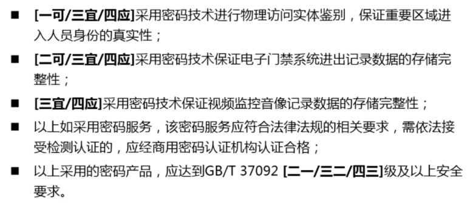
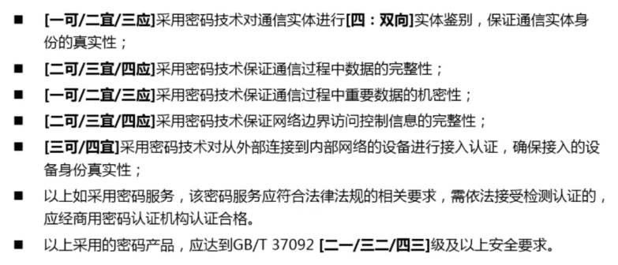
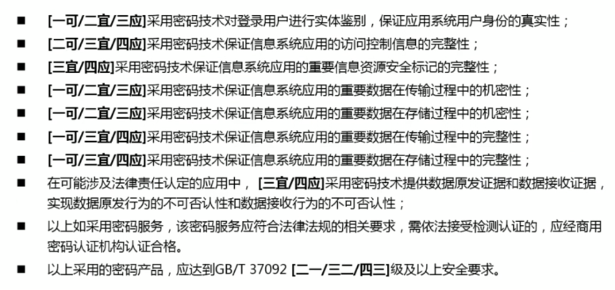
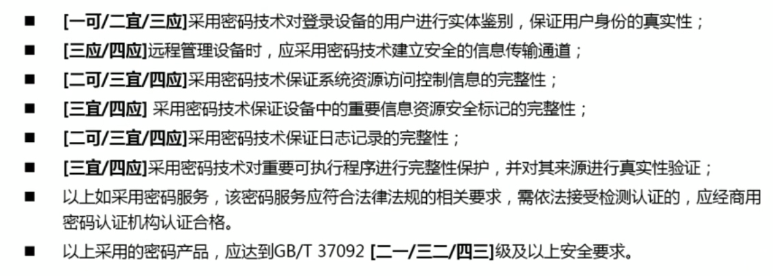

# 密码测试

[toc]

# 关于密评标准—GM/T0054-2018

[关于密评标准—GM/T0054-2018](https://zhuanlan.zhihu.com/p/161924364)

# 国家标准《信息安全技术 信息系统密码应用基本要求（报批稿）》解读

[国家标准《信息安全技术 信息系统密码应用基本要求（报批稿）》解读](https://www.bilibili.com/video/BV1fR4y1q72U/)

## 01 标准内容概要

通用要求 (信息系统中使用的xxx符合法律法规要求)

1. 密码算法
2. 密码技术
3. 密码产品、密码服务

通用要求，是所有级别都需要遵循的

物理与环境安全

(一可 == 在**一**级**可**采用)

网络与通信安全

应用与数据安全

设备与计算安全

**不同层级，相同密码应用要求，的差异性**

## 02 国标与航标的主要变化

## 03 本标准在标准体系中的位置和用途

# From ChatGPT

密码测试通常包含以下内容：

1. 密码长度         ：测试会验证密码的长度是否符合要求。通常要求密码长度在8到16个字符之间，但具体要求可能因组织或应用而异。
2. 复杂性要求       ：测试会检查密码是否符合复杂性要求。这些要求可能包括使用大小写字母、数字、特殊字符以及避免使用常见的字典词汇或简单的模式。
3. 字典词汇检查     ：测试会检查密码是否包含常见的字典词汇，以识别容易猜测的密码。
4. 历史密码检查     ：测试会检查新密码是否与过去使用的密码相似或相同，以避免密码的重复使用。
5. 弱密码检查       ：测试会识别和排除弱密码，如"password"、"123456"等常见和容易猜测的密码。
6. 阻止暴力破解     ：测试会模拟暴力破解攻击，以检查密码是否能够抵御这种攻击。这可能包括限制密码尝试次数、设置锁定机制等。
7. 二因素认证（2FA）：测试可能会推荐或要求启用二因素认证来增加账户的安全性。

密码测试的目的是确保密码的安全性，防止未经授权的访问和数据泄露。通过检查密码的复杂性、猜测性和历史使用情况等方面，可以提高账户的安全性并降低密码被攻击的风险。

gu
0O ilIL1
门

'Ubuntu Mono'
'Jetbrains Mono'
'Source Han Sans HW SC'  # 细，本身可以做到完全对齐，门显示正确，gu显示传统
'Consolas'  # 门不正常
'Noto Sans Mono CJK Sc'  # 细，本身可以做到完全对齐，门显示正确，gu显示传统
'Sarasa Gothic SC'
'Sarasa Mono SC'  # 门不正常
'WenQuanYi Micro Hei Mono'  # 门显示正常
'微软雅黑'

'Jetbrains Mono','Ubuntu Mono','Noto Sans Mono CJK Sc', '微软雅黑'

