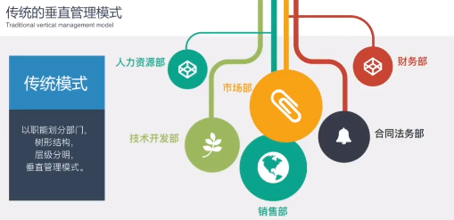
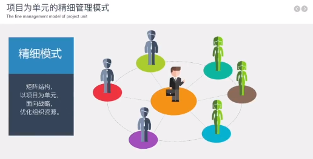
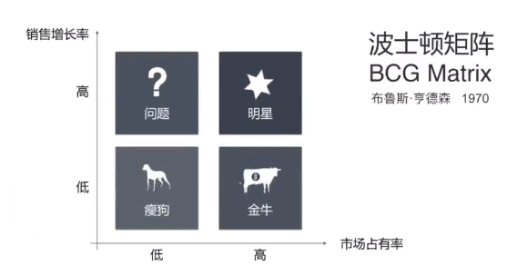
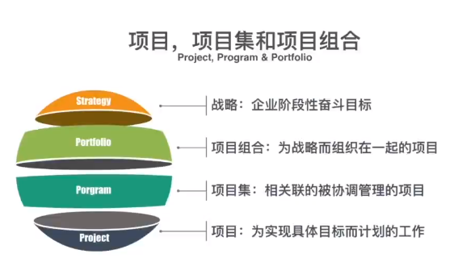
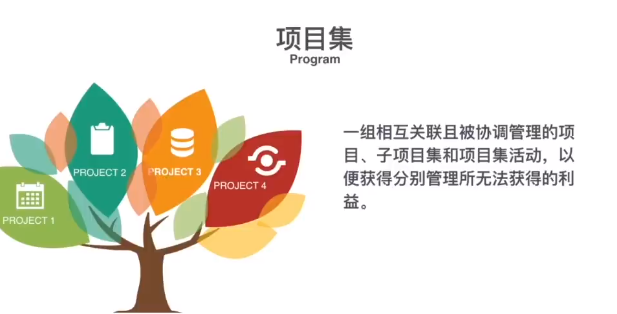
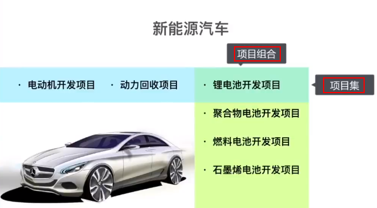

# 项目管理

[toc]

# 项目管理的逻辑

[项目管理的逻辑 -- 清华大学](https://www.bilibili.com/video/BV1sU4y1r7eM/)

## 01 职能部门越卖力，企业越官僚？

职能部门 eg:财务部，人力资源部，法务部

孤岛的产生(两种隔阂同时存在)
1. 管理隔阂 不同层级之间(CEO，总监，经理)
2. 部门隔阂 不同部门之间(技术、销售、市场、财务)

**传统的垂直管理模型**

按照职能划分部门

职能部门掌握资源、管控业务部门工作状态

业务部门感觉从职能部门获取到的帮助较少

职能部门角度，铁路警察各管一段，多一事不如少一事，不求有功但求无过

做项目会存在天然的短板

指令自上而下，汇报自下而上

组织结构树状分解

**项目为单元的精细管理模式**

公司资源面向项目

专业部门 + 从专业部门抽调的员工组成项目团队

纵向专业部门，横向项目团队

项目经理有更高话语权

职能部门是支持项目的资源池，进行人才专业化的培养

对项目更强执行力

## 02 赔钱的项目也要，老板是不是疯了？

波士顿矩阵，分析企业的产品或项目

两个维度
1. 市场占有率(现在)
2. 销售增长率(未来)

产品对应员工 
1. 公司有限的资源优先配给**明星产品**
2. 踏实稳重、善于守摊的负责**金牛产品**
3. 有闯劲、敢打敢拼的的负责**问题产品**
4. 有闲的人做**瘦狗产品**(没有事也要找事做，因为无事生非)

**项目集** : 1+1>2 几个项目一起管理比各自单个管理效率高回报大

eg:房地产开发地块包含多个项目(酒店、写字楼、公寓、商场)，每个项目安排一个项目经理。但**项目间产生资源的冲突或干扰**(房地产项目场地有限)。同时有很多共性的工作，跑政府办手续(环评、规划、消防)，如果各自跑是重复性劳动。找一个负责人，负责地块开发

项目集经理(项目总) 下有很多 项目经理

项目集经理任务不是盯着每个项目的进度、成本、质量，而是去找到项目间相互依赖和相互影响，优化项目间的关系，资源共享，提升效率

**项目组合**

公司有很多项目，都需要争夺资源(人、资金)，产生冲突。项目间需要有一个优先级(顺序)

## 03 日志、周报、月报...然并卵，项目依旧失控！

## 04 

## 05 

# 如何区分项目主体、建设单位、实施机构、业主、立项单位、代建单位、承接单位、施工单位？

在项目管理和建设领域，有许多不同的角色和组织涉及到项目的不同阶段和职能 (From ChatGPT)
1. **项目主体**
   1. 项目主体通常是**指负责整个项目的规划、组织、管理和控制的实体或组织**
   2. 他们对项目的成功负有最终责任，通常是一个政府机构、企业或组织
   3. **项目主体可能是一个建设单位或业主，也可能是一个代表政府的机构**
2. **建设单位**
   1. 建设单位是指**负责项目建设**的实体或组织
   2. **建设单位**是指建筑工程的**投资方**，**对该工程拥有产权**
   3. **建设单位**也称为**业主单位或项目业主**
   4. 他们**承担着项目的设计、施工、监理和交付等职责**
   5. 主要履行**提出建设规划**、**提供建设用地**和**提供建设资金**的责任
   6. 建设单位可能是政府机构、开发商、建筑公司或其他专业机构
3. **实施机构**
   1. 实施机构是指负责**具体执行项目计划和实施项目活动的机构**
   2. **可能是建设单位的一部分**，也**可能是由建设单位委托的独立机构**
   3. 实施机构负责项目的具体执行、协调和监督
4. **业主**
   1. 业主是指**拥有项目或计划的权益**，并**对项目的成功和结果负有责任**的个人、公司、组织或政府机构
   2. 业主**可能是一个建设单位**，也可能是一个代表政府或私人利益的机构
5. **立项单位**
   1. 立项单位是指**对项目进行初步论证、评估和决策，并提出项目建议书或申请**的机构
   2. 他们负责项目的**可行性研究、项目计划和预算编制**等工作
   3. 立项单位通常是政府机构或企业管理层
6. **代建单位**
   1. 代建单位是指**由建设单位委托，代表建设单位进行项目建设管理和实施**的机构
   2. 他们负责管理和协调项目的各个方面，包括设计、施工、监理和交付等
7. **承接单位**
   1. 承接单位是**指由建设单位或代建单位委托，负责具体承接项目建设任务**的实体或组织
   2. 承接单位可能是建筑公司、施工队或其他专业承包商
   3. 他们负责按照合同要求**进行具体的施工和工程实施**
8. **施工单位**
   1. 施工单位是指**负责具体施工和建设**的实体或组织
   2. 他们**执行项目的施工计划，负责材料采购、人员配备、施工管理、质量控制**等工作
   3. 施工单位通常是建筑公司、工程承包商或专业施工队
   4. **实施机构的职责更广泛**，涵盖项目管理的方方面面，而**施工单位更专注于具体的施工活动**

