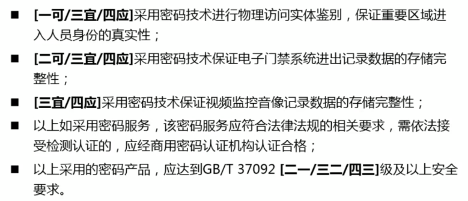
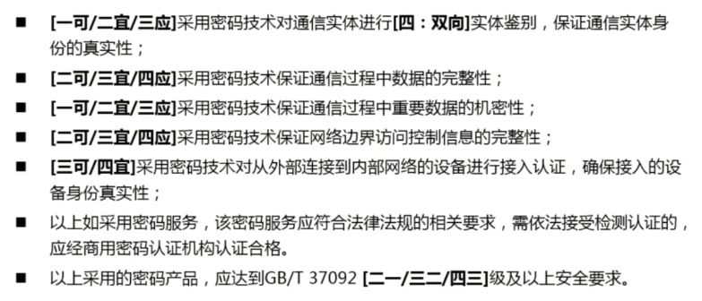
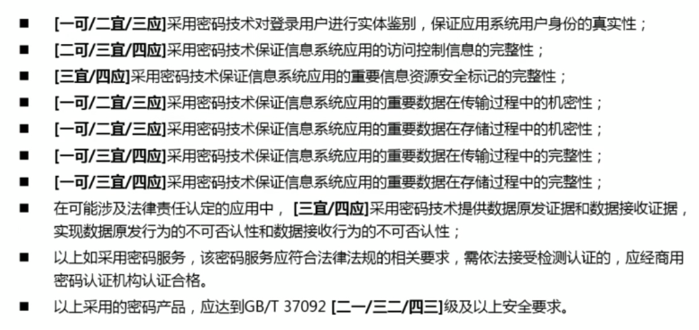
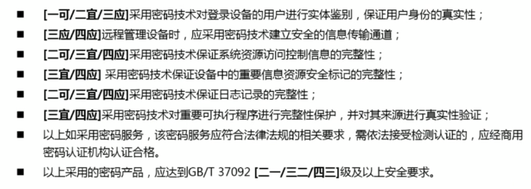

# 密码测试

[toc]

# 关于密评标准—GM/T0054-2018

[关于密评标准—GM/T0054-2018](https://zhuanlan.zhihu.com/p/161924364)

# 国家标准《信息安全技术 信息系统密码应用基本要求（报批稿）》解读

[国家标准《信息安全技术 信息系统密码应用基本要求（报批稿）》解读](https://www.bilibili.com/video/BV1fR4y1q72U/)

## 01 标准内容概要

通用要求 (信息系统中使用的xxx符合法律法规要求)
1. 密码算法
2. 密码技术
3. 密码产品、密码服务

通用要求，是所有级别都需要遵循的

物理与环境安全

(一可 == 在**一**级**可**采用)

网络与通信安全

应用与数据安全

设备与计算安全

**不同层级，相同密码应用要求，的差异性**

## 02 国标与航标的主要变化

## 03 本标准在标准体系中的位置和用途

