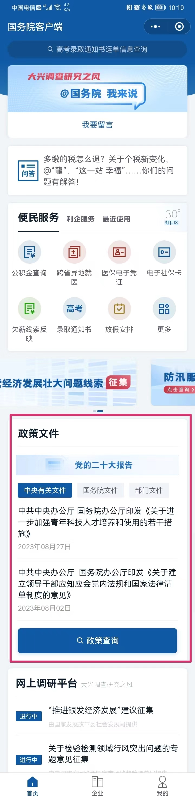

# 国家政策

[toc]

# 政策查询

渠道
1.  国家 层面
    1.  **国务院客户端** 微信公众号
        
    2.  [国务院政策文件库](https://www.gov.cn/zhengce/zhengcewenjianku/index.htm)
    3.  [政策_中国政府网](https://www.gov.cn/zhengce/index.htm)
    4.  [全国标准信息公共服务平台](https://std.samr.gov.cn/)
2.  市 层面
    1.  [上海市人民政府 一网通办](https://zwdt.sh.gov.cn/govPortals/index.do)
    2.  [上海市人民政府规章库](https://www.shanghai.gov.cn/xxzfgzwj/index.html)
3.  区 层面
    1.  [各区部门平台链接](https://www.shanghai.gov.cn/nw49254/index.html)
4.  部门层面
    1.  [各区部门平台链接](https://www.shanghai.gov.cn/nw49254/index.html)
    2.  [上海市水务局(上海市海洋局)](https://swj.sh.gov.cn/zfxxgk/)

数据
1. [上海市公共数据开放平台](https://data.sh.gov.cn/)

