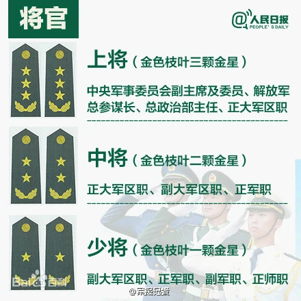
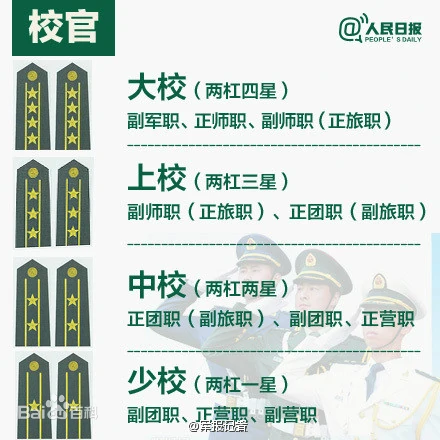
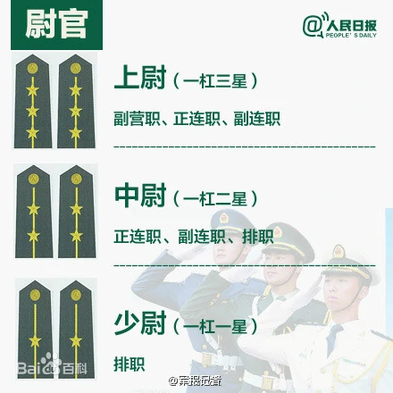
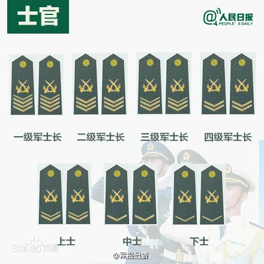
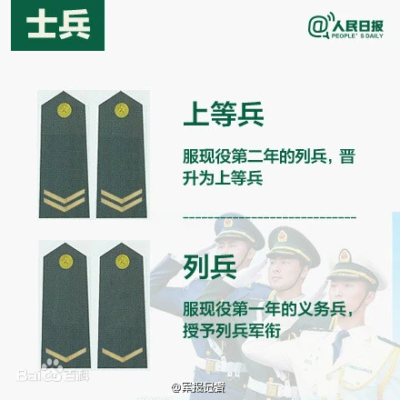
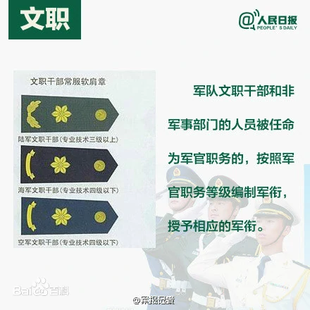
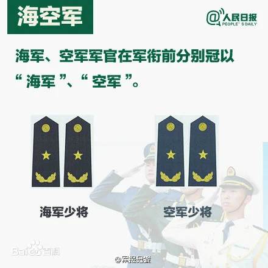
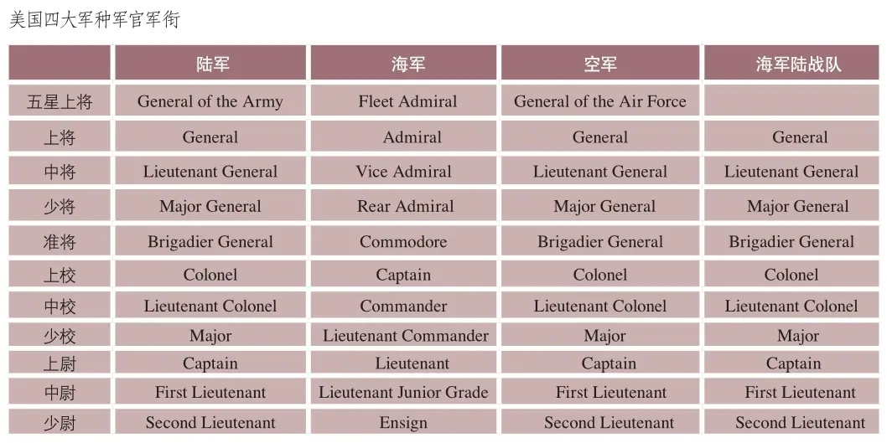
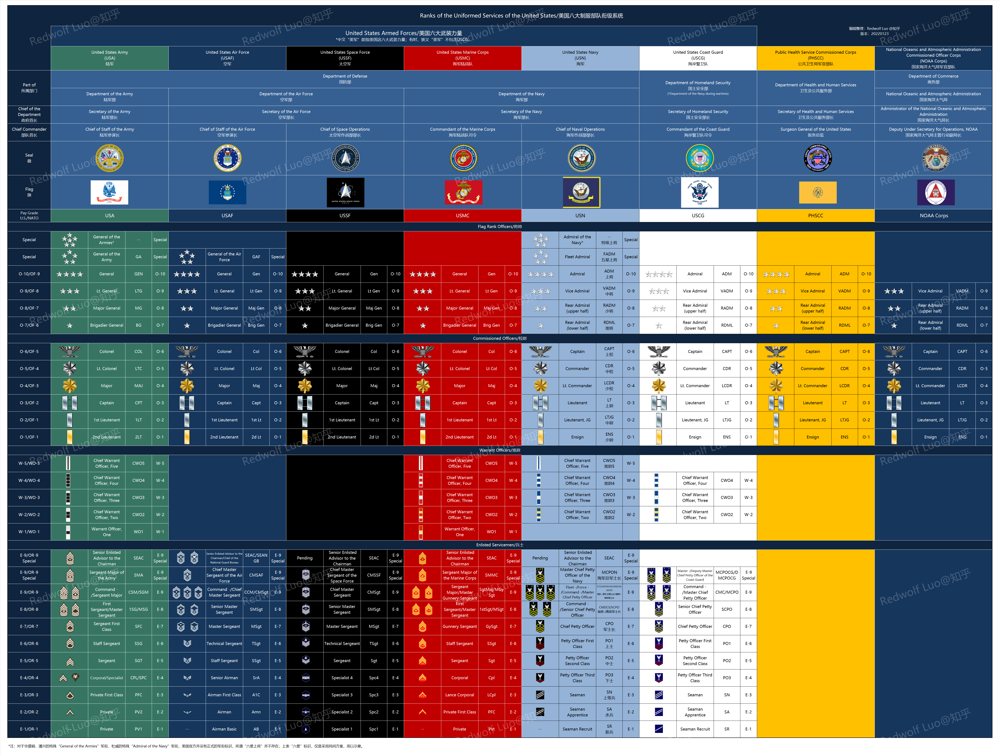
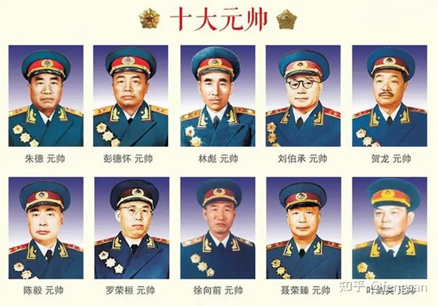

# 军队编制

军-师-旅-团-营-连-排-班

是中国军队中的一个编制，根据军队的组织结构来区分的(指挥机构的级别)

**军**的总人数在3万人左右，1个军下设3个师
**师**包括5-6个团
**旅**比师少1-2个团 
**团**有3个营
**营**下设4个连，人数在500人左右
**连**有3个排
**排**下设3班，每班10人

师和旅的区别
1. 旅相对来说只有和战斗相关的部门，后勤管理系统相比于师小多了，所以旅比师人员减少了很多，但其实战斗人员并没有减少太多
2. 新中国成立后，随着国力的日前强大，各种武器装备进入部队，旅一级编制重回军队体系，炮兵旅、高炮旅、坦克旅、山地步兵旅、守备旅、反坦克旅、工兵旅这种特种旅大量组建，但是这些旅已经隶属于集团军（军）或集团军（军）以上单位

# 军官军衔

## 中国

中国
1. 将官
   
   1. 上将(上将为中国人民解放军现行军衔制中最高军衔)
   2. 中将
   3. 少将
2. 校官
   
   1. 大校
   2. 上校
   3. 中校
   4. 少校
3. 尉官
   
   1. 上尉
   2. 中尉
   3. 少尉
4. 军(警)士 (三等七衔)
   
   自2022年3月31日起，施行新的现役士兵衔级制度。新的衔级**取消了原来四级军士长衔级**，**更名为一级上士衔级**，**原来上士衔级则更名为二级上士衔级**。
   1. 高级军士
      1. 一级军(警)士长
      2. 二级军(警)士长
      3. 三级军(警)士长
   2. 中级军士
      1. 一级上士(原四级军士长)
      2. 二级上士(原上士)
   3. 初级军士
      1. 中士
      2. 下士
5. 义务兵
   
   1. 上等兵
   2. 列兵

## 美国

[美军军官的军衔和晋升](https://zhuanlan.zhihu.com/p/269044695)

[【图表】美军军衔（2022年1月更新，含太空军部分）](https://zhuanlan.zhihu.com/p/461059577)

# 开国十大元帅、十大大将

[开国十大元帅十大将军排名 --- 知乎](https://www.zhihu.com/tardis/zm/art/383171082)

[中国十大元帅由来及功绩 --- 知乎](https://zhuanlan.zhihu.com/p/150947923)

## 十大元帅

1955年9月23日，第一届全国人民代表大会常务委员会第二十二次会议，根据《中国人民解放军军官服役条例》，决定授予 **朱德、彭德怀、林彪、刘伯承、贺龙、陈毅、罗荣桓、徐向前、聂荣臻、叶剑英** 以中华人民共和国元帅军衔

1955年9月27日，中华人民共和国全国人大常委会第二十二次会议通过了授予中华人民共和国元帅军衔的决议。1955年9月27日下午5时，在北京中南海怀仁堂举行了授元帅军衔及授予勋章典礼，授予 **朱德、彭德怀、林彪、刘伯承、贺龙、陈毅、罗荣桓、徐向前、聂荣臻、叶剑英** 10人中华人民共和国元帅军衔，并授予一级八一勋章、一级独立自由勋章、一级解放勋章，中国人民解放军历史上著名的“十大元帅”由此确立

1955年十大开国元帅官方排名
1. 朱德 == 1886-1976 == 四川仪陇人
2. 彭德怀 == 1898-1974 == 湖南省湘潭县人
3. 林彪 == 1906-1971 == 湖北黄岗县人
4. 刘伯承 == 1892-1986 == 四川开县人
5. 贺龙 == 1896-1969 == 湖南桑植县人
6. 陈毅 == 1901-1972 == 四川乐至县人
7. 罗荣桓 == 1902-1963 == 湖南衡山县人
   1. 罗帅和聂帅一样，是我军政工出身的元帅，也都来自红一军团
   2. 罗帅和林帅、粟大将等多数人一样，从基层的连排长做起。和聂帅一样，他在红军时期一直担任政工干部。
8. 徐向前 == 1901-1990 == 山西五台县人
   1. 徐帅有很多独特的军事战法，在红军时期大放异彩
      1. 在红军兵力弱小的时候，通过伏击战消灭敌人。善于围点打援，攻击敌人必救据点，歼灭敌人援军，通过围困迫使敌人投降
      2. 反围剿时用收缩阵地战法，消耗敌人锐气，我军积蓄精力选择时机突然反击，将敌人击溃歼灭
   2. 是练兵高手，解放战争中将中原野战军的后方三线部队打造成华北战场我军第一主力（华北第1兵团）
   3. 反六路围攻是他红军时期歼敌最多的一战
9.  聂荣臻 == 1899-1992 == 四川江津县人
   1.  早年担任黄埔军校教官
   2.  南昌起义中协助周恩来主管军事
   3.  参与领导了广州起义，随后担任广东省委军委书记
   4.  1931年到红一方面军后，他长期担任政委，配合军团长林彪工作
   5.  从1938年起，领导华北地区抗战，一直到全国解放
   6.  让他闻名天下的当属黄土岭伏击战
10. 叶剑英 == 1897-1986 == 广东梅县人
    1.  早年在广东地区孙中山的部队任职
    2.  在我军时期，长期担任参谋长和情报工作，被毛主席称为“叶参座”
    3.  指挥的最知名的战役，当属解放战争时期广东战役
        1.  1949年9月7日，叶剑英在江西赣州主持军事会议，召集二野第4兵团、四野第15兵团、原华南分局书记方方、两广纵队负责人等参加，制订广东战役作战方案
        2.  随后，叶剑英和陈赓联名签发了 《广州外围作战命令》，三路大军共22万人向广州进军
        3.  10月14日，广州解放。叶帅担任广东省人民政府主席和广州市市长，开始了城市接管和建政工作。

## 十大大将

1955年十大开国大将官方排名
1. 粟裕
2. 徐海东
3. 黄克诚
4. 陈赓
5. 谭政
6. 肖劲光
7. 张云逸
8. 罗瑞卿
9. 王树声
10. 许光达

