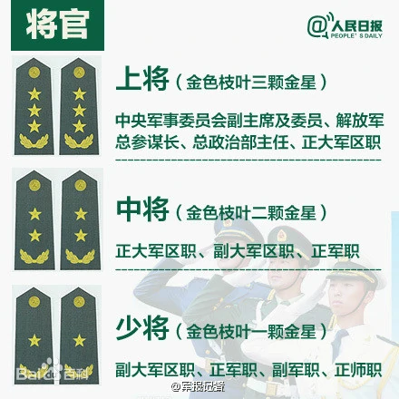
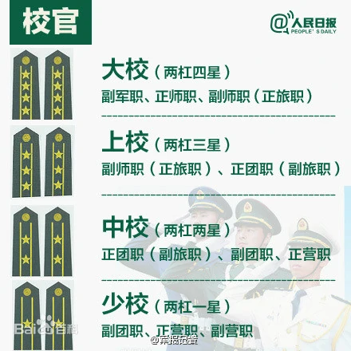
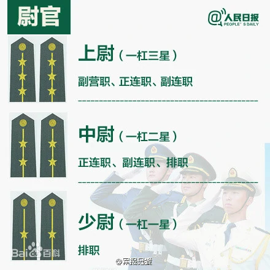
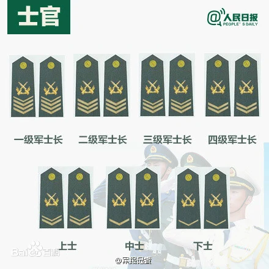
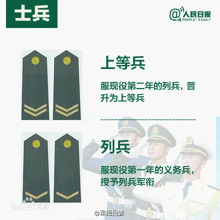
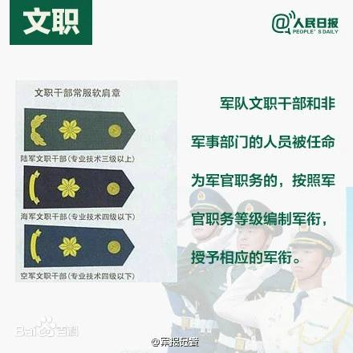
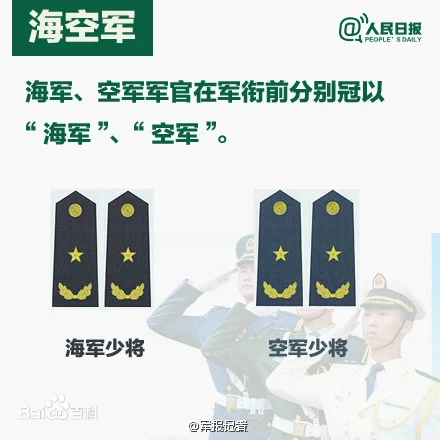
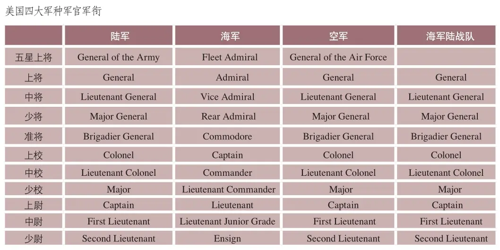
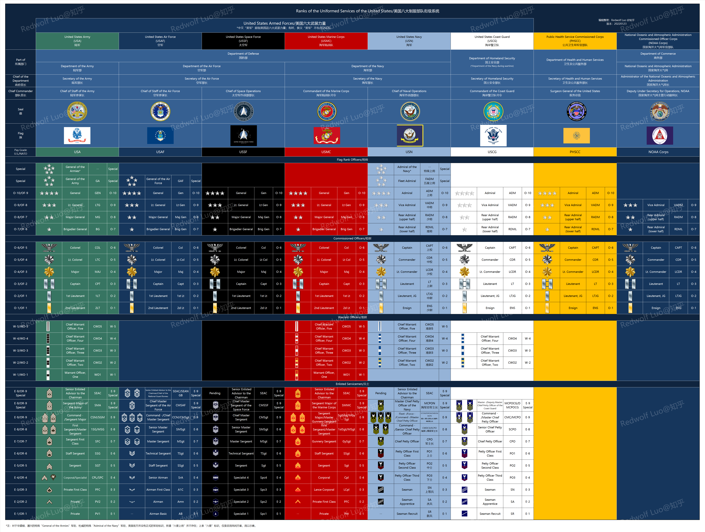

# 军队编制

军-师-旅-团-营-连-排-班

是中国军队中的一个编制，根据军队的组织结构来区分的(指挥机构的级别)

**军**的总人数在3万人左右，1个军下设3个师
**师**包括5-6个团
**旅**比师少1-2个团 
**团**有3个营
**营**下设4个连，人数在500人左右
**连**有3个排
**排**下设3班，每班10人

师和旅的区别
1. 旅相对来说只有和战斗相关的部门，后勤管理系统相比于师小多了，所以旅比师人员减少了很多，但其实战斗人员并没有减少太多
2. 新中国成立后，随着国力的日前强大，各种武器装备进入部队，旅一级编制重回军队体系，炮兵旅、高炮旅、坦克旅、山地步兵旅、守备旅、反坦克旅、工兵旅这种特种旅大量组建，但是这些旅已经隶属于集团军（军）或集团军（军）以上单位

# 军官军衔

## 中国

中国
1. 将官
   
   1. 上将(上将为中国人民解放军现行军衔制中最高军衔)
   2. 中将
   3. 少将
2. 校官
   
   1. 大校
   2. 上校
   3. 中校
   4. 少校
3. 尉官
   
   1. 上尉
   2. 中尉
   3. 少尉
4. 军(警)士 (三等七衔)
   
   自2022年3月31日起，施行新的现役士兵衔级制度。新的衔级**取消了原来四级军士长衔级**，**更名为一级上士衔级**，**原来上士衔级则更名为二级上士衔级**。
   1. 高级军士
      1. 一级军(警)士长
      2. 二级军(警)士长
      3. 三级军(警)士长
   2. 中级军士
      1. 一级上士(原四级军士长)
      2. 二级上士(原上士)
   3. 初级军士
      1. 中士
      2. 下士
5. 义务兵
   
   1. 上等兵
   2. 列兵

## 美国

[美军军官的军衔和晋升](https://zhuanlan.zhihu.com/p/269044695)

[【图表】美军军衔（2022年1月更新，含太空军部分）](https://zhuanlan.zhihu.com/p/461059577)

