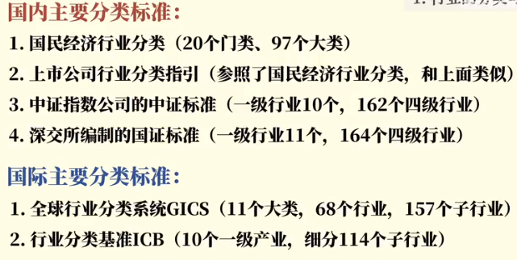
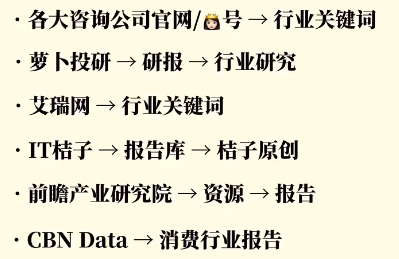
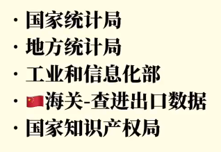
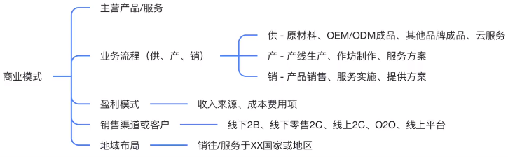
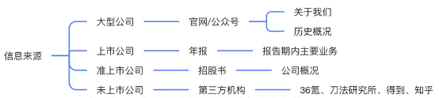
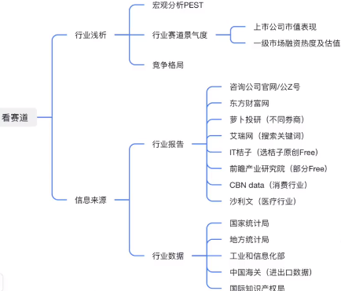
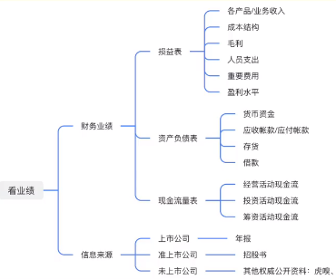
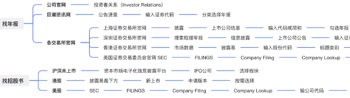
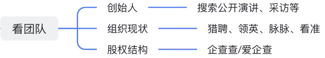

# 方法论

# 如何快速了解一个行业｜5分钟方法论+资料库

[如何快速了解一个行业｜5分钟方法论+资料库 --- B站视频](https://www.bilibili.com/video/BV1Vg411z7YN/)

## 01 行业界定/分类

## 02 行业分析思路

**行业分析思路**
1. 宏观分析(大环境PEST)
   1. 政治 Political    : 政策方针是否有扶持、法律法规是否有监管
   2. 经济 Economic     : 国内外经济条件、宏观经济政策
   3. 社会 Social       : 文化传统、风俗习惯、教育水平
   4. 技术 Technology   : 技术水平、技术发展情况
2. 行业概况
   1. 行业规模
      1. 现有数据
      2. 自己计算
   2. 行业生命周期
      1. 幼稚期
      2. 成长期
      3. 成熟期
      4. 衰退期
   3. 行业市场结构(壁垒)
      1. 完全垄断
      2. 寡头垄断
      3. 垄断竞争
      4. 完全竞争
   4. 业务模式(营销、生产、扩张) 盈利模式
3. 产业链分析
   1. 上下游业态
   2. 在产业链中的位置
   3. 在产业链中产生的价值
   4. 是否不可或缺
   5. 是否具备定价权
4. 资本市场表现
   1. 行业内上市公司业绩表现(年报)
   2. PE(private equity 私募股权投资)/VC(venture capital风险投资)投资动向

## 03 行业报告与数据查找

### a 找行业报告

[萝卜投研](https://robo.datayes.com/uqer/report)

[艾瑞网](https://www.iresearch.cn/mindex.shtml)

[IT橘子](https://www.itjuzi.com/)

[前瞻产业研究院](https://f.qianzhan.com/)

[CBN Data](https://www.cbndata.com/)

[洞见研报](https://www.djyanbao.com/index)

### b 年报/招股书

年报 : 关注 ==市场回顾== 板块

招股书 : 关注 ==行业概览== 板块 (市场规模、竞争格局、产业链)

### c 宏观数据

国家统计局 顶栏 "统计数据"

### d 搜索文章

文章 -> 数据图片 -> 索引 -> 官网

# 如何快速了解一家公司｜6分钟方法论+资料库

[如何快速了解一家公司｜6分钟方法论+资料库 --- B站视频](https://www.bilibili.com/video/BV1q84y1r7fE/)

目标公司
1. 商业模式
2. 天花板
3. 财务业绩
4. 高管团队

## 01 看业务 == 商业模式 (做什么 + 怎么做)

盈利模式 在 供、产、销 三个阶段

## 02 看赛道

### a 宏观分析 

PEST

### b 行业赛道景气程度

上市公司 : 二级市场 —— 市值、市盈率

独角兽/小型企业 : 一级市场 —— 融资热度、估值情况

### c 竞争格局

竞争对手

市占率

## 03 看业绩 (看财务报表)

## 04 看团队

# 行业研报哪家强？

[行业研报哪家强？](https://www.bilibili.com/video/BV16a41197Km/)

大型买方机构工作，也在长江干过，个人的喜好：
宏观：长江伍戈、兴业王涵、中信明明
策略：申万
有色：长江，独一档的存在；建投也很厉害
电新：长江、中信、天风
金工：国盛、国信，国君和华泰则经常讲模型框架和科普，点名批评建投
食品饮料：看的不多，感觉国君还是厉害
化工：建投

金融工程：国盛刘富兵
金属新材料：长江王鹤涛
电力与新能源：长江邬博华、天风孙潇雅
食品饮料：华创董广阳、国君訾猛
全行业：长江