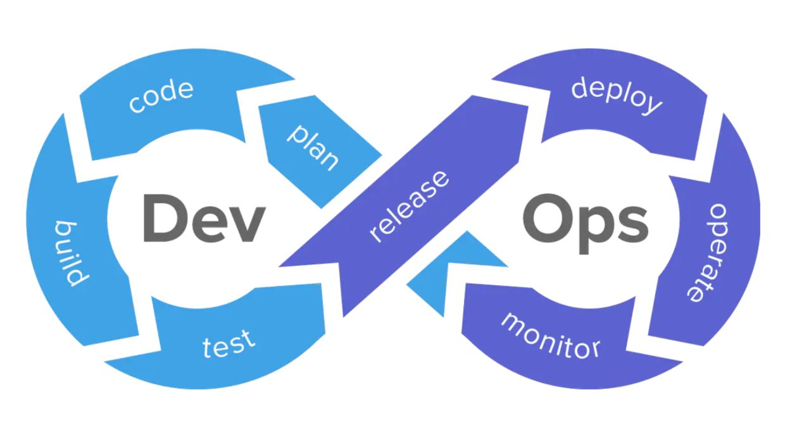
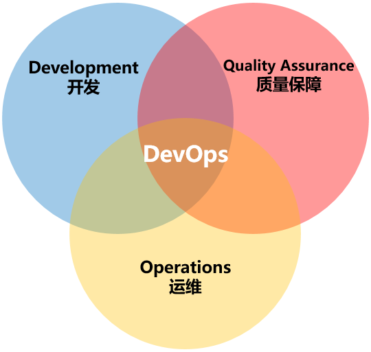
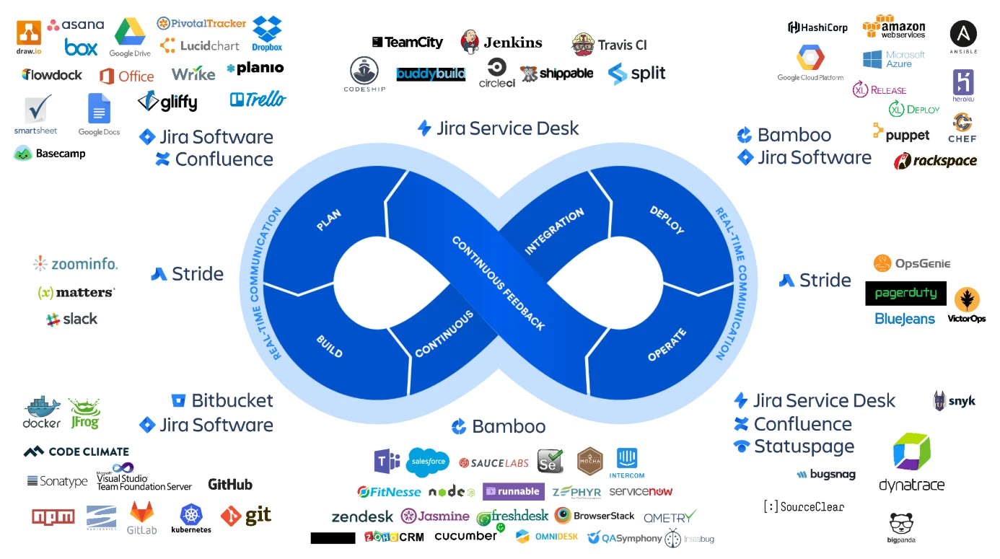
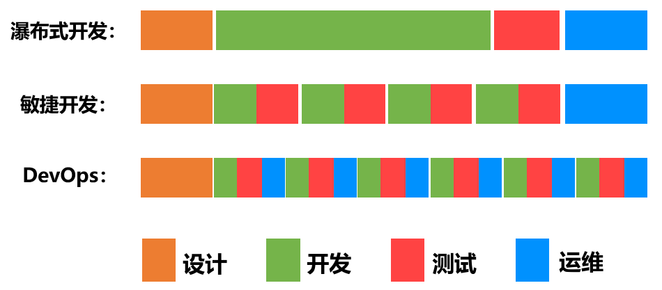
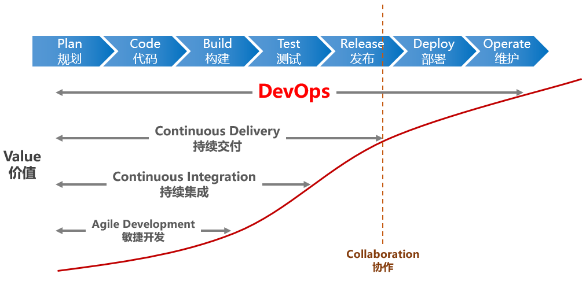
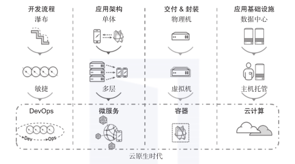
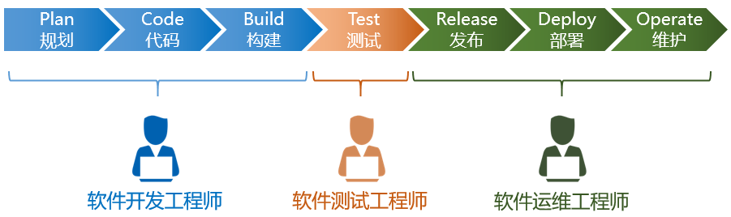
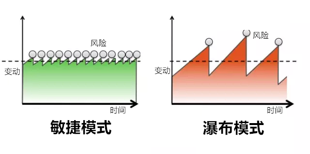

# LLM Ops

--

# Table of Contents

- [LLM Ops](#llm-ops)
- [Table of Contents](#table-of-contents)
- [AI Ops \& LLM Ops](#ai-ops--llm-ops)
- [Dev Ops](#dev-ops)
  - [简介](#简介)
  - [历史](#历史)

---

# AI Ops & LLM Ops

[什么是 AIOps? - IBM](https://www.ibm.com/cn-zh/topics/aiops)

[什么是 LLMOps？ - Dify](https://docs.dify.ai/v/zh-hans/learn-more/extended-reading/what-is-llmops)

**AI Ops**，全称 **Artificial Intelligence for IT Operations**

利用人工智能技术来优化IT运维管理的方法,结合 机器学习、大数据分析和自动化技术，以提高IT系统的效率、可靠性和安全性。

目标 - 通过智能分析和预测来减少人为错误，提高问题解决的速度和准确性；帮助IT团队更好地理解复杂的系统行为，预测潜在的问题，并在问题发生之前采取预防措施。

AI Ops 核心组成部分
1. **智能监控&处理数据** - 使用机器学习模型来分析数据中心的大量监控数据，及时发现潜在的问题和性能瓶颈
2. **事件聚合和分析** - 对从各种IT监控工具收集到的事件和警报进行聚合和相关性分析，以减少误报并确定真正的问题
3. **自动化问题解决** - 应用人工智能对系统故障进行自动诊断，并提供解决问题的建议或直接自动化修复(故障恢复、资源分配或安全响应)
4. **持续学习和优化** - 系统不断学习和适应新的数据模式，提高问题检测和解决的准确性
5. **高级分析和预测** - 利用先进的数据分析技术来预测可能出现的问题，并在它们影响业务之前采取预防措施
6. **可视化和报告** - 提供直观的仪表板和报告，帮助IT团队理解系统状态和AI Ops的决策过程。

AI Ops的应用场景非常广泛，包括但不限于
1. **性能监控** - 实时监控系统性能，预测和预防性能瓶颈
2. **异常检测** - 自动检测系统中的异常行为，及时发出警报
3. **故障预测** - 通过分析历史数据预测潜在的故障点，提前进行维护
4. **安全分析** - 识别安全威胁和异常行为，自动采取防御措施
5. **资源优化** - 根据工作负载自动调整资源分配，提高资源利用率

通过智能化的工具和流程来加强团队的能力，最终实现更加可靠和高效的IT服务和基础设施管理

model deployment

dataset management

---

# Dev Ops

## 简介

DevOps - **Development** 和 **Operations** 的组合

DevOps是一组**过程、方法与系统的统称**，用于促进开发、技术运营、质量保障QA(**测试是QA的一部分**) 部门之间的沟通、协作与整合

dev 到 ops的过程必须通过质量门

**目的** - 缩短软件开发生命周期，并 使用 **持续交付** 提供高质量的软件

**CI & CD**
1. CI - Continuous Integration **持续集成**
2. CD - Continuous Delivery **持续交付**
   1. 持续交付 Continuous Delivery 是一种软件开发实践，它确保了软件的任何更新经过自动化测试后，可以频繁且可靠地向用户交付
3. CD - Continuous Deployment **持续部署**

**DevOps的流程**
1. 运维人员会在 开发期间 介入到 开发过程 中，了解开发人员使用的系统架构和技术路线，从而制定适当的运维方案
2. 开发人员会在 运维初期 参与到 系统部署 中，并提供系统部署的优化建议
3. Dev 到 Ops 的过程必须通过 QA

**支持 DevOps 的软件**

DevOps 贯穿 **软件全生命周期**，而不仅限于开发阶段

**DevOps 的 价值**

**DevOps & 微服务、虚拟化、容器**
1. 微服务架构下，不同的工程师可以对各自负责的模块进行处理，例如开发、测试、部署、迭代
2. 虚拟化，一种敏捷的云计算服务。从硬件上，将一个系统“划分”为多个系统，系统之间相互隔离，为微服务提供便利
3. 容器，在操作系统上划分为不同的 运行环境 Container，占用资源更少，部署速度更快

---

## 历史

软件从零开始到最终交付，包含的 **阶段 & 对应角色**
1. **开发工程师** - 规划plan、编码code、构建build
2. **测试工程师** - 测试test
3. **运维工程师** - 发布release、部署deploy、维护operate

**瀑布模型 & 敏捷开发**
1. **瀑布模型** - 等一个阶段所有工作完成之后，再进入下一个阶段
2. **敏捷开发**(Agile Development)
   1. 能**应对快速变化需求**的软件开发能力，把大项目变成小项目
   2. 帮助更快地发现问题，产品被更快地交付到用户手中，团队可以更快地得到用户的反馈，从而进行更快地响应
   3. 版本变化比较小，风险会更小
      
   4. **☆** 但 **效果仅限于开发环节**，运维 非常 排斥改变

---