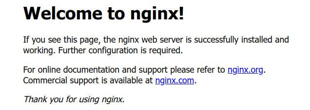
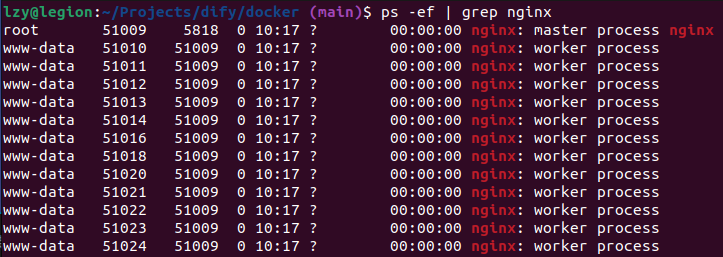
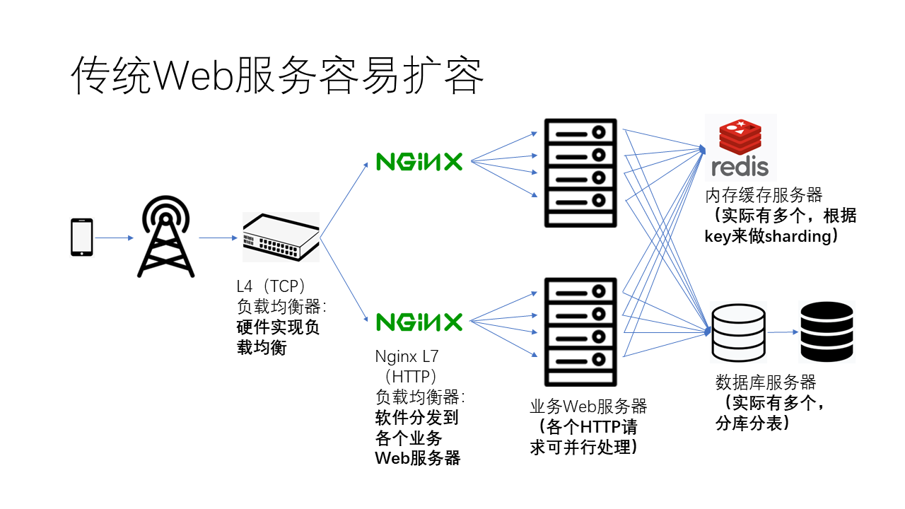

# Nginx

[nginx 官网](https://nginx.org/en/)

[nginx Docs](https://docs.nginx.com/)

**(E)NGIN(E) X**

---

## Table of Contents

- [Nginx](#nginx)
  - [Table of Contents](#table-of-contents)
- [【GeekHour】30分钟Nginx入门教程](#geekhour30分钟nginx入门教程)
  - [简介 \& 安装](#简介--安装)
  - [服务启停](#服务启停)
  - [静态站点部署](#静态站点部署)
  - [配置文件](#配置文件)
  - [反向代理 \& 负载均衡](#反向代理--负载均衡)
  - [HTTPS 配置](#https-配置)
  - [虚拟主机](#虚拟主机)
- [Trouble Shooting](#trouble-shooting)
  - [关闭Nginx自启动](#关闭nginx自启动)
  - [bind() to 0.0.0.0:80 failed](#bind-to-000080-failed)

---

# 【GeekHour】30分钟Nginx入门教程

[【GeekHour】30分钟Nginx入门教程](https://www.bilibili.com/video/BV1mz4y1n7PQ/)

## 简介 & 安装

流行的 Web 服务器

解决 C10K 问题 = 10000 concurrent connection = 同时处理 10000 个并发连接


被 [F5](https://www.f5.com/) 公司收购


安装

```bash
sudo apt install nginx
```

## 服务启停

启动

```bash
sudo nginx
```

浏览器输入 [localhost](http://localhost/)




查看进程

```bash
ps -ef | grep nginx
sudo lsof -i :80
```


nginx进程
1. master - 主进程
   1. 读取 & 验证 配置文件
   2. 管理 worker 进程
2. worker - 工作进程
   1. 处理实际请求


worker 进程数量可以通过配置文件调整

**sudo nginx -s [signal]**
1. quit - 优雅停止
2. stop - 立即停止
3. reload - 重载配置文件
4. reopen - 重新打开日志文件

```bash
sudo nginx -s stop
```

## 静态站点部署

查看 安装目录(--prefix) & 编译参数 & 配置文件(--conf-path) & 日志文件

```bash
lzy@legion:~/Projects/dify/docker (main)$ nginx -V
nginx version: nginx/1.18.0 (Ubuntu)
built with OpenSSL 3.0.2 15 Mar 2022
TLS SNI support enabled
configure arguments: --with-cc-opt='-g -O2 -ffile-prefix-map=/build/nginx-zctdR4/nginx-1.18.0=. -flto=auto -ffat-lto-objects -flto=auto -ffat-lto-objects -fstack-protector-strong -Wformat -Werror=format-security -fPIC -Wdate-time -D_FORTIFY_SOURCE=2' --with-ld-opt='-Wl,-Bsymbolic-functions -flto=auto -ffat-lto-objects -flto=auto -Wl,-z,relro -Wl,-z,now -fPIC' --prefix=/usr/share/nginx --conf-path=/etc/nginx/nginx.conf --http-log-path=/var/log/nginx/access.log --error-log-path=/var/log/nginx/error.log --lock-path=/var/lock/nginx.lock --pid-path=/run/nginx.pid --modules-path=/usr/lib/nginx/modules --http-client-body-temp-path=/var/lib/nginx/body --http-fastcgi-temp-path=/var/lib/nginx/fastcgi --http-proxy-temp-path=/var/lib/nginx/proxy --http-scgi-temp-path=/var/lib/nginx/scgi --http-uwsgi-temp-path=/var/lib/nginx/uwsgi --with-compat --with-debug --with-pcre-jit --with-http_ssl_module --with-http_stub_status_module --with-http_realip_module --with-http_auth_request_module --with-http_v2_module --with-http_dav_module --with-http_slice_module --with-threads --add-dynamic-module=/build/nginx-zctdR4/nginx-1.18.0/debian/modules/http-geoip2 --with-http_addition_module --with-http_gunzip_module --with-http_gzip_static_module --with-http_sub_module
```

查看 配置文件 位置

```bash
sudo nginx -t

lzy@legion:~ $ sudo nginx -t
nginx: the configuration file /etc/nginx/nginx.conf syntax is ok
nginx: configuration file /etc/nginx/nginx.conf test is successful
```

```bash
# 安装目录
--prefix=/usr/share/nginx

# 配置文件
--conf-path=/etc/nginx/nginx.conf
#	include /etc/nginx/conf.d/*.conf;
#	include /etc/nginx/sites-enabled/*;
# /var/www/html/index.nginx-debian.html
```


```bash
sudo gedit /var/www/html/index.nginx-debian.html
```


## 配置文件


## 反向代理 & 负载均衡

正向代理(Forward Proxy) - 代理客户端，为客户端提供服务
1. 客户端通过正向代理服务器发送请求，代理服务器代表客户端向目标服务器发送请求，然后将目标服务器的响应返回给客户端
2. 例子 : VPN - 让 VPN 代理服务器 作为客户端，代理 原客户端 访问外网 - 客户端清楚，对服务端透明
   


反向代理(Reverse Proxy) - 代理服务端，为服务器提供服务
1. 客户端发送请求到反向代理服务器，反向代理服务器再将请求转发给目标服务器，并将目标服务器的响应返回给客户端
2. 例子 : Google 后台有很多服务器，只对外暴露一个域名，客户端只能通过域名访问。请求被转发到背后的服务器(隐藏了真实的服务器 IP地址、端口等 信息) - 对客户端透明
   
   


## HTTPS 配置

## 虚拟主机


# Trouble Shooting

## 关闭Nginx自启动

```bash
sudo systemctl disable nginx
```


## bind() to 0.0.0.0:80 failed

```bash
lzy@legion:~/Projects/dify/docker (main)$ sudo nginx
nginx: [emerg] bind() to 0.0.0.0:80 failed (98: Unknown error)
nginx: [emerg] bind() to [::]:80 failed (98: Unknown error)
nginx: [emerg] bind() to 0.0.0.0:80 failed (98: Unknown error)
nginx: [emerg] bind() to [::]:80 failed (98: Unknown error)
nginx: [emerg] bind() to 0.0.0.0:80 failed (98: Unknown error)
nginx: [emerg] bind() to [::]:80 failed (98: Unknown error)
nginx: [emerg] bind() to 0.0.0.0:80 failed (98: Unknown error)
nginx: [emerg] bind() to [::]:80 failed (98: Unknown error)
nginx: [emerg] bind() to 0.0.0.0:80 failed (98: Unknown error)
nginx: [emerg] bind() to [::]:80 failed (98: Unknown error)
nginx: [emerg] still could not bind()
```

**solution**

```bash
# Linux
sudo lsof -i :80
sudo kill -9 <PID>


# Windows
netstat -ano | findstr :80
taskkill /PID <PID> /F
```

关闭占用端口的 进程 & 应用


