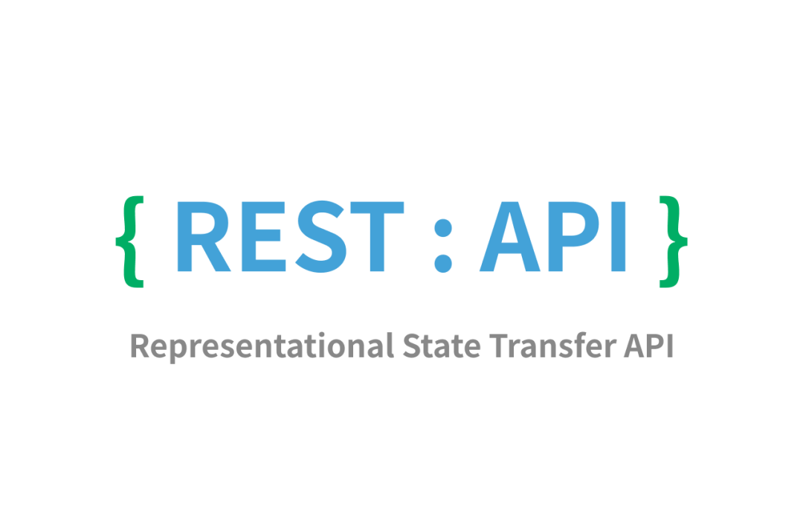
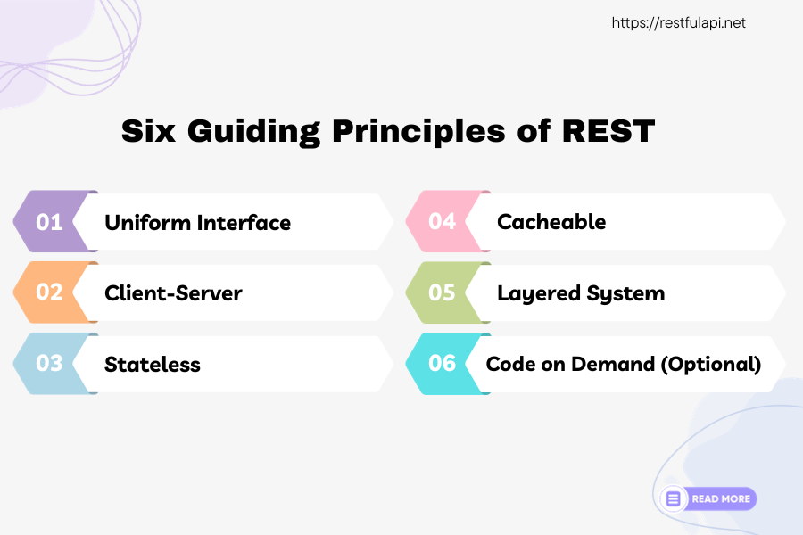

# RESTful API

[【API技术核心原理】REST | GraphQL | gRPC | tRPC](https://www.bilibili.com/video/BV1yL41167fD/)

[【大厂面试】面试官：你连RESTful都不知道我怎么敢要你？](https://mp.weixin.qq.com/s/56lUMDnklrvWQXrpWWC8Xg)

[菜鸟教程](https://www.runoob.com/w3cnote/restful-architecture.html)

全称 **RE**presentational **S**tate **T**ransfer API(Application Programming Interface)

**不是 协议，不是 语言**

一种 **软件架构风格**，定义 客户端和服务器 交换数据 的 规则和约定

REpresentational - JSON,XML,JPEG 都是 资源表现形式

State Transfer - 状态变化，通过 HTTP method 实现

**六大原则**
1. **服务端-客户端 (Client-Server)**
   1. 相互独立，不需要知道对方逻辑，可以使用不同 技术栈
2. **无状态 (Stateless)**
   1. 要求 **客户端的状态不保存在服务端**，客户端 请求时 需要 正确表示自己的状态 并 传输给服务端
3. **缓存 (Cacheable)**
   1. 无状态 不代表 不缓存
   2. 如果 客户端 短时间内 不断 请求 同一个 资源 会影响 网络带宽和响应时间
   3. GET 设置为 默认缓存，POST 不缓存
4. **统一接口 (Uniform Interface)**
   1. 不同的资源 用 不同的 URI (Uniform Resource Identifier，统一资源标识符) 表示
   2. URL (Uniform Resource Locator，统一资源定位符) - URI 的 子集
   3. HTTP method (表明要干什么) - HTTP方法包含在HTTP请求行中
      1. **GET**    - 从服务器获取指定资源的信息
      2. **POST**   - 向服务器提交新的资源，请求服务器创建一个新资源
      3. **PUT**    - 更新服务器上的现有资源或创建新资源
      4. **PATCH**  - 对资源进行部分更新
      5. **DELETE** - 删除服务器上的一个资源
5. **分层系统 (Layered System)**
   1. 发送请求可能先通过 负载均衡 进行 流量分配，分配到部署了 API 的 服务器上 再 请求数据库
   2. 客户端难以猜透服务端具体架构，系统更安全，架构更容易扩展
6. **按需代码 (Code on Demand / Hidden State)**
   1. 服务端可以响应可执行代码给客户端

用大白话来说 - **URL定位资源** - **HTTP描述操作**
1. 通过 **URL** 就知道要什么资源
2. 通过 **HTTP method** 就知道要干什么
3. 通过 **HTTP status code** 就知道结果如何

eg
1. GET /tasks 获取所有任务
2. POST /tasks 创建新任务
3. GET /tasks/{id} 通过任务id获取任务
4. PUT /tasks/{id} 更新任务
5. DELETE /tasks/{id} 删除任务

eg
1. GET - 获取资源
2. POST - 添加资源
3. PUT - 修改资源
4. DELETE - 删除资源

server 提供的 RESTfuI API 中， URL 中只使用名词来指定资源，原则上不使用动词

用 HTTP Status Code 传递 server 的状态信息
1. 200 表示 成功
2. 500 表示 Server 内部错误

优点
1. 风格统一
2. 面向资源，一目了然，具有自解释性
3. 充分利用 HTTP 协议本身语义

缺点
1. 很依赖 API 文档

