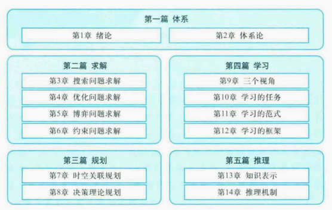
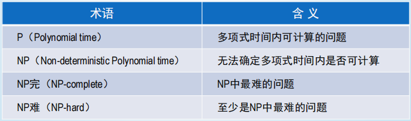
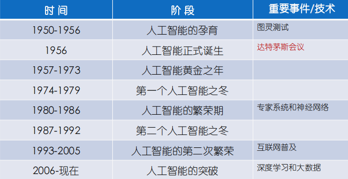
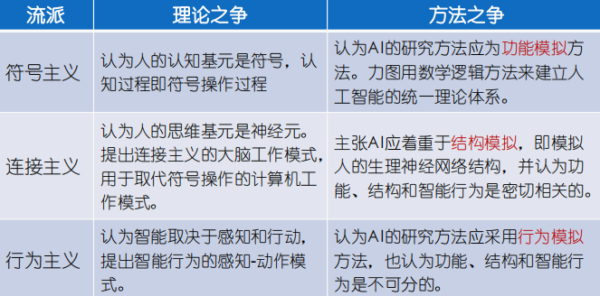

# 人工智能基础

期末复习整理

傻逼课，基本没听，老师不知道在讲什么，纯纯自学

还是说我是垃圾，层次不够

## 00 框架

## 01 绪论

### 什么是人工智能

智能=知识（智能行为基础）+智力（获取知识、应用知识求解问题能力）

感知、记忆、思维、学习、行为

达特茅斯会议，AI诞生标志

### 人工智能的基础

逻辑学
1. 命题逻辑（布尔逻辑），Boole
2. 一阶逻辑，布尔逻辑的扩展，增加了对象和关系
3. 关联逻辑（指称理论），揭示如何将逻辑中的对象和显式世界对象关联

概率论
1. 概览
2. 统计学方法：James Bernoulli，Pierre Laplace
3. 贝叶斯规则：Thomas Bayes，用于不确定推理的现代方法的基础

什么是可计算的？可计算性、易处理性（不能指数级增长）

经济学
1. 运筹学
2. 决策论
3. 博弈论

神经科学、认知科学、控制论

认知心理学
1. 注意机制
2. 记忆、感知、语言运用、问题求解……

### 人工智能历史

### 人工智能判定

1. 图灵测试
2. 图灵测试2.0
3. 中文屋

### 人工智能层级与流派

层级
1. 人工专用智能（弱人工智能）：ANI narrow  专注一个具体任务
2. 人工通用智能（强人工智能）：AGI general 应用于任何问题
3. 人工超级智能（超人工智能）：ASI super   超过人类的智能

功能
1. 指物：客观世界对象
2. 指心：人心世界对象
3. 指名：认知世界（符号世界）对象

流派
1. 符号主义：原理为物理符号系统假设和有限合理性原理
2. 连接主义：关注于大脑神经元及其连接机制，试图揭示人类智能的本质机理，学习
3. 行为主义：假设智能取决于感知和行动，不需要知识、表示和推理，而且不断进化

### 人工智能最新发展水平

机器学习、自然语言处理、智能调度、智能诊断、机器视觉、机器人学

 
 

## 02 体系论

### 人工智能的主体论点

符号与亚符号
1. 符号人工智能：知识可以由语义上由意义的符号结构组成，符号能表征实体
2. 亚符号人工智能：不确定和不精确是普遍事实，智能行为可以通过语义上无意义的亚符号获得（或许和概率派类似？）

整齐与不整齐
1. 整齐派：人工智能的解决方案是清晰可证明的，基于逻辑及其形式化扩展
2. 不整齐派：智能太复杂，无法用整齐的方法解决复杂人工智能问题，采用无定形的主义网络

逻辑与反逻辑
1. 逻辑派：
   1. 观点：机器无需仿真人类思维，发现抽象推理和问题求解本质
   2. 方法：形式逻辑、知识系统、专家系统
2. 反逻辑派：
   1. 观点：没有通用的逻辑
   2. 方法：常知识库（手工构建）

争论：计算心理学、计算哲学、机器智能

AI的智能主体范式
1. 主体：感受器感知环境，执行器对环境起作用
2. 智能主体：感知+一定思维+执行

### 理性智能体

环境、感知、动作

主体
1. 智能主体，具有一定思维
2. 计算主体：通过计算进行行为决策
3. 理性主体：能做出理性正确的判断

理性智能体
1. 环境感知能力
2. 一定的智力
3. 能够做正确的事

### 智能体的任务环境

任务环境规范描述

PEAS描述
1. P:Performance
2. E:Environment
3. A:Actuators
4. S:Sensors

完全可观测：传感器在 每个时间点课访问环境完整状态
部分可观测：不完全可观测

单智能体：一个智能体在一个环境内运行
多智能体：考虑环境中其他智能体

确定：环境状态完全由当前状态和智能体执行的动作决定
随机：不确定的

片段式（阵发性）：动作过程被分为原子片段，每个片段的动作选择取决于片段本身
延续式（连续性）：当前决策影响未来所有决策

静态：环境随智能体动作改变
动态：环境不随智能体动作改变
半动态：环境不随时间推移改变，智能体性能发生变化

离散型：
连续型：

已知：动作结果给定
未知：需学习如何动作

### 智能体的结构

### 智能体的类型

## 03 搜索问题求解

## 04 优化问题求解

## 05 博弈问题求解

## 06 约束问题求解

## 07 08 经典规划 

## 09 学习概述和学习任务

## 10 学习范式

## 11 学习框架和人工神经网络

## 12 知识表示

## 13 推理机制

