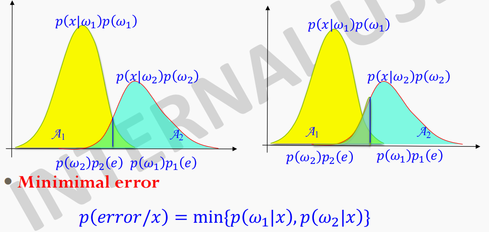
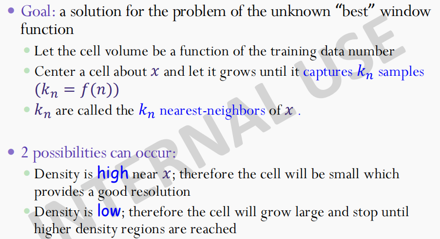
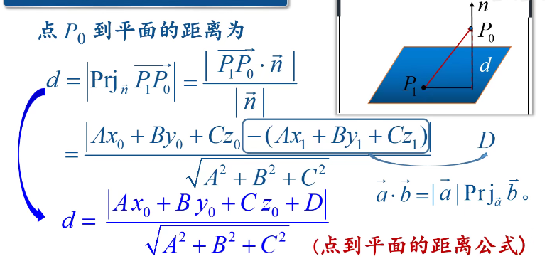
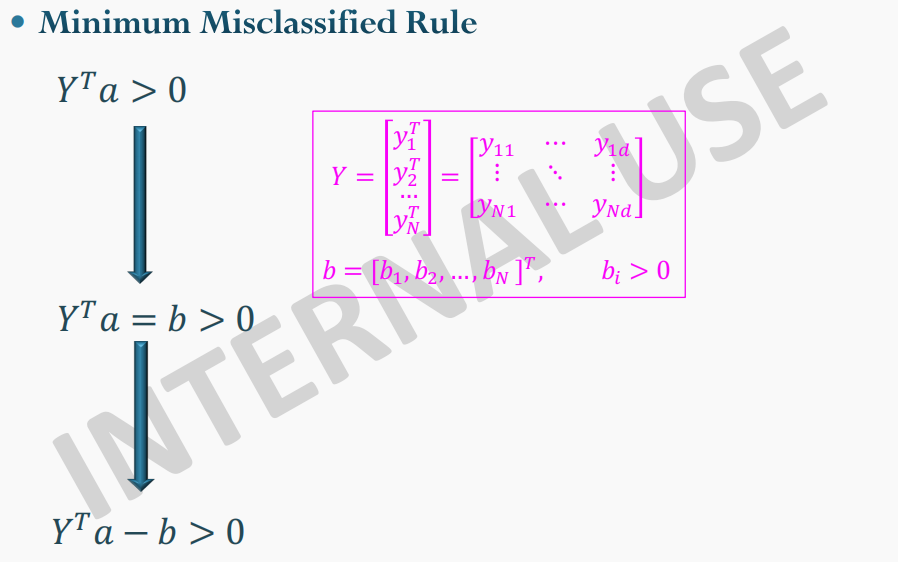
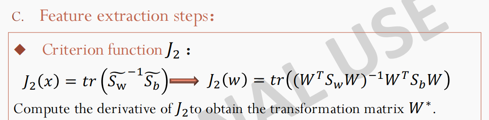
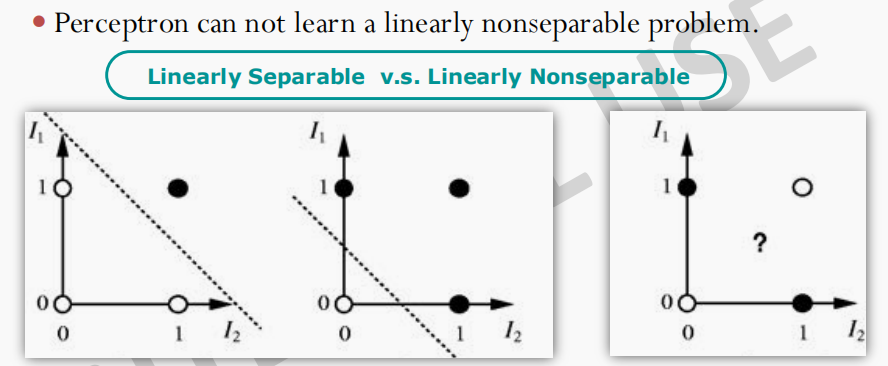
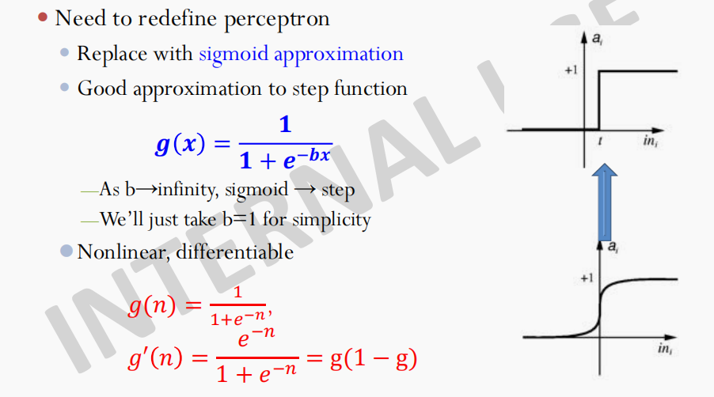

# 模式识别

[toc]

## 00 传送门 

REMAIN

## 01 Introduction

### Introduction to Pattern Recognition

To assign an object or event to one of a number of categories, based on features derived to emphasize commonalities.

Pattern is a set of objects or phenomena or concepts where the elements of the set are similar to one another in certain ways/aspects.

### Pattern Recognition Systems

模式识别步骤
1. 预处理 Preprocessing
   1. reduce influence of noise
   2. restore the degraded data
   3. standardize the feature(数模转换、二进制编码、滤波、transformation)
2. 特征提取 Feature Extraction
   1. 好的特征选取会对识别准确性带来很大提升
3. 分类&决定 Classification and Decision
   1. classifier design:分类规则通过训练样本学习
   2. classification decision:用分类器对输入数据进行识别
   3. Issue of generalization.泛化性

### Pattern Classification Methods

1. Supervised Learning
   1. 两个阶段：training（工程师 learn） & recognizing（用户 use）
2. Unsupervised Learning
   1. 将数据进行聚类，寻找内在联系和结构
   2. 不同的聚类方法将得到不同的clusters

### Relative Mathematics Concepts

#### probability distribution

#### normal distribution

#### standard normal distribution

 
 

## 02 Bayesian Decision Theory

### Introduction

Thomas Bayes --- Bayes Theorem

A theory for how to make decision in the presence of uncertainty.

三个重要概念：
1. 先验概率：prior probability : $p(\omega_i)$，反映了实际物体没有出现之前，我们所拥有的对可能出现的物体的先验知识。
2. 类条件概率：class-conditional probability density : $p(x|\omega_i)$，类别为$\omega$时，x的概率密度。
3. 后验概率：posterior probability : $p(\omega_i|x)$，在观察到物体特征向量x后做出的决策。
4. 变量说明：x是物体的特征向量，$\omega$是所有可能的类别

贝叶斯公式：将先验概率转换为后验概率

$p(\omega_i|x)=\frac{p(x|\omega_i) \times(\omega_i)}{p(x)}$

$posterior=\frac{likelihood \times prior}{evidence}$

可能需要配合全概率公式一起使用

从比较简单的判决函数转用贝叶斯公式计算后验概率，再进行分类（对于当前观察到的x显然$p(x)$的值相同，与类别无关，约去）

特殊情况

按照贝叶斯公式计算后验概率后的错误分类概率

贝叶斯决策实际上就是用后验概率来进行决策

### Bayesian Decision Theory

$\lambda$的用途：**在某个类别下做出某种决策的风险/损失**，记得是选使得R尽量小的决策。

条件风险：出现某个特征向量的时候，做出某种决策的风险/损失。无论遇到何种情况的特征，我们都可以通过选择最小化条件风险的行为使得预期损失最小。

积分是在整个特征空间进行的。如果想要总风险最小，就是选用这样一个判决函数$a(x)$来指导我们进行行为的决策（选出进行哪个行为），使得$R(a_i(x)|x)$对每个x尽可能小。

贝叶斯决策提供了一个总风险的优化过程。最小化后的总风险被称为贝叶斯风险$R^*$，它是可获得的最优的结果。

**这里的$\lambda_{ij}=\lambda(a_i|\omega_j)$代表当实际类别为$\omega_j$被判为$\omega_i$的风险/损失。**

通常这两个系数都是正的，因为一般来说，一次错误判断造成的损失比正确判决的大。

进一步整理得到下图：

一步步推导回顾：

#### 特殊情况：0/1损失函数

REMAIN

### Discrimination Functions

### The Normal Distribution

### Test

损失函数未给出，按照0-1损失，用后验

损失函数给出，提到的按提到的算，没提到的损失默认为0

判别函数，贝叶斯判别函数

正态分布是的正态分布，三种，随后一种简单分析

 
 

## 03 Parameter Estimation

### Introduction

在贝叶斯决策理论中，通过先验概率和类条件概率设计最优分类器。

在模式识别实际中，一般得不到有关问题的的概率结构的全部知识。往往只有一些模糊龙潭的知识，和一些训练数据（设计样本），这些样本是待分类模式的子集。

如果事先知道参数个数，并且先验知识允许我们能够把条件概率密度进行参数化。例如可以假设类条件概率为一个**多元正态分布**。**这样将问题从估计完全未知的概率密度转化为估计参数**。（i.i.d == independent and identically distributed == 独立同分布）

两种最常用的方法：
1. **最大似然估计**
2. **贝叶斯估计**

最大似然估计将带估计的参数看作确定的量，只是取值未知。最佳估计就是产生使得已观测到的样本的概率为最大的那个值。

贝叶斯估计把带估计的参数看作符合某种先验概率分布的随机变量。对样本观测的过程就是把先验概率密度转化为后验概率密度，利用样本对参数初始估计值进行修正。（每次观测到新的样本都使得后验概率密度函数变得更加尖锐）

**无论使用哪种参数估计方法，都使用后验概率作为分类准则**

### Maximum-Likelihood Estimation

极大似然估计性质：①收敛的好 ②比贝叶斯估计简单

#### General Principle

特征向量服从$p(x|\omega_i)$分布，假设似然函数参数的形式给出，构成未知向量$\theta_i$。为了表示与$\theta_i$有关，记为$p(x|\omega_i,\theta_i)$。

假设属于类别$D_i$的训练样本对于参数向量$\theta_j(j\not = i)$的估计不提供任何信息。也就是，假设每个参数向量$\theta_j$对它所属的类别起的作用都是向量独立互不影响的。每个参数向量只对自己的类别中的向量起作用。

多元高斯分布：

**$\mu$是均值，$\Sigma$是协方差矩阵**

$p(x|\omega_i) \equiv p(x|\omega_i,\theta_i)$表示了：对于类别$\omega_i$只有$\theta_i$决定了概率密度。

**假设有c个样本集，那么就会有c个独立的问题**：已知样本D（实际问题中属于某一类的样本），每一个样本都是独立的根据已知形式的概率密度函数$p(x|\theta)$抽取得到的，要求使用这些样本估计概率密度函数中参数向量$\theta$的值（这里的$\theta$指的应该是这一类的）。

$p(D|\theta)$是似然函数

底数大于1的对数函数是单调递增的，所以使得似然函数达到最大的参数向量$\hat{\theta}$也使得似然函数达到最大。

如果似然函数可微，可以通过标准的微分运算求得$\hat{\theta}$。

因为取了对数，所以$\prod$变成了$\Sigma$。

**这个等式是求解最大似然估计的必要条件（不是充分条件）**，所有的极值点都已经求得，就能确定其中一定有一个是全局最优点。

#### 高斯情况：$\mu$未知

对多元正态分布函数，先取对数，再进行求导。

公式说明：**对均值的最大似然估计就是对全体样本取平均，也就是居之地的极大似然估计等于样本均值。**

#### 高斯情况：$\mu$和$\Sigma$均未知

先考虑单变量情况：即$\theta$的组成成分是$\theta_1=\mu$，$\theta_2=\sigma^2$

对对数似然函数关于变量$\theta$求导

推广到多元情况

得到结论：**实际均值的最大似然估计就是样本均值，协方差的最大似然估计就是n个$(x_k-\hat{\mu})(x_k-\hat{\mu})^T$矩阵的算数平均**

#### 估计的偏差

前面所述的对方差的最大似然估计是**有偏估计**。对所有可能的大小为n的样本集进行方差估计，其数学期望并不等于实际的方差。（样本均值只是实际均值的最大似然估计，将实际均值的最大似估计代入，并不能直接当作协方差方差的最大似然估计，只有将实际均值代入，才是无偏估计）。这个有偏估计是渐近无偏估计。

#### 一般情况

对于一般情况，得到一个含有位置参数的概率密度函数。取n个点求出似然函数，再将其转为对数似然函数，进行求导，并得到未知参数的极大似然估计。

### Bayesian Estimation

REMAIN

### Test

贝叶斯参数估计了解一下

极大似然估计要掌握

 
 

## 04 Non-Parametric Estimation and Nearest-Neighbor Classification

### Portals

[机器学习数学基础 | 非参数估计](https://www.bilibili.com/video/BV1HE411N7p6)

### Introduction

大多数模式识别方法都假设密度函数的形式已知，而且相关的未知参数是可估计的，在此条件下进行有监督学习过程。实际情况，上述假设未必成立。

概率密度函数形式也很少符合实际情况。所有经典密度函数都是单模的，只有一个局部极大值，现实中情况大多是多模的。

**使用非参数方法(non-parametric method)，能够处理任意的概率分布，而不必假设概率密度的参数形式已知。**

非参数估计来源于非参数统计学

两种方法：直方图，近邻搜索

Lazy Learning（Nonparametric Estimation）保留数据，想想KNN

Eager Learning（Parametric Estimation）根据数据学习出参数

### Density Estimation 概率密度的估计

P是概率密度函数p(x)平滑后的(取平均)之后的版本。可以通过估计概率P来估计概率密度函数p。

显然，一共n个样本，其中k个样本落在区域R中的概率服从二项式分布定理。k的期望值为$E[k]=np$。

k的二项分布在均值附近由显著的波峰。所以$\frac{k}{n}$是概率P的一共很好的估计，当n足够大时，非常准确。

V是区域R所包含的体积。

当R足够小，p就是一个常数。在不同欧氏空间，V代表不同含义。

上述所讨论的都是理想情况：如果希望得到p(x)，而不是平滑后的版本P，我们必须要求体积V趋近于0。另一方面，如果在固定样本个数n的前提下，让体积V趋近于0，区域R也不得不变得很小，区域中可能就不包含任何样本了（$p(x) \approx 0 $），估计结果变得无意义。或者碰巧有样本落到x处，估计的结果就变为无穷大。从实际的观点说，不得不接受一定程度的平滑效果。

为了估计点x处的概率密度函数，构造一系列包含点x的区域：$R_1,R_2...$。第一个区域使用1个样本，第二个区域使用2个样本……记$V_N$为区域$R_n$的体积，$k_n$为$R_n$中的样本个数，$p_n(x)$表示对$p(x)$的第n次估计。**n是样本个数**。

若要求$p_n(x)$收敛到$p(x)$，则要满足下面三个条件。

第三个条件说明，虽然落在小区域$R_n$的样本个数很大，但在全体样本所占比例很小。

有两种获得区域序列的途径
1. Parzen窗方法
2. $k_n$-近邻法

这两种方法最终都能收敛，但是在有限样本的情况下很呐预料他们的效果。

### Parzen Windows

$\varphi(u)$表示一个中心在原点的单位超立方体（通过判断单位化后是否在单位超立方体中，判断本身在不在超立方体中），$h_n$表示超立方体一条边的长度。

求出所有在划分区域中的点的个数，并带入公式$p_n=\frac{k/n}{V_n}$

**相当于在每个样本点的位置叠加一个窗函数，想要知道x点的概率密度，就将不同位置的窗函数在点x处的作用进行叠加。**

上述公式表示每一个样本$x_i$根据它距离x的远近不同，对结果做出不同贡献。将所有的$x_i$的作用进行求和即得到在点x处的概率密度。

通过下面两条规则的约束，可以保证$p_n(x)$是一个合理的概率密度（最后有$\frac{1}{n}$进行了归一化，总和变为1），还要保证$V_n=(h_n)^d$。

讨论窗的宽度$k_n$对$p_n(x)$的影响:

如果$h_n$很大，$\delta_n$的强度较小，宽度较大，是散焦out-of-focus的估计。

如果$h_n$很小，$\delta_n$的有些部分峰值很大，尖脉冲的叠加，充满噪声。

推广来看，$\varphi(\mu)$未必需要是一个超立方体，可以是任意形式，只要用窗函数的自变量x包围的体积作为$V_n$即可。

这里使用二维圆周对称正态Parzen窗。

**注意纵轴经过了归一化，实际的高度并不相同。**如果窗函数太尖锐，确实会在概率密度函数中产生凹陷。

为了得到精确的估计，所需样本个数非常多。当$n = \infty$，即时窗函数宽度不同，各种估计的结果相同。

### $k_n$-Nearest Neighbor Estimation

由于最佳的窗函数的选择总是一个问题，一种可行的解决方法是让体积称为训练样本的函数，而不是硬性规定窗函数为全体样本个数的某个函数。例如，为了从n个训练样本中估计$p(x)$，以点x为中心，让体积扩张，直到包含进$k_n$个样本为止。这些样本被称为点x的$k_n$个最近邻。

如果点x附近的概率密度很大，则体积就相对较小。

REMAIN

### The Nearest-Neighbor Rule 最近邻规则

每个样本所属的类别均已知。对于测试样本点x，在集合中理他最近的点记为x'。最近邻规则的分类方法就是**把x分为x'所属的类别**。**最近邻规则是次优的方法，通常的误差率比最小可能误差率（即贝叶斯误差率）大，但不会超过两倍。**

对最近邻规则能够很好工作的感性理解。**首先，赋予最近邻点的标记$\theta'$本身就是一个随机变量。$\theta'=\omega_i$的概率无非就是后验概率$P(\omega_i|x')$**。当样本个数足够大，有理由认为x'和x距离足够小，使得$P(\omega_i|x') \approx P(\omega_i|x)$，因为这恰好就是状态位于$\omega_i$的概率。

空间Voronoi网格

当$k=\infty$，就等同于贝叶斯决策。

### Test

Parzen窗口和KNN估计要掌握

 
 

## 05 Linear Classification

### Portals

### Introduction

**之前假设的是概率密度函数的参数形式已知**，通过训练样本估计概率密度的参数值。

**现在假定判别函数的参数形式已知**，通过训练的方法来估计判别函数的参数值。

线性判别函数相对容易计算

线性判别函数：x的各个分量的线性函数，或者是以x为自变量的某些函数的线性函数

**寻找线性判别函数将被形式化为极小化准则函数的问题**，以分类为目的的准则函数可以是**样本风险、训练误差**，即对训练样本集进行分类所引起的平均损失。

### Linear Discriminant Functions

W是权向量，$\omega_0$被称为偏置（阈值权）

**令g(x)=0**即得到用于分类的判定面（超平面）

超平面上每一点满足该等式，代入任意两点，**可得到$W$与超平面上任意向量正交**。

$x_p$是$x$在超平面$H$上的正交投影，易得$g(x_p)=0$

另外，$\frac{w_0}{||w||}$是原点到$H$的距离。

超平面方向由法向量W决定，位置由偏置决定。

多分类问题

c分类问题（c为类别个数），可以转化为c-1次二分类问题（每一次判断是不是这一类的）

c分类问题（c为类别个数），也可以转化为$\frac{c(c-1)}{2}$个二分类问题，每两类生成一个超平面(实际上可能不需要那么多)。

线性分类器存在的问题
1. 线性分类器所划分的区域是凸的，这限制了线性分类器的适应性和精确性。
2. 每一个判决区域都是单连通的，对于条件概率密度$p(x|\omega_i)$为单峰的问题合适。
3. 会产生无法分类的情况（粉色区域）

#### Decision Trees 决策树

好的决策树性质：
1. 最小化节点数
2. 最小化叶子结点到根结点的距离
3. 最小化叶子结点到根结点的平均距离

决策树决策方式
1. 穷举法：search all possible decision tree and select the best one (the one with the minimum error)
2. 后验概率

#### Generalized Linear Discrimination Functions 广义线性判别函数

通过加入额外的项（W的各对分量之间的乘积）

二次判别函数(Quadratic)

**得到的判别函数不是x的线性函数，而是y的线性函数。（非线性）判别函数和数据同时被映射，在高维空间进行判别（判别函数在高维被映射为线性函数），不考虑在低维空间中判别函数的形式。**

二次判别函数共有$(d + \frac{d \times (d-1)}{2} + d + 1)=\frac{(d+1)\times(d+2)}{2}$项(二阶自身+二阶不同+一阶+偏置)(d是数据维数)

将一条直线映射为三维空间的一条抛物线。产生了一维空间的非单连通区域。

将二维输入映射到三维空间。

异或问题例子：

多项式判别函数(Polynomial)

增广特征向量&增广权向量（augmented）

维数灾难

#### 线性判别函数（LDF）的设计

准则函数展现了分类器性能的好坏。

### Fisher Linear Discrimination

Ronald Aylmer Fisher(1892-1962)

解决维数灾难，适用于有监督（有监督标签）

虽然将d维数据直接投影到直线上可能会导致样本被混叠。但是我们可以找到一个大致方向。

如何选择最好的投影方向？可以以**不同类别（聚类）样本均值之间的距离，通过使得投影后最远（也就是距离的投影）**为判断标准。**但是如果每一类方差的主方向和这一条投影的直线不正交，分类效果将不会很好**。本图就是效果并不好的体现。

这张图显然比上一张图的分类效果更好。

#### 基本准则：

#### Fisher线性判别函数的数学推导:

对于一个二分类问题

①先求样本均值。对于**一维数据，通过公式$y=w^tx$进行投影，如果$w$是单位向量，则$y$就是投影**。其实可以直接对d维数据均值进行投影，不必计算每一点的投影再进行平均。

②计算类内散度矩阵。**每一类的散度矩阵对于每一点求和，然后对不同类进行求和，得到$S_w$**，可以只计算d维的情况，然后进行投影，便于计算。

③计算类间散度矩阵。**每一类之间均值的距离**，同样可以只计算d维的情况，然后进行投影，便于计算。

④根据投影的基本准则建立准则函数，**类间散度/类内散度**

⑤利用**拉格朗日函数**，通过求导的方式计算出投影的方向$w^*$。其中R是一个标量，且$\frac{R}{\lambda}$，也为一标量，所以对于求投影方向并没有影响。

⑥最后写出分类函数，$w_0$在样本数量较小的情况下可以由下面三个公式获得。

#### 推广到多分类问题

 
 

### Perceptron Criterion Function 感知器准则函数

感知机模型如下。

#### 两类线性可分的情况

用样本确定一个判别函数$g(x)=a^ty$，的权向量a。寻找一个能够将所有样本正确分类的权向量。如果这个权向量存在，则称为**线性可分(linear Separable)**。

求解权向量其实就是确定权空间中的一点。每个样本都对解向量的可能位置给出限制。

通过规范化（例如取负值等方法）将所有规范化后的点归为一类。通过规范化，我们可以不关注标签，然后去寻找权向量$a$使得$a^ty_i>0$对所有样本成立。这样的权向量被称为“分离向量”或者“解向量”。

有几种增加附加要求的方式来对解向量进一步限制。等式$a^ty_i$定义了一个穿过权空间原点的超平面$y_i$为法向量。有两种限制方法：
1. 找到一个单位长度的权向量，它使得从样本到分类平面的最小距离达到最大
2. 在所有i中寻找满足$a^ty_i \geqslant b > 0$的具有最小长度的权向量。b被称作“边沿裕量”，是一个正的常数。

图中所展示的是由$a^ty_i \geqslant b > 0$所产生的正半空间的交叠区域。新的交叠区在原解区中，且他和原边界被隔开的距离为$\frac{b}{||y_i||}$。

感知机准则函数

**$y'$已经经过了规范化。如果经过规范化仍然无法使得$a^ty'>0$则任务是误分类的。**通过让准则函数逐渐减小，修正超平面位置，使得误分类的点数量减小。

梯度下降法步骤（计算对权向量$a^t$每一个分量的梯度并求和）

### Minimum Error Classification

感知机算法不能解决线性不可分问题。

### Minimun Squared Error Procedures 最小平方误差方法

之前将注意力放在被错分的样本上，现在考虑包含所有样本的准则函数。

线性方程组可以使用矩阵来简化表达。问题是找到一个权向量使得它满足线性方程组。一般情况下矩阵是收高形的，也就是行比列多。导致权向量$a$是超定的，通常不能同时满足所有方程。

此处b可以代表裕量。

利用空间进行直观理解。定义误差向量和准则函数。

求解伪逆矩阵$Y^+$（利用梯度=0），与向量b相乘即得到权向量$a^*$

### Nonlinear Discriminant Functions

REMAIN

### Test

概念、算法多

Fisher  感知器

最小错误分类、最小平方错误分类 计算较复杂

伪逆矩阵需要掌握

非线性判别函数 看懂例题即可

 
 

## 06 Feature Selection and Feature Extraction

### Portal

[同济小旭学长讲PCA](https://www.bilibili.com/video/BV1E5411E71z)

### Introduction

know what features to select? (PCA LDA ICA Transforms)

reduce misclassification error ---> better feature

特征种类
1. 统计特征
2. 时域特征
3. 几何特征
4. 光谱特征

Dimensionality Reduction 降维
1. 大多数learning方法对于高维数据效率低
2. 数据的本征维数可能很小（治病基因可能很短）
3. 特征特征是confusable的
4. 简化计算，简化特征空间结构（分界面结构简单）

特征抽取和特征选择是DimensionalityReduction（降维）的两种方法，针对于the curse of dimensionality(维灾难)，都可以达到降维的目的。但是这两个有所不同。

1. 特征抽取（Feature Extraction）:Creating a subset of new features by combinations of the existing features.也就是说，特征抽取后的新特征是原来特征的一个映射。

2. 特征选择（Feature Selection）:choosing a subset of all the features(the ones more informative)。也就是说，特征选择后的特征是原来特征的一个子集。

好的特征集合的条件：
1. 具有很大的识别信息量（很好的可分性）
2. 具有可靠性（模棱两可的似是而非的应该去掉）
3. 具有尽可能强的独立性（重复的、相关性强的不会增加更大分类信息）
4. 数量尽可能少，同时损失的信息量尽可能小（计算快）

### Class Separability Criterion 类别可分性准则

[特征提取 --武汉大学](https://www.bilibili.com/video/BV1U54y1i7dZ)

[特征提取 --国防科技大学](https://www.bilibili.com/video/BV144411D74h?p=34)

需要一个准则函数J(criterion function)，衡量不同特征及其组合的分类有效性，例如Minimum Error Rate(错误分类最小)

理想准则：某组特征使得分类器错误概率最小。但是，在实际应用中，直接使用是非常困难的，此时还没有训练分类器；对不同特征，训练的分类器也不同；也不能保证分类器在训练后是最理想的。

实际的类别可分性判据硬满足的条件（4个）：

可分性判据越大，误分率越小

i、j代表类，Jij>0说明可分

互相独立时，总贡献是每一个特征的贡献，具有可加性

加入新特征，提高可分性（至少不降低）

**不是所有可分性判据都能满足所有上述条件，选取最重要的**

#### Based on Distance 距离度量

直接基于样本，不涉及分类器，所以应用广泛

##### 距离函数

常见的有以下5种。

闵可夫斯基、欧几里得、切比雪夫

##### 准则函数

tr是迹，即方阵的主对角线元素的总和

Sw：within-class scatter matrix 类内散度矩阵 越小越好

Sb：between-class scatter matrix 类间散度矩阵 越大越好

##### 特征提取步骤

投影后的散度矩阵可以用原空间的进行计算。

#### Based on Probability 概率分布

#### Base on Entropy Function 熵函数

### Feature Extraction

是对于原来特征的一个低维**映射**，凝练出**新特征**

based on distance

based on probability distance

#### PCA 主成分分析

用于数据降维

省去某些维度信息

目标：将数据投影到新坐标系，使得信息保留最多

评判标准：使得数据分布尽量分散（方差大），作为主成分（坐标系）

保存信息：
1. 新坐标系原点
2. 新坐标系角度
3. 新坐标点

操作步骤：
1. 去中心化，将坐标原点放在数据中心
2. 找新的坐标系，找到投影后方差最大的方向（因为去中心化，所以所有数据点到原点的距离为常数。由勾股定理，当点到投影平面的距离最短时，投影点到原点的距离平方最大，也就是方差最大。因为到投影平面的距离短，所以保留了数据信息）

数据变换
1. 数据线性变换

    

2. 数据旋转变换

    

白数据$D$，x与y不相关，且都符合标准正态分布。通过先拉伸后旋转变化得到$D'$，此时x与y相关

现在我们已有的数据是$D'$，希望通过操作将已有数据还原成白数据

问题转化为求R？

**协方差矩阵的单位特征向量就是R，特征值就是新数据的方差**

对本例$\bar{x}、\bar{y}$均为0，因为已经进行区中心化

这里体现出了，协方差矩阵的特征向量拼接起来就是R。L其实就是特征值组成的向量

选取几个最大特征值对应的特征向量，将数据**左乘**以这些特征向量所合成的矩阵的**转置**即进行了映射（投影）。

outsider将会对求解结果造成很大影响

#### PCA步骤

先对数据进行去中心化

求得协方差矩阵

先求出协方差矩阵的特征值，再求得对应的特征向量

较大的特征值所对应的特征向量就是投影的方向

对于高维数据，可能需要选取较多的特征向量，并合成矩阵转置后再右乘数据，进行降维

### Feature Selection

**从原始特征中选择**有代表性、分类性的特征，Dnew < Dorigin

#### 特征选择方法

1. 最优的 optimal
   1. exhaustive search 穷举搜索
   2. branch and bound search 分支限界搜索
2. 次优的 suboptimal
   1. Sequential Forward Search(SFS) 序列前向选择
   2. Sequential Backward Search(SBS) 序列后向选择
   3. Plus 1 take away r
   4. Sequential Forward Floating Search(SFFS)
   5. Sequential Backward Floating Search(SBFS)
   6. Best Individual Features

 

穷举搜索会生成每一个可能的解，保证了最优性，所以效率低。

分支界定法，搜索状态空间树，可以通过bound进行剪枝。并且有两个模块：
1. 一个用于在搜索解空间时生成分支
2. 另一个生成bound，即时剪断一些分支

 

SFS：特征子集X从空集开始，每次选择一个特征x加入特征子集X，使得特征函数J(X)最优。简单说就是，每次都选择一个使得评价函数的取值达到最优的特征加入，其实就是一种简单的贪心算法。

SBS：从特征全集O开始，每次从特征集O中剔除一个特征x，使得剔除特征x后评价函数值达到最优。序列后向选择与序列前向选择正好相反，它的缺点是特征只能去除不能加入。

SFS与SBS都属于贪心算法，容易陷入局部最优值。

### Test

类的可分离性

PCA 协方差矩阵

准则函数，题目会告诉选取哪一个

模拟退火和遗传算法不考

## 07 Unsupervised Learning and Clustering

### Portal

[K-means Blog](https://zhuanlan.zhihu.com/p/78798251)

[物以类聚的Kmeans](https://www.bilibili.com/video/BV1ei4y1V7hX)

[什么是K-Means](https://www.bilibili.com/video/BV1mf4y1k7UC)

### Introduction

Supervised(Labeled Data)

Unsupervised(Unlabeled Data)

目标：
1. Find the class label
2. Find the number of classes directly from data

评价指标：
1. high **intra-class** similarity:cohesive within clusters
   
   高类间相似：**聚类内**的凝聚力

2. low **inter-class** similarity:distinctive berween clusters
   
   低类阶级相似：**聚类间**的独特性

    

**聚类是主观的**

**类的概念是模棱两可的**（可以有很多的聚类的方法，聚成不同的类）

聚类算法
1. 基于邻接度 contiguity
2. 基于密度 density
3. 基于欧式密度 Euclidean density

Definition Distance Measures

distance(dissimilarity)

1. 欧氏距离
   
   

2. 三角距离
   
   

应用
1. 图像处理
   1. 图片分组
   2. Image Segmentation
2. 网页
   1. 用户分类
3. 信息生物学
   1. 蛋白质聚类

### Probability Model-Based Clustering

对于每个区域，概率密度都是单峰的(unimodal distribution)

REMAIN

### Dynamic Clustering

基本方法
1. K-means
2. K-medoids
3. Fuzzy c-means
4. ISODATA

#### K-means算法

无监督聚类算法

K代表类别数 cluster number

不断迭代的算法

收敛到一个局部最小值

Ck指的是每一个类别的中心

算法步骤：

1. （随机）选择K个值，作为聚类的初始中心

2. 对任意一个样本点，求其到K个聚类中心的距离，将样本点**归类到距离最小的中心的聚类**，如此迭代n次
   
   

3. 每次迭代过程中，利用均值等方法**更新各个聚类的中心点(质心)**，假定找到的成员都是正确的

4. 对K个聚类中心，利用2,3步迭代更新后，如果位置点变化很小(可以设置阈值)，则认为达到稳定状态，迭代结束，对不同的聚类块和聚类中心可选择不同的颜色标注

优点：
1. 原理比较简单，实现也是很容易，收敛速度快(not always) 
2. 聚类效果较优。 
3. 算法的可解释度比较强。 
4. 主要需要调参的参数仅仅是簇数k。

问题：
1. 不同的初始中心点导致不同的聚类结果
   1. 不使用随机，采用某些方法（选择距离聚类中心最远的点）
   2. 解决方法：K-means++……
2. 不同K的选择导致不同结果
   1. 随着K增加，J(D)单调减小
   2. 解决方法：手肘法、GapStatistic……
      

缺点：
1. 需要预先设定K
2. 初始点的选择对结果影响大
3. 对于非凸的数据集比较难收敛 
4. 如果各隐含类别的数据不平衡，比如各隐含类别的数据量严重失衡，或者各隐含类别的方差不同，则聚类效果不佳。
5.  最终结果和初始点的选择有关，容易陷入局部最优
6.  对噪音（noisy）和异常点（离群点outlier）比较的敏感

### Hierarchical Clustering 分层聚类

hierarchical cluster
1. 基于欧氏距离
   1. agglomerative 聚合的
   2. divisive 分裂的
2. 基于概率

#### hierarchical cluster Ⅰ

partition data set sequentially

tree of clusters

##### Distance Measure
1. singe link
   两个聚类中最接近的两个元素之间的距离

   

2. complete link
   两个聚类中最远的两个元素之间的距离

   

3. average link
   两个聚类中任意的两个点之间的距离的平均值

   

不同link的不同聚类结果

##### agglomerative聚类步骤

##### 例子

一遍遍的刷新矩阵，矩阵逐渐变小。直到最后2×2矩阵，不用写成1×1

汇合点所标记的只就是更新矩阵时找到的非零最小值

##### 相关问题

dendrogram n.系统树图

知道分为几类，就知道最终结果

选择最长的lifetime，某次合并的Δ最大，表示将两个不同的类进行合并

#### hierarchical cluster Ⅱ

暂无

#### 总结

 
 

### Test

K均值

分层聚类

答题规范

## 08 Artificial Neural Networks for Pattern Recognition

### Introduction

#### Biological Inspiration
Learning by adaption
   

spikes 脉冲

synaptic 突触，给一个权重

excitation 刺激

inhibition 抑制

#### Artificial neurons and neural networks

神经元激活函数

perceptron 感知机：change weight to decrease the error

**error=(what we got)-(what we wanted)**

topology 拓扑

#### Artificial neural networks application

ALV:autonomous Land Vehicle

### Feed-forward Neural Network

#### Single Layer Perceptron

单层感知机，只能回答对还是错。

计算权重时，先随机初始化，一般选择在[-0.5,0.5]之间。在网络中挑选一个点。

利用梯度下降法

感知机不能通过学习解决一个线性不可分问题。

#### Multilayer Perceptron (MLPs)

用g(x)近似阶跃函数，使其可导。

### Neural Networks Methods

### ANN Design

### Test

三个网络
