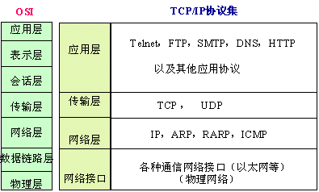

# 系统编程

[toc]

## Portals

REMAIN

## 黑皮书知识点整理

### 01 进程视角

#### 进程

进程是通信的最终端点

由操作系统进行调度

**进程和程序关系**

程序错误产生：语法、逻辑

编译器将高级指令转为机器代码

进程状态&进程映像

进程标识符(PID:Process IDentifier)

 

#### 进程调度

操作系统 --> 调度器

调度概念：
1. 时间片（份额）：就绪 运行 上下文切换 调度开销 时间片不能过长过短 时间片长度基本不变
2. 进程状态：就绪 运行 阻塞 （**进程解除阻塞，并不直接进入运行，必须经过就绪**）
3. 调度器：分派（分派器，进程状态恢复） 上下文切换
4. 调度算法目标（4点）：公平性、最小调度开销、最小进程等待时间、最大化吞吐量
5. 避免“饥饿”
6. 调度算法（6点）：先来先服务FCFS、最短作业优先SJF、时间片轮转RR、最短剩余作业优先SRJN、多级队列、多级反馈队列MLFQ

现代操作系统：Windows NT(New Tech) 32个优先级的MLQF，Linux

**信号量、互斥锁、事件触发**（同步手段）

#### 进程间通信

进程间通信(IPC Interprocess Communication)
1. 消息
2. 剪贴板
3. 共享内存
4. 管道
5. socket
6. ROS

SOCKET套接字
1. 位于7层网络模型的传输层。基于套接字的IPC实现可以使用TCP也可使用UDP
2. 通过专用通道通信
3. **一个进程可以使用多个套接字**，一个计算机可以有多个IP地址（多个网卡）
4. 要建立通信，进程需要先创建一个socket（操作系统创建socket并将ID给进程）

#### 线程

单线程

同一个进程中的线程共享进程资源（内存、文件、网络连接）

同步机制管制对共享内存的访问

线程间通信能够通过使用进程地址空间中共享内存实现

线程分类：
1. 内核级线程：内核级调度：每一个线程都被独立调度，运行进程使用更多资源
2. 用户级线程

同步与异步线程操作：join原语

线程带来的额外复杂性
1. 多线程对进程数据空间的共享访问，可能出现不同线程动作时序不一致（不确定性）
2. 信号量、互斥锁 --> 对资源的互斥访问
3. 多线程有利于最大限度利用处理器计算资源

### 02 通信视角

#### 概述

RPC:Remote Procedure Call 远程过程调用

RMI:Remote Method Invocation 远程方法调用

#### 寻址方式

消息接收者在寻址中的标识方式（4种）
1. 单播通信（打电话），消息发送到特定编址的目标进程
2. 广播通信（主持人），传递给全部进程，使用一个特殊的广播地址
3. 多播通信（一对多），传递给一组进程，使用一个特殊的多播地址
4. 任播通信 传递到一个组中最近的潜在成员（TCP UDP不直接支持）

#### TCP/IP

模型

**传输层关注特定进程之间的通信**

TCP : Transport Control Protocol 传输控制协议

UDP : User Datagram Protocol 用户数据报协议

TCP/IP协议栈

计算机端口标识特定进程

#### IP

网络层的主要协议

网络流量 --> IP数据包

**路由**基于IP协议头部携带的目的IP地址进行

IPv4、IPv6（前者地址范围有限，后者提供更高的服务质量）

TTL字段防止路由环路。数据包经过一个路由器，TTL值减一。若值为0，数据包被丢弃。

### 03 资源视角

#### 通信中的存储器资源

发送缓冲区/传输缓冲区

缓冲区是一块连续的内存块（**一维、连续，链表不行（不连续，需要序列化）**）

#### 虚拟内存

进程的内存空间到VM系统再到存储介质上的实际位置的映射。

REMAIN

特定算法（4点）
1. 最近最少使用 LRU
2. 最不经常使用 LFU
3. 先进先出 FIFO
4. 随机算法

#### 事务

事务是一种提供资源访问结构的机制。**当一个进程请求访问一个资源，执行检测，确保该资源没有参与进一个正在运行的事务**。如果被占用，则新请求需要等待，否则创建一个新事务（避免其他进程访问资源）。

四个准则：
1. 原子性
2. 一致性
3. 隔离性
4. 持续性

#### 锁

用于标识资源处于使用状态

可以在事务内使用

抑制并发性

#### 死锁

每个进程都在等待使用被集合中其他进程所持有的资源。

4个条件
1. 互斥
2. 占用且等待
3. 非抢占
4. 循环等待

#### 网络带宽

带宽 --- 珍贵的资源

应答开销、协议开销 使得有效载荷<1

## 课程PPT整理

## 大作业代码汇总

