# 系统编程

[toc]

## Portals

[]()

[]()

REMAIN

## 黑皮书知识点整理

### 01 进程视角

#### 进程

进程是通信的最终端点

由操作系统进行调度

**进程和程序关系**

程序错误产生：语法、逻辑

编译器将高级指令转为机器代码

进程状态&进程映像

进程标识符(PID:Process IDentifier)

<br>

#### 进程调度

操作系统 --> 调度器

调度概念：
1. 时间片（份额）：就绪 运行 上下文切换 调度开销 时间片不能过长过短 时间片长度基本不变
2. 进程状态：就绪 运行 阻塞 （**进程解除阻塞，并不直接进入运行，必须经过就绪**）
3. 调度器：分派（分派器，进程状态恢复） 上下文切换
4. 调度算法目标（4点）：公平性、最小调度开销、最小进程等待时间、最大化吞吐量
5. 避免“饥饿”
6. 调度算法（6点）：先来先服务FCFS、最短作业优先SJF、时间片轮转RR、最短剩余作业优先SRJN、多级队列、多级反馈队列MLFQ

现代操作系统：Windows NT(New Tech) 32个优先级的MLQF，Linux

**信号量、互斥锁、事件触发**（同步手段）

#### 进程间通信

进程间通信(IPC Interprocess Communication)
1. 消息
2. 剪贴板
3. 共享内存
4. 管道
5. socket
6. ROS

SOCKET套接字
1. 位于7层网络模型的传输层。基于套接字的IPC实现可以使用TCP也可使用UDP
2. 通过专用通道通信
3. **一个进程可以使用多个套接字**，一个计算机可以有多个IP地址（多个网卡）
4. 要建立通信，进程需要先创建一个socket（操作系统创建socket并将ID给进程）

#### 线程

单线程

同一个进程中的线程共享进程资源（内存、文件、网络连接）

同步机制管制对共享内存的访问

线程间通信能够通过使用进程地址空间中共享内存实现

线程分类：
1. 内核级线程：内核级调度：每一个线程都被独立调度，运行进程使用更多资源
2. 用户级线程

同步与异步线程操作：join原语

线程带来的额外复杂性
1. 多线程对进程数据空间的共享访问，可能出现不同线程动作时序不一致（不确定性）
2. 信号量、互斥锁 --> 对资源的互斥访问
3. 多线程有利于最大限度利用处理器计算资源

<br>
<br>

### 02 通信视角

#### 概述

RPC:Remote Procedure Call 远程过程调用

RMI:Remote Method Invocation 远程方法调用

#### 寻址方式

消息接收者在寻址中的标识方式（4种）
1. 单播通信（打电话），消息发送到特定编址的目标进程
2. 广播通信（主持人），传递给全部进程，使用一个特殊的广播地址
3. 多播通信（一对多），传递给一组进程，使用一个特殊的多播地址
4. 任播通信 传递到一个组中最近的潜在成员（TCP UDP不直接支持）

#### TCP/IP

模型


**传输层关注特定进程之间的通信**

TCP : Transport Control Protocol 传输控制协议

UDP : User Datagram Protocol 用户数据报协议

TCP/IP协议栈

计算机端口标识特定进程

#### IP

**网络层**的主要协议

网络流量 --> IP数据包

**路由**基于IP协议头部携带的目的IP地址进行

IPv4、IPv6（前者地址范围有限，后者提供更高的服务质量）

TTL字段防止路由环路。数据包经过一个路由器，TTL值减一。若值为0，数据包被丢弃。

#### TCP

面向连接的协议，在消息发送和传输前，先要建立逻辑连接

面向字节流（无结构字节流）

全双工通信

**TCP连接是单播**，连接只能在一对进程之间，可以建立多个连接

TCP头部。

源端口&目的端口，进程级寻址能力。

定时器

数据流被分为多个TCP报文段，32位序列号。

流量控制，滑动窗口

三个原语（listen connect accept）

SYN洪泛攻击（SYN Cookie）

[三次握手与四次挥手](https://www.bilibili.com/video/BV1kV411j7hA)

三次握手，四次挥手
1. 握手（建立连接，防止失效的数据包发送到服务器）
   1. 客户端向服务器申请连接 SYN
   2. 服务器应答客户端申请 SYN+ACK
   3. 客户端应答服务器的应答 ACK
2. 挥手（关闭连接）
   1. 客户端发送结束请求 FIN
   2. 服务器回复客户端请求 ACK （此时服务器还可以发送未发送的数据，客户端还可以接收数据）
   3. 服务器回复结束 FIN
   4. 客户端回复服务器的结束 ACK （客户端进入超时等待状态，服务器收到后立即关闭连接，服务器若没有收到ACK会回到上一步重发FIN包）


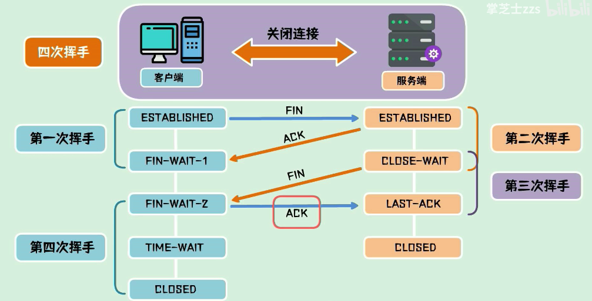

多线程，accept每创建一个新的套接字，就成功接受了一次连接请求。

利用TCP作为传输协议的高层协议：FTP、Telnet、HTTP、SMTP

#### UDP

**无连接协议**，不建立逻辑连接，不需要任何事先握手

UDP不必是单播，可能广播UDP报文段（数据报）

对于广播服务（受众不确定的服务） --> UDP

UDP报头

缺乏可靠性和指令，没有流量控制和拥塞控制

额外开销低，使用较少的网络带宽（更小的头部）

低延迟协议、不需要建立连接，也不需要等待确认

利用UDP作为传输协议的高层协议：TFTP、DNS、SNMP

#### TCP&UDP比较及选择准则

计算机系统的资源必须有一个指针。

统一资源定位符：URL --- Universal Resource Locator

域名系统：DNS --- Domain Name System

#### 链路层地址

链路层提供了设备间基于单条数据链路的连接。

链路层需要唯一的标识物理设备，并确保不会有两个设备有相同的物理地址。

MAC地址被固化到特定的网硬件接口，必须全球唯一。

组织唯一标识符：OUI --- Organizationally Unique Identifier

#### 网络层地址

在逻辑层面网络被划分为多个设备组（子网）。每组一套相关的地址。

**网络层地址基于所处网络的位置，而不是基于物理网络适配器的身份标识**

IP地址，两个版本

IPv4：**长度32位，4字节**，写成四个十进制数

子网掩码，分离地址的网络部分和主机部分

一个计算机安装多个网络适配器（每一个都有自己的IP）可以在任何适配器上接收数据包。

**本地：127.0.0.1**，特定的环回地址

IPv6：**长度128位，16字节**，写成8个十六进制数

IP和MAC地址之间的转换

地址解析协议：ARP --- Address Resolution Protocol

#### 传输层地址（端口）

每一个进程必须有一个唯一的地址

端口号必须在本地唯一

端口号在TCP/UDP是16位

熟知端口号范围：1-1023

注册端口号范围：1024-49151

#### 套接字

应用程序接口：API --- Application Programmer Interface

两种IO模式：阻塞模式、非阻塞模式

TCP原语：socket bind listen connect accept recv shutdown closesocket

UDP原语：socket bind sendto recvfrom closesocket

#### 绑定（进程到端口）

进程和端口建立关联

解析消息的传输层头部中的端口号

**每个端口只能映射到一个进程**

#### 通信死锁

多个进程彼此等待被组内其他进程占用的资源时，系统产生死锁。

被阻塞的进程所等待的资源来自于组内其他进程的消息。

**通信死锁的必要条件：通信双方接收套接字都配置成阻塞IO模式，进程中发送和接收操作在同一个线程，双方同时等待接收。**

#### 错误检测与校正

前向纠错 FEC --- Forward Error Correction，携带了额外信息，可以在接收端重构数据。

重传、错误校正

#### 应用特定协议

远程串口（数据->socket）

自己对传输协议进行二次封装

#### 通信视角的透明性需求

访问、位置、网络、部署、故障、规模扩展透明性


<br>
<br>

### 03 资源视角

#### 通信中的存储器资源

发送缓冲区/传输缓冲区

缓冲区是一块连续的内存块（**一维、连续，链表不行（不连续，需要序列化）**）

#### 虚拟内存

进程的内存空间到VM系统再到存储介质上的实际位置的映射。

REMAIN

特定算法（4点）
1. 最近最少使用 LRU
2. 最不经常使用 LFU
3. 先进先出 FIFO
4. 随机算法

#### 事务

事务是一种提供资源访问结构的机制。**当一个进程请求访问一个资源，执行检测，确保该资源没有参与进一个正在运行的事务**。如果被占用，则新请求需要等待，否则创建一个新事务（避免其他进程访问资源）。

四个准则：
1. 原子性
2. 一致性
3. 隔离性
4. 持续性

#### 锁

用于标识资源处于使用状态

可以在事务内使用

抑制并发性

#### 死锁

每个进程都在等待使用被集合中其他进程所持有的资源。

**产生死锁的4个条件**
1. 互斥
2. 占用且等待
3. 非抢占
4. 循环等待

#### 网络带宽

带宽 --- 珍贵的资源

应答开销、协议开销 使得有效载荷<1

#### 消息长度（最上层传输）

附加的额外开销：头部（mac地址，用于识别下一个更高层的协议）

以太网64字节最小帧长，1518字节最大帧长（18字节头部）。小于最小帧长要添加附加字节。

最大传输单元 MTU --- Maximum Transmission Unit

应用层的消息被分解为若干个分组。每个分组对于通向目的地的整个端到端路由都符合最小帧，避免分组分片。

#### 数据压缩

有损压缩：网页图片

无损压缩：赫夫曼编码

#### 序列化

将结构体或对象转换为线性字节格式的过程。在缓冲区中存储、在网络中传输。

接收端接受后，进行反序列化，回到原始格式。

<br>
<br>

### 04 体系结构视角

#### 软件组件之间的耦合

直接耦合、间接耦合、紧耦合、隔离耦合、松散耦合、间接耦合应用程序中的松散耦合。

#### 客户端-服务器

CS体系时双层体系结构，简洁但不具有可扩展性
1. 程序逻辑集中在单一服务器组件上
2. 组建的复杂性和功能性成近似线性增加
3. 服务用户和服务提供者之间的直接通信关系引起灵活性和健壮性限制
4. 所有客户端连接到特点服务引起性能瓶颈

#### 三层和多层体系结构

引入附加层，将应用程序逻辑分离到更小模块，分布在更多类型的组件上。透明性益处。

#### 提供集团资源和计算资源的系统模型

集群、网格、数据中心、云

#### 静态链接和动态链接

将库链接到应用程序源代码

静态链接：会显著增加生成的可执行文件的大小。

动态链接：使用相同DLL的应用程序越多，越节省内存。

使用动态链接部署时的可配置性，相同DLL有不同的版本，具有不同功能。

静态链接应用程序是独立的，不存在外部依赖。避免了DLL遗漏或者版本不匹配。

<br>
<br>

### 05 分布式系统

#### 透明性

用户希望系统执行他们的任务，而不用去理解系统细节。

**访问透明性**（软件层资源虚拟化）

VFS --- Virtual File System

NFS --- Network File System

**位置透明性**（只关心访问对象、不需要知道对象位置）

根据资源名称请求资源

**复制透明性**（能够创建对象的多个副本）

应用程序感知不到任何复制效果的影响

维护一致性

**并发透明性**

并发进程能够共享对象而互不干扰

系统应该为每个用户提供他们独占访问资源的假象

数据一致性问题，多个实体要更新同一个资源

长时间锁定资源，会失去并发透明性

#### 域名系统

URL通过DNS翻译成Internet地址

DNS实现了基于域的分层命名方案

域和子域。下面的是上面的子域。

#### 时间服务

Internet时间服务 --- ITS

TIME，到2037年失效

DAYTIME，偏移量补偿网络传输延时

NTP --- 网络时间协议 ，基于UDP，精度更高64位时间戳

#### 物理时钟同步

Berkeley算法，同步一组服务器中的全部时钟，选择一个主服务器，用来协调接下来的同步活动。

#### 选举算法

自动从一组进程中选出一个进程执行一个特定角色。

bully选举算法

ring选举算法

领导者预选

<br>
<br>

## 课程PPT整理

### 01 指针&结构体

**整数&浮点数**

sprintf

printf

%d %x（hex） 进制转换

因为指数的存在，浮点数分布不均匀（分段均匀）

浮点数加法（对阶，小阶向大阶看起、尾数加减、规格化处理、舍入处理、检查是否溢出）

**补码**

正数的补码是原码，负数的补码是符号位不变，其他位取反加1

补码的补码是原码

-128补码1000 0000（-128没有反码和原码）

**指针**

用指针访问一次数据，需要访问两次内存

内存对齐：增加寻址范围，保证操作原子性，增加CPU访问速度（编译器保证透明性）

数组和指针的越界访问（程序员保证）

数组访问时，被编译器转换为相对于数组名的线性地址

指针不指向实体，不允许访问

void*指针不能访问，因为不知道多长

通过指针访问存取的字节数由指针数据类型决定，指针强制转换是给编译器的指示信息。

数据类型决定数据的表现形式，比如有符号和无符号数。

指向动态内存申请的空间的指针不能随意指向别人，否则内存泄露。

**数组**

数组不是数据类型，数组的元素是数据类型。

数据用数组名和序数访问了每个变量。数组离不开循环。

编译器会把数组访问展开成一维线性方式（因为内存是一维的）。数组是高级语言的福利。

高维数组

函数的传值和传地址，计算机不加区分。

**结构体**

编译器将结构体成员转换成线性偏移量

浅拷贝&深拷贝

高级语言的福利

### 02 堆&栈

**C/C++占用的内存**
栈区（stack）：由编译器自动分配释放，存放函数的参数值，局部变量的值等。其操作方式类似于数据结构中的栈。

堆区（heap）：一般由程序员分配释放，若程序员不释放，程序结束时可能由OS回收（内存泄漏）。注意它与数据结构中的堆是两回事，分配方式类似于链表。

全局区/静态区（global/static）：全局变量和静态变量的存储是放在一块的，初始化的全局变量和静态变量在一块区域，未初始化的全局变量、未初始化的静态变量在相邻的另一块区域。程序结束后由系统释放【静态存储区】。

文字常量区：常量字符串就是放在这里的。程序结束后由系统释放。

程序代码区：存放函数体的二进制代码。

**程序的段**

一个正常的程序在内存中通常分为程序段、数据端、堆栈三部分。

程序段里放着程序的机器码、只读数据，这个段通常是只读，对它的写操作是非法的。

数据段放的是程序中的静态数据。

动态数据则通过堆、栈来存放。

函数体中定义变量在栈上。

使用动态内存申请在堆上，需要手动释放。

函数体外定义的为全局量，在全局区。

加了static修饰符也放在全局区（**生命期等同于全局**,**作用域满足常规**）。

在所有函数体外定义的static变量表示在该文件中有效，不能extern到别的文件用。

在函数体内定义的static表示只在该函数体内有效。

静态函数与普通函数的区别在于：静态函数不可以被同一源文件以外的函数调用。

静态局部变量与普通局部变量的区别在于：静态局部变量只初始化一次，下一次初始化实际上是依然是上一次的值。

静态全局变量与普通全局变量的区别在于：静态全局变量的作用域仅限于所在的源文件。

**堆和栈**

栈：
1. 快速访问(存取数据比堆快)
2. 没有必要明确的创建分类变量，因为它是自动管理的
3. 空间被CPU高效地管理着，内存不会变成碎片
4. 只有局部变量
5. 受限于栈大小(取决于操作系统)
6. 变量不能调整大小

堆：
1. 变量可以被全局访问
2. 没有内存大小限制
3. （相对）访问比较慢
4. 没有高效地使用空间，随着块内存的创建和销毁，内存可能会变成碎片
5. 空间自己申请自己释放
6. 可以realloc()

**堆和栈的申请**

栈的申请速度快，堆的申请速度慢。

栈stack：
1. 只要栈的剩余空间大于所申请空间，系统将为程序提供内存，否则将报异常提示栈溢出。
2. 在Windows下，栈是向低地址扩展的数据结构，是一块连续的内存的区域。这句话的意思是栈顶的地址和栈的最大容量是系统预先规定好的

堆heap：
1. 首先应该知道操作系统有一个记录空闲内存地址的链表，当系统收到程序的申请时，会遍历该链表，寻找第一个空间大于所申请空间的堆结点，然后将该结点从空闲结点链表中删除，并将该结点的空间分配给程序；
2. 对于大多数系统，会在这块内存空间中的首地址处记录本次分配的大小，这样，代码中的delete语句才能正确的释放本内存空间。另外，由于找到的堆结点的大小不一定正好等于申请的大小，系统会自动的将多余的那部分重新放入空闲链表中。
3. 堆是向高地址扩展的数据结构，是不连续的内存区域。这是由于系统是用链表来存储的空闲内存地址的，自然是不连续的，而链表的遍历方向是由低地址向高地址。

**堆和栈中存储的数据**

**堆栈**是内存中的一个**连续的块**。一个叫堆栈指针的寄存器（SP）指向堆栈的栈顶。堆栈的底部是一个固定地址。

栈【stack】：

在函数调用时，**第一个进栈的是主函数中后的下一条指令（函数调用语句的下一条可执行语句）的地址，然后是函数的各个参数**，在大多数的C编译器中，参数是由右往左入栈的，然后是**函数中的局部变量**。注意**静态变量是不入栈**的。当本次**函数调用结束后，局部变量先出栈，然后是参数**，最后栈顶指针指向最开始存的地址，也就是主函数中的下一条指令，程序由该点继续运行。通常对局部变量的引用是通过给出它们对SP的偏移量来实现的。

堆【heap】：

一般是**在堆的头部用一个字节存放堆的大小**。堆中的具体内容有程序员安排。


**字节序**

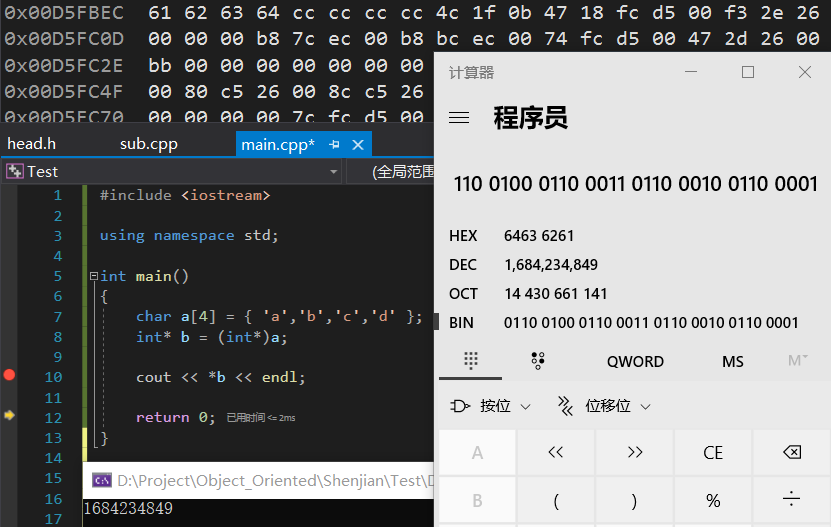

### 03 编译&链接 

**函数内指针的风险**

堆栈的空间随着函数进入和退出不断地被重复使用，指向堆栈空间的指针没有意义，会被覆盖

**宏函数**

定义宏函数时，最好将每一个元素加括号，另外不用分号

```cpp
#define square(x) (x)*(x)
```

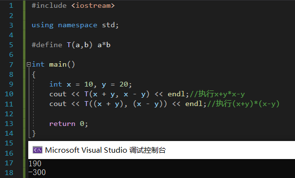

**执行文件**


### 04 内存管理

**计算机总线**

数据总线、地址总线、控制总线（DB、AB、CB）

**实模式**

存储单元的物理地址 = 段基地址 << 4 + 偏移地址

在Real Mode下，我们对一个内存地址的访问是通过Segment:Offset的方式来进行的，其中Segment是一个段的Base Address，一个Segment的最大长度是64 KB，这是16-bit系统所能表示的最大长度。而Offset则是相对于此Segment Base Address的偏移量。Base Address+Offset就是一个内存绝对地址。

编程的时候，使用16-bit段寄存器CS（Code Segment），DS（Data Segment），SS（Stack Segment）来指定Segment，CPU将段积存器中的数值向左偏移4-bit，放到20-bit的地址线上就成为20-bit的Base Address。


**保护模式**

Protected Mode，内存的管理模式分为两种，段模式和页模式，其中页模式也是基于段模式的。也就是说，Protected Mode的内存管理模式事实上是：纯段模式和段页式。进一步说，段模式是必不可少的，而页模式则是可选的。如果使用页模式，则是段页式；否则这是纯段模式。

对于段模式来讲，访问一个内存地址仍然使用Segment:Offset的方式，这是很自然的。由于 Protected Mode运行在32-bit系统上，那么Segment的两个因素：Base Address和Limit也都是32位的。

Protected Mode，顾名思义，又为段模式提供了保护机制，也就说一个段的描述符需要规定对自身的访问权限（Access）。

现代操作系统在刚加电时首先运行在实模式下，然后再切换到保护模式下运行。

与GDT不同的是，LDT在系统中可以存在多个，并且从LDT的名字可以得知，LDT不是全局可见的，它们只对引用它们的任务可见，每个任务最多可以拥有一个LDT。另外，每一个LDT自身作为一个段存在，它们的段描述符被放在GDT中。

GDT为一级描述符表，LDT为二级描述符表。

局部描述符表LDT（Local Descriptor Table）

全局描述符表GDT（Global Descriptor Table）

三种地址
1. 逻辑地址：即逻辑上的地址，实模式下由“段基地址+段内偏移”组成；保护模式下由“段选择符+段内偏移”组成。
2. 线性地址：**逻辑地址经分段机制后就成线性地址**，它是平坦(Flat)的；如果不启用分页，那么此线性地址即物理地址。
3. 物理地址：**线性地址经分页转换后就成了物理地址**。

所有 32 位应用程序都有 4 GB 的进程地址空间（32 位地址最多可以映射 4 GB 的内存）。操作系统的地址空间分布决定了用户可用的最大地址空间，比如32位Windows是用户2G+内核2G的地址空间分配方式，32位Linux是用户3G+内核1G，不同操作系统的实现方式，对malloc也是有影响的。


内存的5大区：栈区，堆区，全局区（静态区），文字常量区，程序代码区。这5大区就只能可怜的蜗居在这2G的内存里。(2^30)-1字节 = 2G-1字节 = 0x7fffffff。


### 王道考研内存管理

[传送门：王道考研 操作系统](https://www.bilibili.com/video/BV1YE411D7nH?p=33)

#### 内存基础


相对地址 --- 逻辑地址

绝对地址 --- 物理地址

代码编译为机器码，告诉CPU去哪里存取数据。但实际生成的指令并不知道进程的数据会被存放在什么位置，所以编译生成的指令使用**逻辑地址 --- 相对地址**。

逻辑地址、物理地址：指令中的地址，编译时只关心“相对地址”，实际放入内存中在想办法根据起始位置得到“绝对地址”。


编译链接后的装入模块地址从0开始，指令中使用的地址、数据存放的地址都是相对于起始地址而言的逻辑地址。

**装入**的三种方式：
1. **绝对装入**：编译时就知道程序放在内存的位置，编译程序直接产生绝对地址的目标代码（只适用于单道程序环境）
2. **静态重定位**：装入模块从0开始。编译链接后的根据内存当前情况，将装入模块装入到内存的适当位置。**装入时对地址进行重定位，将逻辑地址变换为相对地址。**（装入内存时，必须分配其要求的全部内存空间，没有足够内存，不能进行装入作业）
3. **动态重定位**：装入模块从0开始。装入程序吧装入模块放入内存后，并不会立即把逻辑地址转换为物理地址。而是**把地址转换推迟到程序真正要执行的时候才进行。**装入内存后，所有的地址仍然是逻辑地址。需要一个**重定位寄存器**，存放装入模块的起始地址。存取的时候，加上寄存器值。（运行程序移动，只需修改重定位寄存器）。可以将程序分配到不连续的存储区中（起始位置+偏移量）。

**链接**的三种方式
1. 静态链接：程序在运行前，先将各目标模块及库函数链接成一个完整的可执行文件（装入模块），之后不再拆开。（过程中将独立的逻辑地址合并为完整的逻辑地址）
   
   

2. 装入时动态链接：将各目标模块装入内存时，边装入边链接。
   
   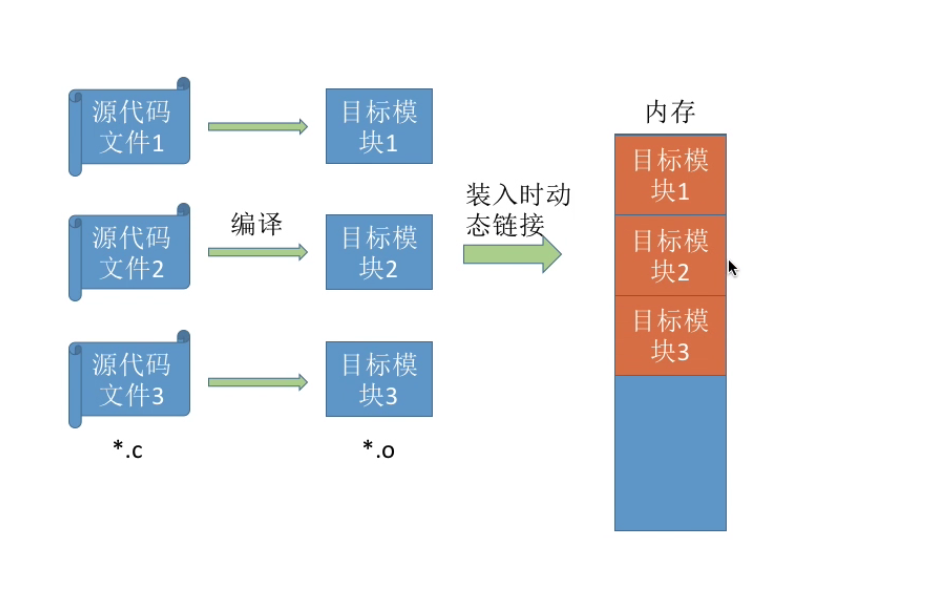

3. 运行时动态链接：在程序执行中需要目标模块的时候，才进行链接。优点在于便于修改和更新，便于实现对目标模块的共享。
   
   

#### 操作系统对内存管理

操作系统需要对内存进行管理
1. **内存空间的分配与回收**
2. **从逻辑上对内存空间进行扩充**（虚拟化）
3. **逻辑地址与物理地址的转换**（三种装入方式）
4. **内存保护功能** 各进程在各自存储空间中运行互不干扰（也不能访问操作系统的内存空间）（上限&下限寄存器、重定位寄存器&界地址寄存器）


#### 覆盖技术

解决程序大小超过物理内存总和的问题（将程序分为多个段（模块），常用的段常驻内存，不常用的段在需要时调入内存）

内存中分一个**固定区**&若干个**覆盖区**。需要常驻的段放在固定区中，调入后不再调出。不常用的段放在覆盖区。

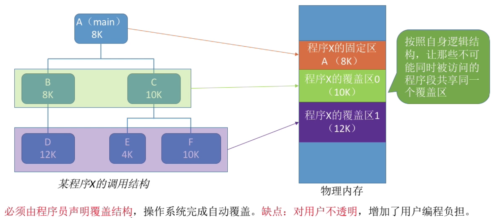


#### 交换技术

进程管理块  PCB --- Process Control Block

内存空间紧张时，系统将内存中某些进程暂时换出外存（放在外存的对换区），把外存中已经具备运行条件的进程换入内存（内存和磁盘间动态调度）。进**程的PCB保留在内存中，插入挂起队列**（记录进程所在外存的位置，进行管理）。

挂起(suspend)：**暂时换出外存等待的进程状态**（就绪挂起（就绪的进程进入外存）、阻塞挂起（阻塞的进程进入外存））

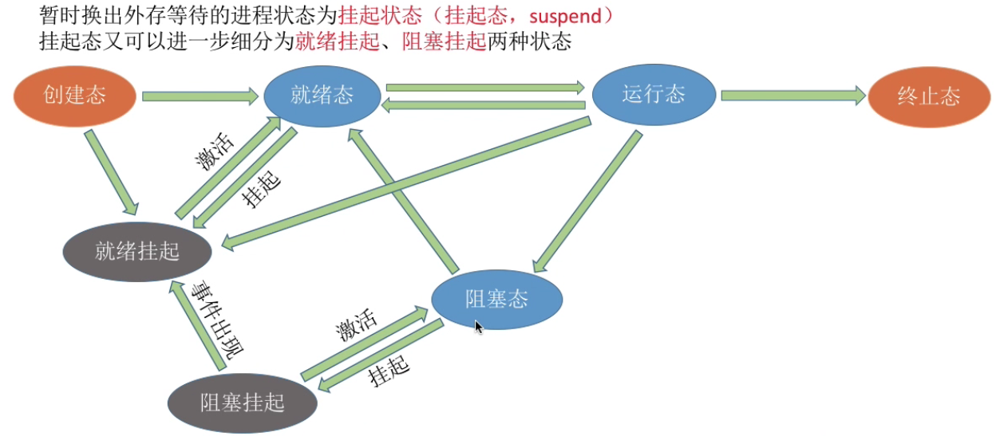

磁盘空间分为对换区和文件区
1. 对换区：追求换入换出速度，**采用连续分配方式**，I/O速度比文件区更快
2. 文件区：追求存储空间利用率，**采用离散分配方式**

缺页率高，说明系统内存紧张，换出进程。

优先换出阻塞进程和优先级低的进程。肯导致“饥饿”（可以通过考虑进程在内存的驻留时间）。PCB会常驻内存，不会被换出外存。


#### 内存分配管理方式

内部碎片：分配给进程的内存区域中，没有使用到的部分

外部碎片：内存中的某些空闲分区由于太小而难以利用（**通过紧凑技术Compaction解决**（将进程内存移位），**动态重定位**方便进行紧凑技术）

紧凑技术的时间复杂度很高

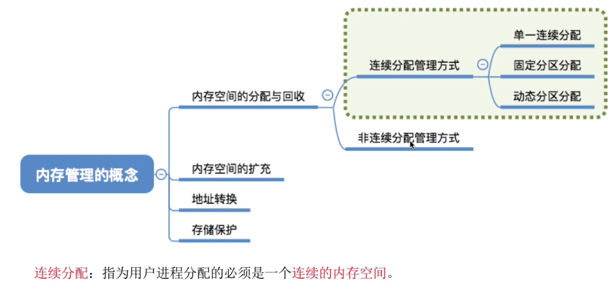

**①单一连续分配方式**

内存被分为**用户区和系统区**。系统区常位于内存的低地址部分，用于存放操作系统相关数据。用户区存放用户进程相关数据。

内存中**只能有一道用户程序，用户程序独占整个用户区**。

**优点：实现简单、无外部碎片、可以采用覆盖技术扩充内存**

**缺点：只能用于单用户单任务的操作系统中、有内部碎片、存储器利用率低**


**②固定分区分配**

将用户区划分为若干个**固定大小的分区（不是相等）**，每个分区内只装入一道作业。

1. 分区大小相等
   1. 缺乏灵活性
   2. 适用于一台计算机控制多个相同对象的场合
2. 分区大小不等
   1. 增加灵活性，根据在系统中运行的作业大小进行划分

**操作系统建立分区说明表**，实现各个分区的分配与回收。数据结构包括：大小、起始地址、状态。

操作系统根据用户程序大小检索分区说明表，找到满足大小的未分配的，然后进行分配并修改状态。
1. 实现简单、无外部碎片
2. 有内部碎片、内存利用率低；如果用户程序太大，需要采用覆盖技术，性能降低。

**③动态分区分配（可变分区分配）**

**不会预先划分内存分区，在进程装入内存时，根据进程大小动态的建立分区**，使得分区正好适合进程需要。系统分区的大小和数目是可变的。

记录内存使用情况的使用情况的数据结构
1. 空闲分区表（分区大小、起始地址、状态（空闲））
2. 空闲分区链（双向链表）
3. 表项的顺序按需求修改

空闲分区的选择（**动态分区分配算法**）

分区的分配和回收（更新空闲分区表，空闲分区合并）

优缺点
1. 没有内部碎片但是有外部碎片
2. 系统分区数量和大小可变

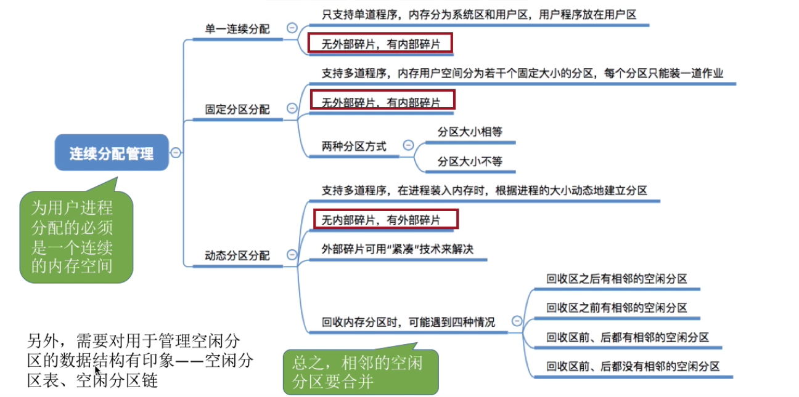

#### 动态分区分配算法


首次使用算法(First Fit) 不需要对链表进行重排 优先使用低地址的小空间

最佳适应算法(Best Fit)

最坏适应算法(Worst Fit)

邻近适应算法(Next Fit) 一般采用循环链表 不需要对链表进行重排

#### 基本分页存储管理

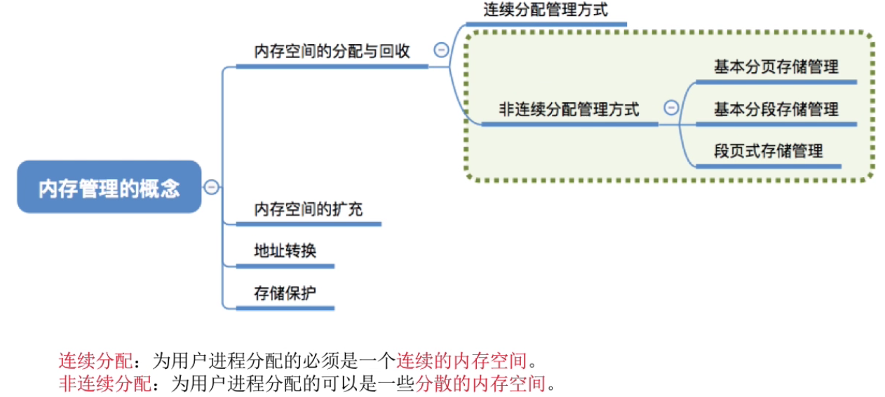

非连续分配：可以为用户进程分配**分散的内存空间**

将进程进行拆分成小部分，分布放入内存的小分区。分区越小，内存利用率越高。

**页框（页帧、内存块、物理块）**，每一个页框的编号为**页框号**，从0开始。从低地址到高地址。

将用户进程的地址空间也分为与**页框大小相等**的区域，称为页、页面。每一个页面也有一个编号**页号**，从0开始。

页框不能太大否则会有过大的内存碎片。

**操作系统以页框为单位**为各个进程分配内存空间。进程每个**页面放入一个页框**（**一一对应**），各个页面不必连续存放，也不必按先后顺序，可以放到不相邻的页框中。

**实现地址的转换**

步骤
1. 算出逻辑地址对应的页号（通过逻辑地址求得）
2. 页号对应页面在内存中的起始位置（通过页表获得）
3. 算出逻辑地址在页面的“偏移量”（通过逻辑地址求得）
4. 物理地址=页面始址+页内偏移量

**页面大小一般为2的整数幂**

如果用K位表示“页内偏移量”，说明系统一个页面的大小是$2^K$个内存单元

如果用M位表示“页号”，说明一个进程最多允许有$2^M$个页面

为了知道进程的每个页面在内存中的存放位置，**操作系统为每个进程建立页表**。记录进程页面和实际存放的内存块之间的关系（**页号和块号**，内存块的起始地址等于**块号*块大小**）。

每个页表项的长度是相同的，页号是隐藏的（页表占用连续的内存空间，内存块号所用的二进制数的长度是固定的，知道是哪一个页号，就可以直接访问内存块号。页号不需要出现在页表项这个数据结构中。）

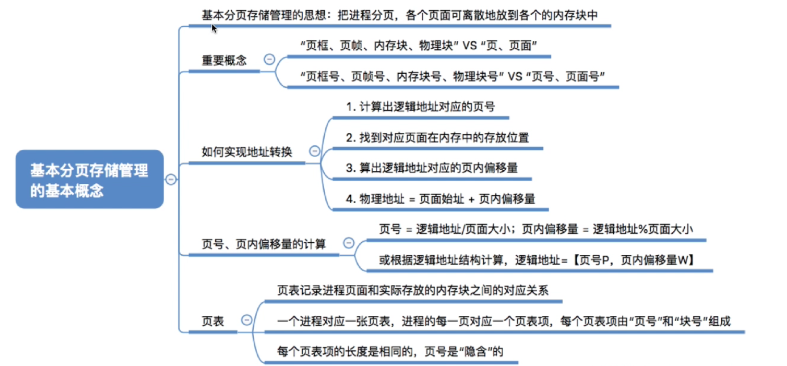

### 05 C++高级

### 06 DLL

### 07 事件驱动

### 08 进程通信和同步(Communication and Synchronization)

**进程的引入**

顺序程序：顺序性、资源独占性、可再现性

并发执行：间断性、失去封闭性、不可再现性、资源共享

**进程是系统进行资源分配和调度的独立单位，线程是CPU调度的最小单位**

进程的存储映像组成：**进程控制块PCB**、进程执行的**程序**、**数据**和**工作区**

进程控制块PCB：记录进程信息
1. 标识信息：标识系统进程，创建进程时系统分配的唯一的代码，只能在操作系统内部使用（用户标识、父进程标识）
2. 状态信息：进程使用处理器时的各种现场信息（CPU通用寄存器内容、CPU状态寄存器内容、栈指针）
3. 控制信息：操作系统对进程进行调度管理时用到的信息（进程状态（运行、就绪、阻塞），调度信息（优先级、正在等待的事件），数据结构信息，队列指针，位置信息，通信信息……）

**进程创建**
1. 创建进程标识
2. 分配内存和其他资源
3. 初始化PCB
4. 置于就绪队列：系统将同种状态的PCB排成一个队列。利用指针组成单向、双向链表。

**进程的同步与互斥**

进程的同步和互斥使得并发执行的进程之间共享资源、相互合作、使得程序执行有可再现性。

并发带来的问题
1. 全局变量共享有风险。读写操作先后顺序
2. 操作系统分配资源困难
3. 定位程序错误困难

**进程同步**

同步：多个几次呢发生的事件存在时序关系，需要按照规定时序执行

互斥：多个进程不能同时使用一个资源

进程通信：多进程之间要传递一定的信息

临界资源：某段时间仅允许一个进程使用资源（互相排斥的使用）

临界区：每个进程访问临界资源的代码段落

### 王道考研进程

[](https://www.bilibili.com/video/BV1YE411D7nH?p=18)

#### 进程同步、互斥


进程具有异步性：各并发执行的进程以各自独立的、不可预知的速度向前推进。

同步（直接制约关系），相互合作完成工作，协调工作顺序。

互斥（间接制约关系），进程之间并没有明确的合作关系，只是要访问同一个变量。


互斥所要遵循的四个规则：


（让权等待的意思是如果现在进不去就先不要一直等着了，一会再来）

#### 进程互斥的软件实现方法

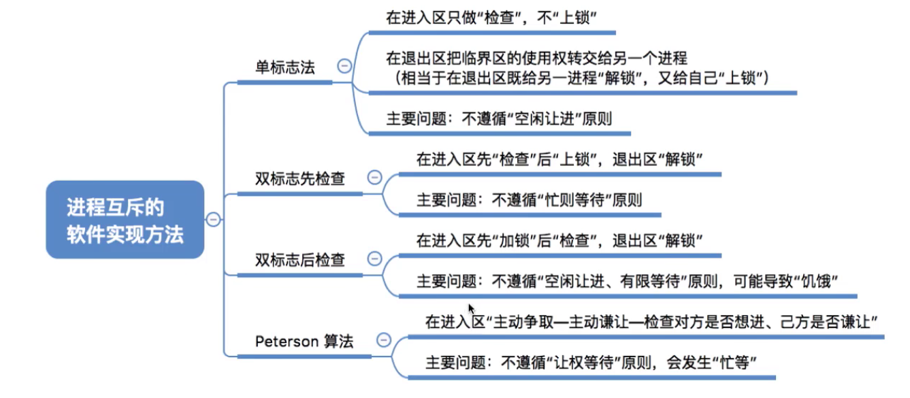

单标志法：

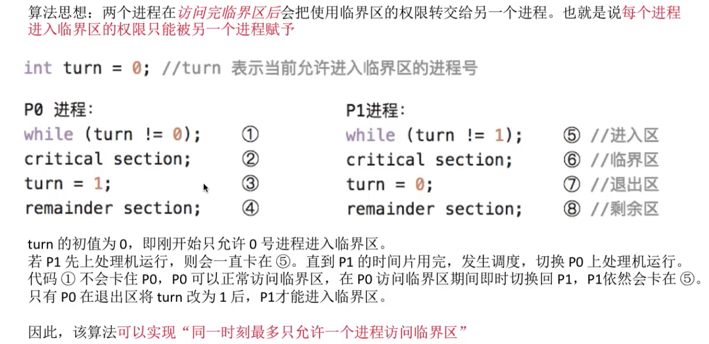

单标志位缺点：如果P0不执行，P1无法执行（**违背空闲让进**）


双标志先检查法：如果对方进程明确表达自己不进行访问，则我方进程可以进行访问。但是由于异步执行问题，当两个数组一开始都为false可能会导致问题（分别跳过while）。（**违背忙则等待**）

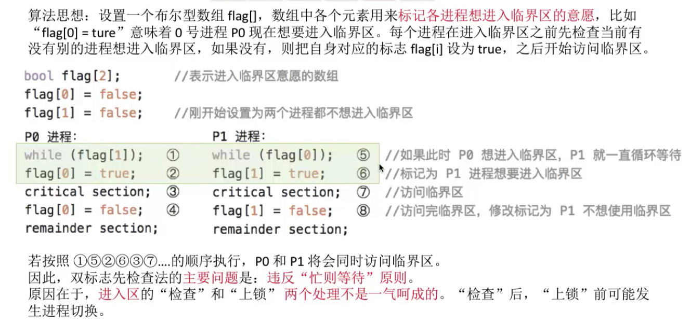

双标志后检查法：先上锁，标识访问的意愿。但可能导致两个进程都无法进入临界区的问题。

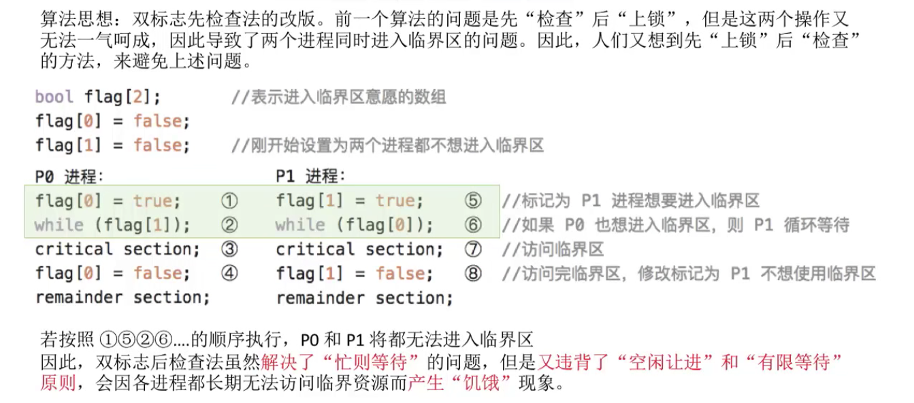

Peterson算法：每一个进程都先用flag表示访问的意愿，同时用turn表示自己承诺可以优先让别人进入（谁最后说的客气话，谁就孔融让梨）。这种情况下不会同时卡住，因为turn只有一个值。（**没能实现让权等待**）


#### 进程互斥的硬件实现方法

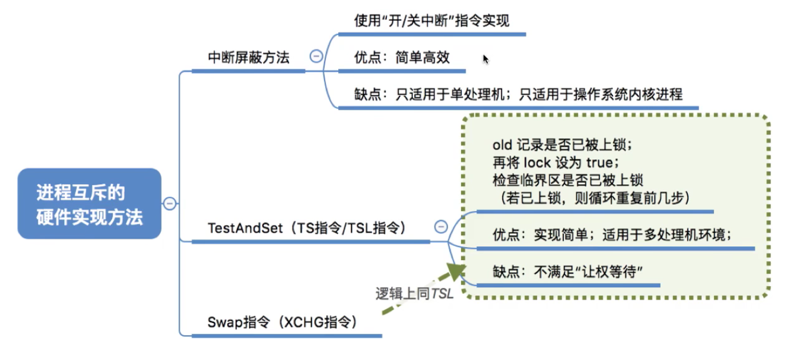

中断屏蔽方法

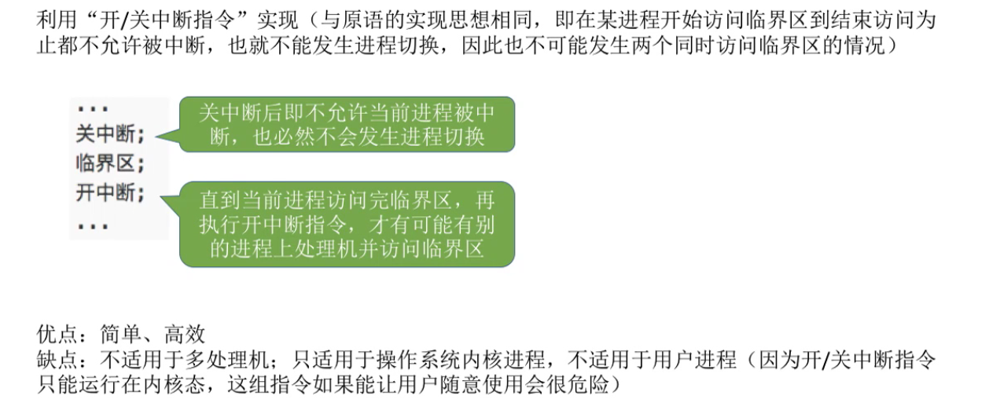

TSL(test and set lock)

如果lock位true，就会一直卡住。如果lock为false，就会上锁（阻止他人访问），然后自身执行临界区代码段，完成后解锁。

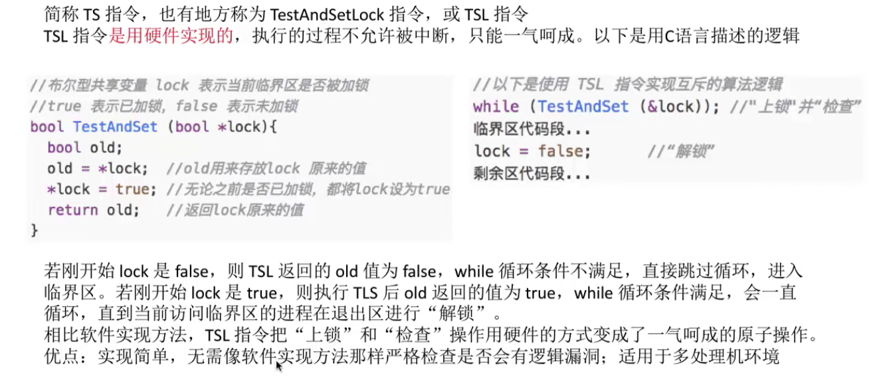

Swap（如果被上锁就一直交换，两个true交换，一直循环等待）


#### 信号量机制


信号量——变量

两种信号量
1. 整型信号量
2. 记录型信号量（复杂的数据结构，内含队列和资源数）

之前所学都无法实现“**让权等待**”

原语：只能一气呵成的执行（由关中断、开中断指令实现）


**整型信号量**（不满足让权等待）

用原语实现检查和上锁

（疑惑点：如果一个进程进不了临界区将会一直被卡在wait原语的while循环中，由于原语是不会被中断的，进程是不是一直不会被切换？）


**记录型信号量**

有多少资源就将信号量初始化为多少。
 


#### 用信号量实现进程互斥、同步、前驱关系


**信号量机制实现进程互斥**

将临界区看作一种特殊的资源，且只有一个，用将信号量初始化为1。

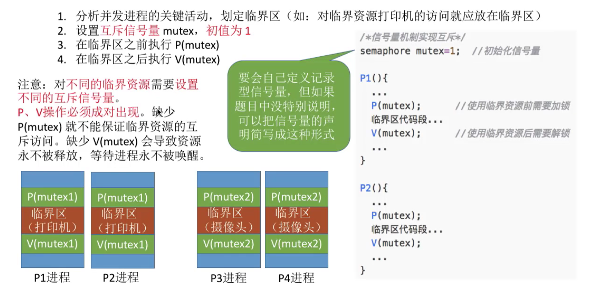

**信号量机制实现进程同步**


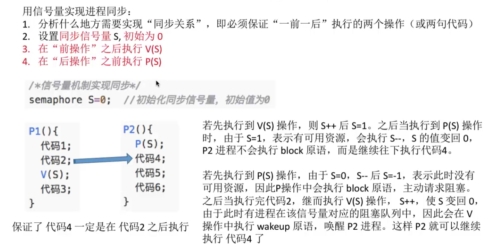

**信号量机制实现进程前驱**

初始化信号量为0。对于先执行的程序，在执行完必须先执行的代码**之后**放一个**V操作**；对于后执行程序，在执行必须后执行的程序**之前**放一个**P操作**。对于不同的顺序要用到不同的信号量。

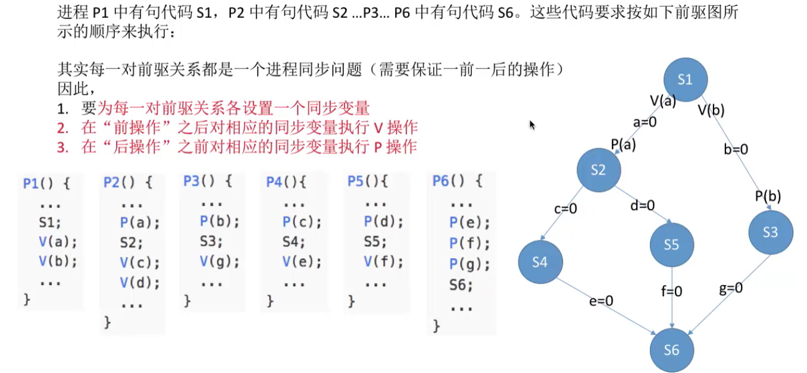

### 09 线程

### 王道考研线程

[](https://www.bilibili.com/video/BV1YE411D7nH?p=12)

#### 线程概念和多线程模型


线程可以理解为轻量级的进程


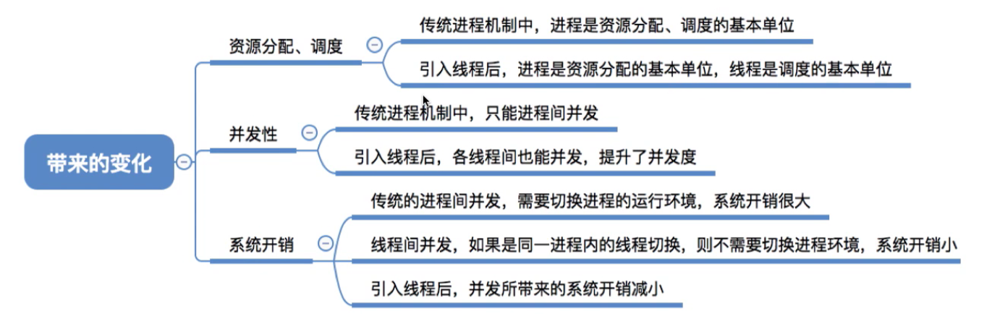

线程间切换开销小于进程间开销


**线程的实现方式**

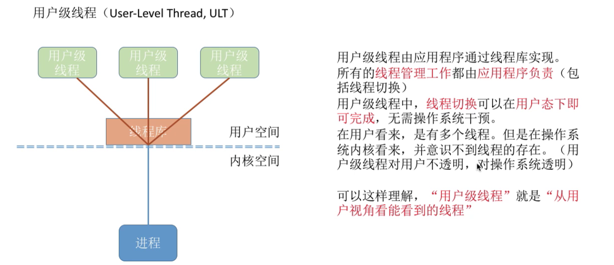


**多线程模型**


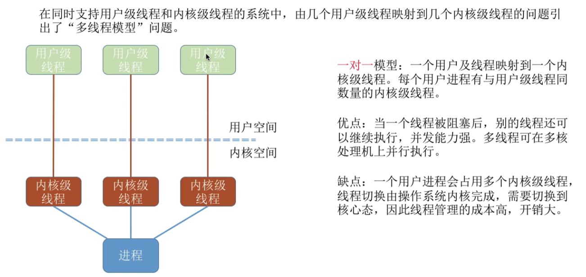


### 10 OpenMP

### 11 Socket

判断对方机器和自身在不在同一网络的标准，与掩码有关，两个ip地址分别与掩码相与，判断是否相同。

主机A主机B通信时，先看看目标和自身在不在同一网络（同一个路由器）。如果在（和掩码相与一样），直接通信，直接给对方。如果不在，不能直接给B，需要先给路由器，要离开当前网络。网关，出当前网络，去其他网络（下一跳）。

**网关地址和自己的ip一定在同一网络。**

通讯双方有源和目标

局域网内通讯，用ip地址寻址更方便

DNS服务器

路由器也会抉择，可以是多口的，可以连接很多网络。每个口都有地址

accept()阻塞而listen()不阻塞的原因

### 12 SSE


## 大作业代码汇总


