# 自动控制原理

[toc]

## Portals

[自动控制原理（系统学习） -- 卢京潮](https://www.bilibili.com/video/BV1ZJ411c757)

[自动控制原理（快速学习） -- 轻声说了随便](https://space.bilibili.com/437724982)

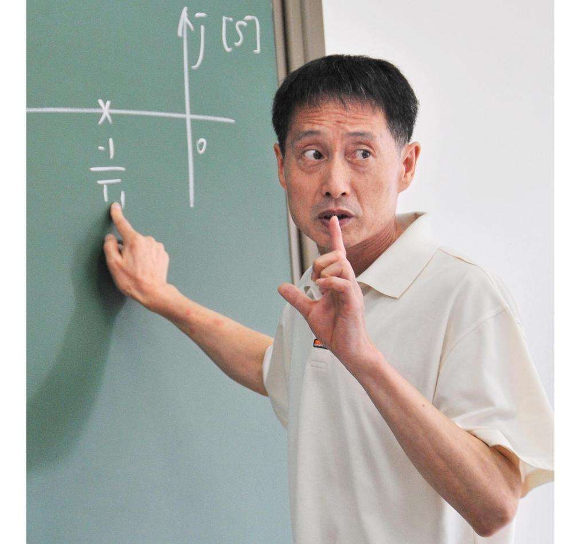

## REMAIN

信号与系统和自控联系（传递函数，单位冲激响应，齐次解，特解，零输入，零状态）

幅相特性为什么只要将$s=j\omega$带入即可。可以是任意的s吗，模值对于系统的影响？

## 01 自动控制的一般概念

*卢京潮 p1、p2、p3、p4、p5*

## 02 控制系统的数学模型

**时域模型——微分方程**

线性时不变系统

非线性方程线性化

### 拉普拉斯变换

*卢京潮 p6*

微分定理**减$0_-$时**的函数值

使用终值定理的条件是，原像函数的终值确实存在。（否则可能可以计算出结果，但是不正确）

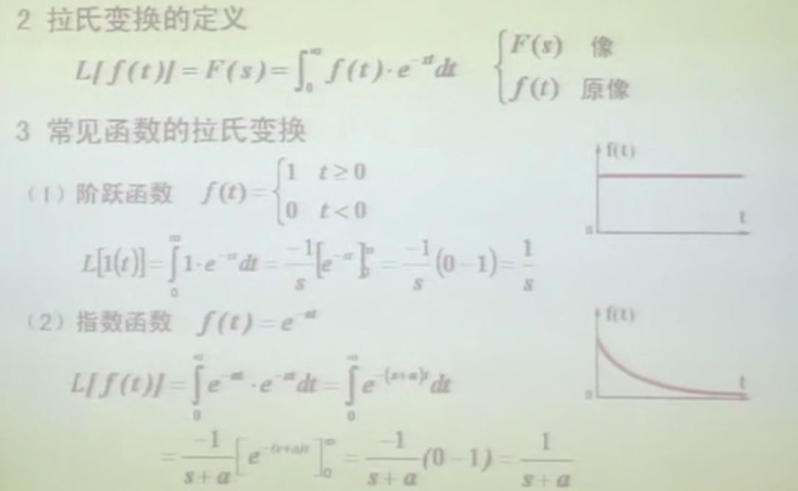

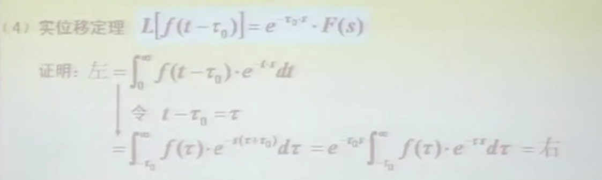

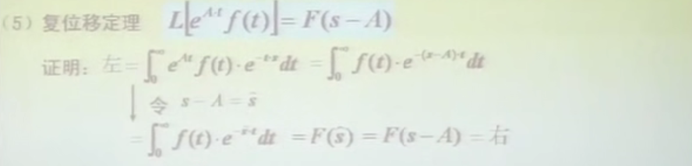

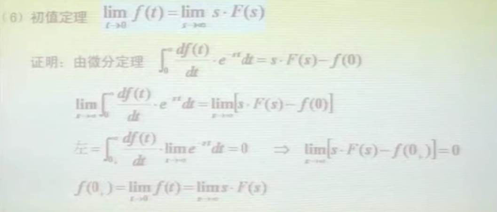

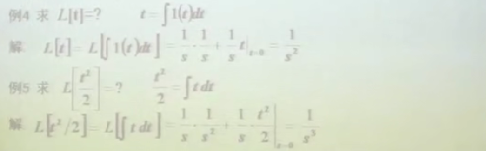

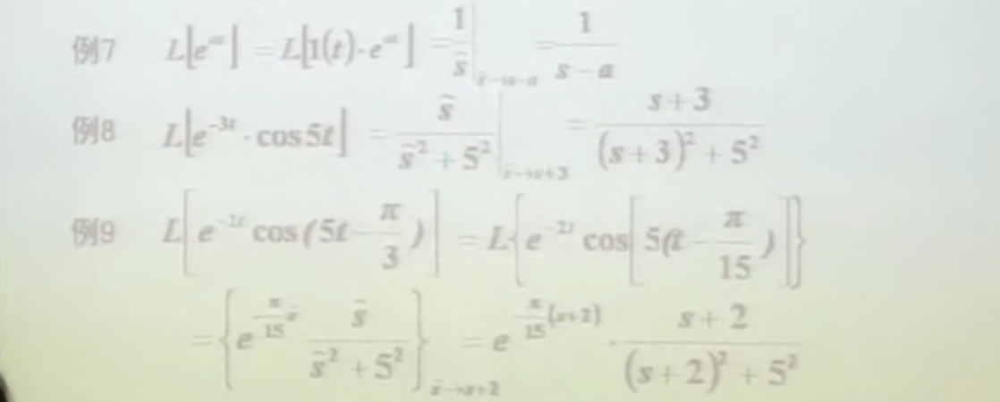

### 拉普拉斯逆变换

*卢京潮 p7、p8*

逆变换
1. 反演公式
2. 查表法（部分分式法）--- 使用留数法

**用Laplace变换求解线性常微分方程**

初始条件只与输出有关，输入不受影响

也可以通过Laplace变换求解自由响应（零输入响应）

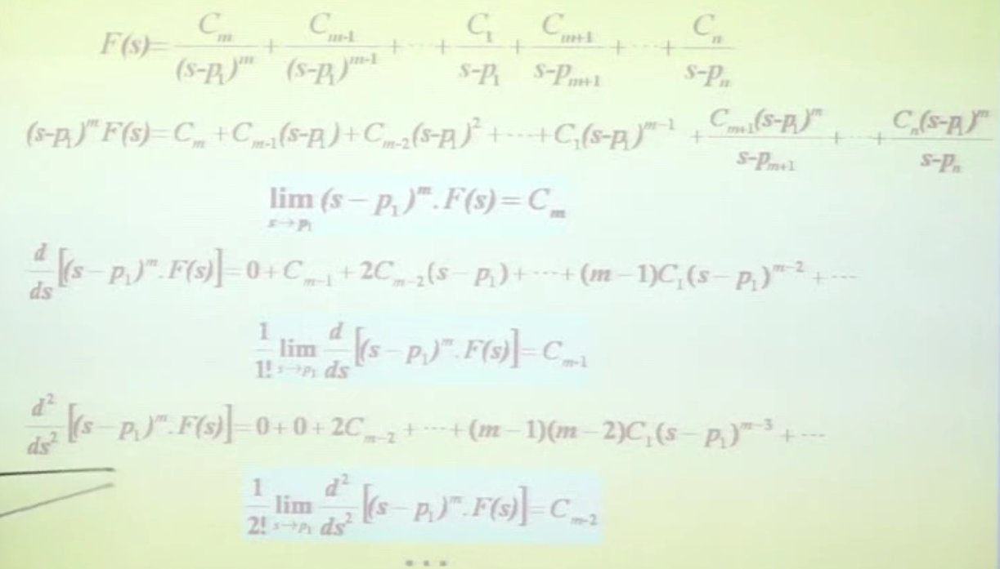

**影响系统响应的因素**
1. 输入信号（规定r(t)=u(t)，阶跃信号，如果跟踪阶跃信号较好，跟踪其他信号会很好）
2. 初始条件（规定零初始条件）
3. 系统的结构参数（自身特性决定系统性能）

### 传递函数

*卢京潮 p8*

定义：**零初始条件下**，线性定常系统输出量拉氏变换与输入量拉氏变换之比。（$G(s)=\frac{C(s)}{R(s)}$）

传递函数和微分方程对应，可以互相唯一确定

两种标准形式
1. 首一标准型
2. 尾一标准型 --> 前面系数为增益

$G(s)=L(系统单位冲激响应)$

**传递函数与输入输出无关**

两种求传递函数的方法
1. 对单位冲激响应进行拉氏变换
2. 输出拉氏变换除以输入拉氏变换

（时域卷积等于频域相乘，利用单位冲激信号对原信号进行卷积，得到的就是原信号本身REMAIN）

**传递函数的局限**
1. 原则上**不反映非零初始条件时，系统的全部信息**（定义是零初始条件下，**零状态响应**）
2. **只适用于描述SISO（单输入/单输出）系统**
3. **只能用于表示线性定常系统**，否则无法将$C(s)$提取出来（如下图非线性系统所示）

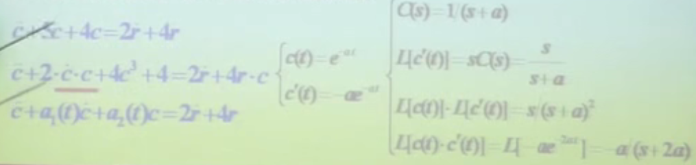

### 控制系统的复域数学模型

*卢京潮 p9、p10*

**典型环节的传递函数**

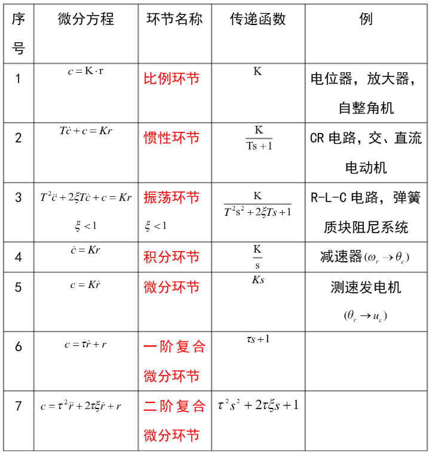

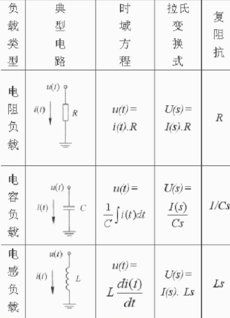

典型环节不一定有物理实现（分子阶数比分母高）

不同的元部件可以有相同的传递函数

任意传递函数都可以看作典型环节的组合

如果将系统从中间断开，分别算出传递函数进行相乘，无法得到正常工作时的输入输出传递关系，必须连在一起算（**要考虑负载效应**）。

### 结构图及其等效变换

*卢京潮 p11、p12*

**比较点与引出点之间的移动(慎用，很麻烦)**，比较点之间、引出点之间可以分别互相移动而不受影响

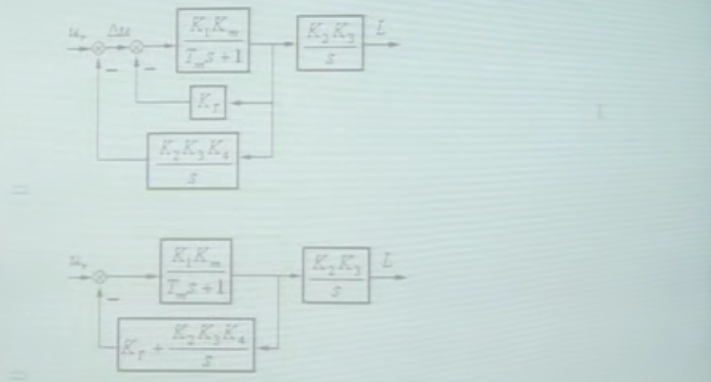

**难题(Paper Tiger)$\times$2**，一步一步耐心做即可

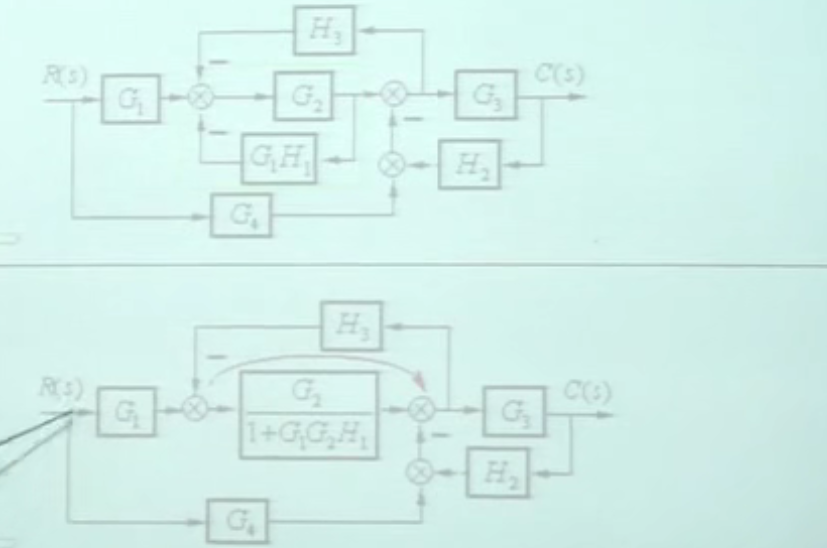

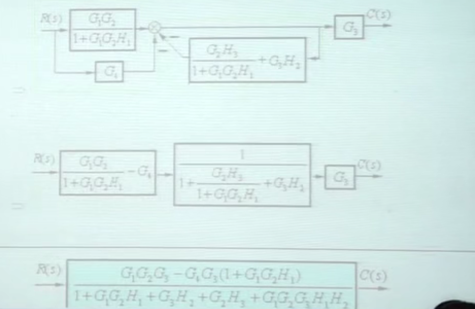

**必须要使用“杀手锏”的题**

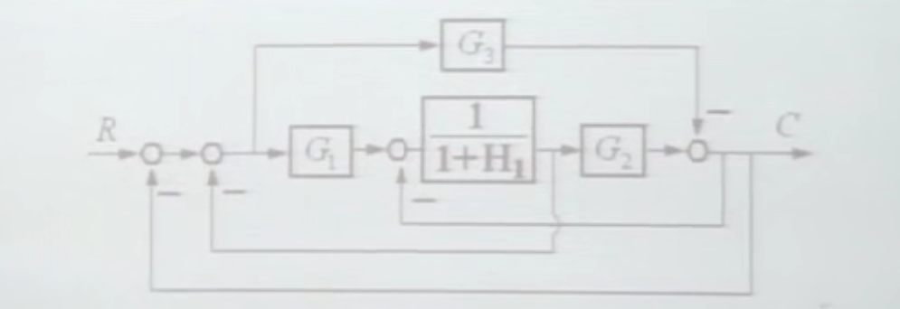

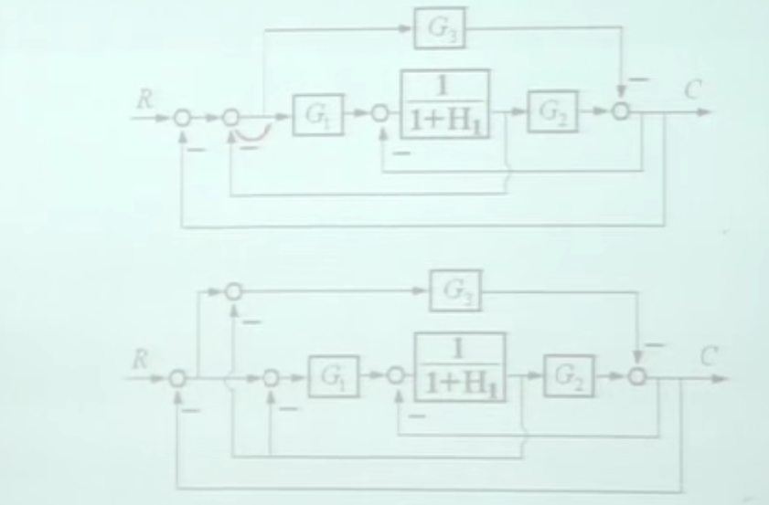

（将线路进行化简，更改一下走线）

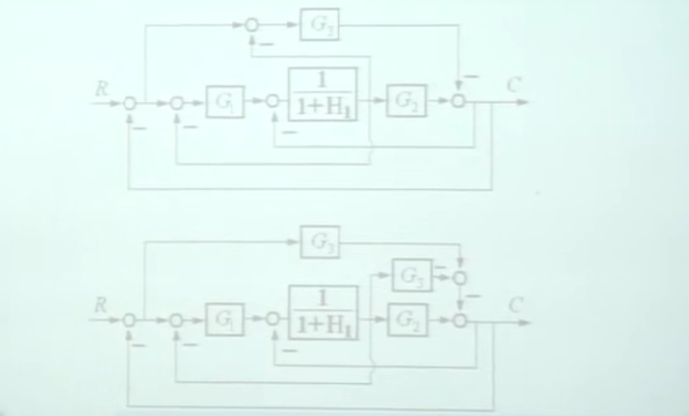

（注意：负负得正，经过了两个比较点）

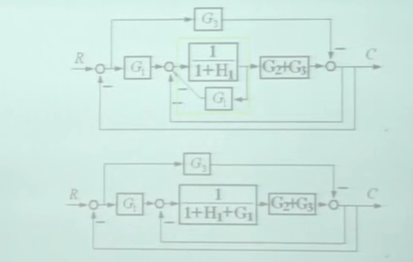

（分清并联和反馈）

### 梅森公式

*卢京潮 p13、p14*

**信号流图**

和方框图不同的是，信号流图的每个点代表一个信号。

相关概念
1. 节点：比较点、引出点
2. 前向通路：**输入到输出，与任何一个节点相交不多于一次的通路**
3. 前向通路增益：前向通路中各传递函数的乘积
4. 回路：**起点和终点再同一节点，且与其他节点相交不多于一次的闭合回路**（顺着信号线方向）
5. 回路增益L：回路中所有传递函数的乘积
6. 不接触回路：互相之间没有公共结点的回路

（在信号流图中$a_3$和$a_4$看上去连在一起，但并不代表同一个信号。）

**梅森公式/mason Mason**

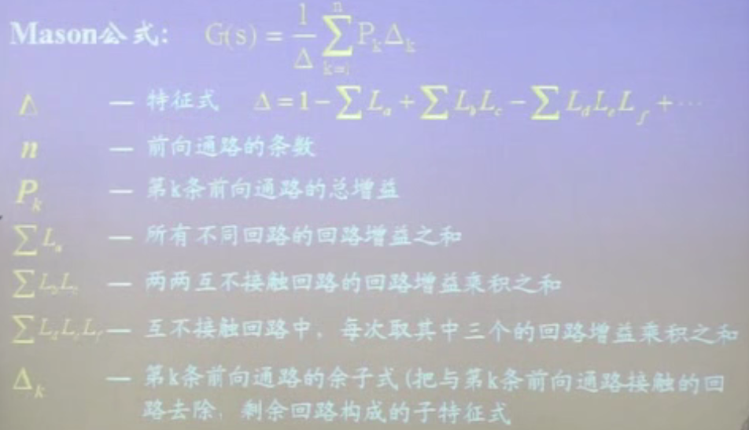

对于剩余回路构成的余子式，与前向通路有公共点也不行（注意特征式的正负号、比较点的正负）

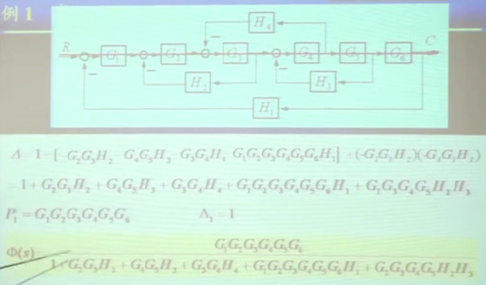

**难题$\times$5**，小心仔细不要漏（前向通路、回路），分清前馈通道和反馈通道（从原点出发的前馈通道构不成回路），比较点的正负

（藏B回路，注意只通过$G_3$的回路有两条）

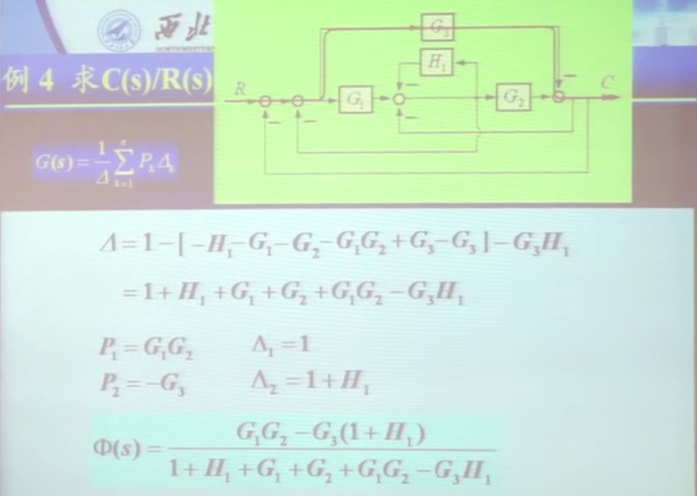

（藏B前向通道，初次之外还有一个M形的不要漏）

（多输入情况，回路不变总特征式不变）

### 控制系统传递函数

*卢京潮 p14(后半段)*

**开环传递函数与闭环传递函数之间的关系**

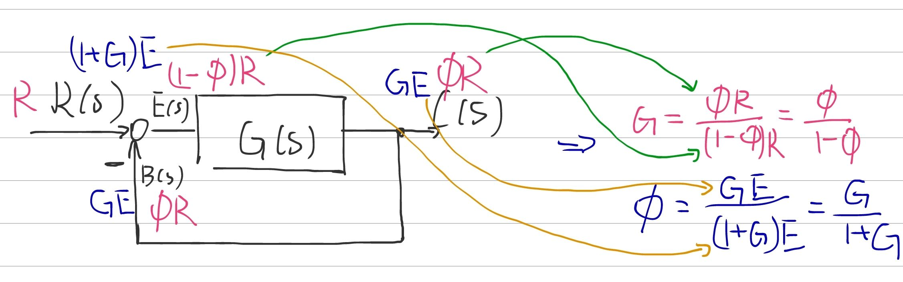

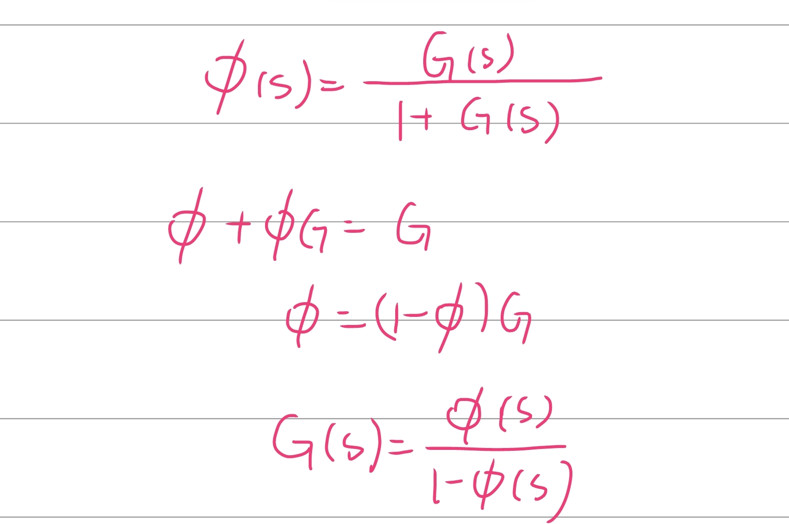

**完整框图**

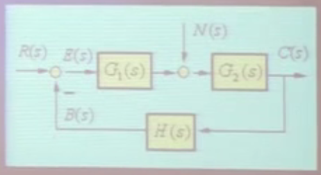

**控制输入R、干扰输入N、系统输出C、偏差E、反馈B**

**开环传递函数**（不是开环系统的传递函数）

将主反馈切断，得到闭环系统的开环传递函数

开环增益：**开环传递函数化为“尾一”标准型**前面的系数

闭环增益：**闭环传递函数化为“尾一”标准型**前面的系数

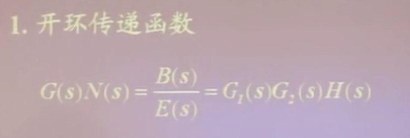

**控制输入r(t)作用下的闭环传递函数**

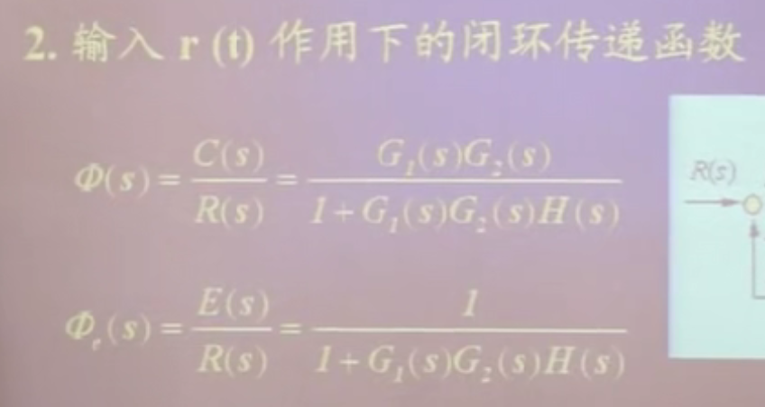

$\Phi_e(s)$中的$e$表示对误差的传递函数

**干扰输入n(t)作用下的闭环传递函数**

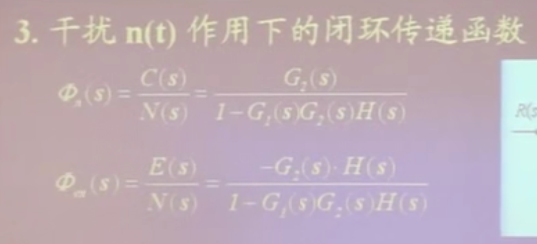

**系统总输出和总误差**

利用叠加原理求得，不用×额外的负号（图中有些正号有点不清楚）

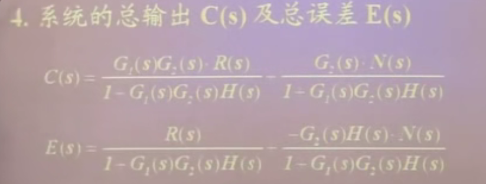

**综合例题**

（常规计算：先写出输入到输出的传递函数，将输入信号进行拉氏变换，与传递函数相乘，再进行拉氏反变换）

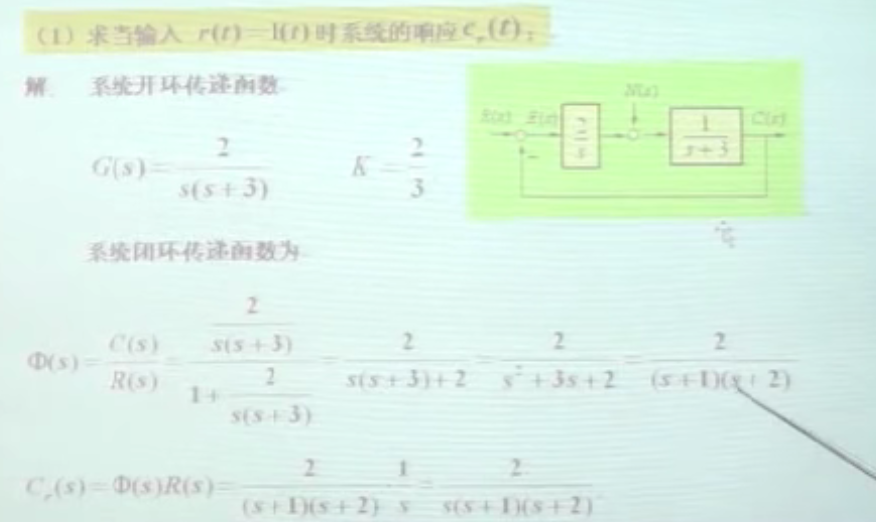

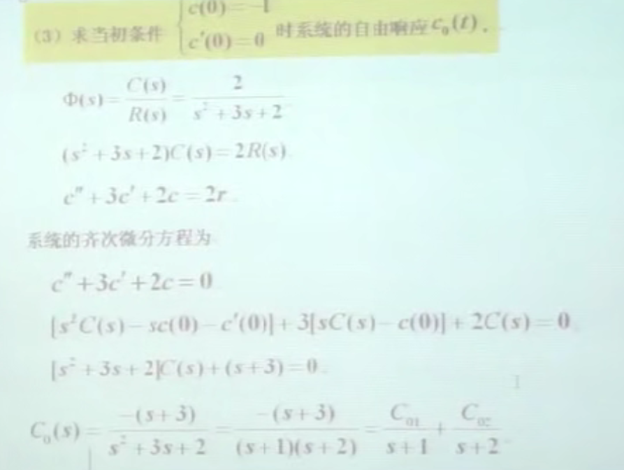

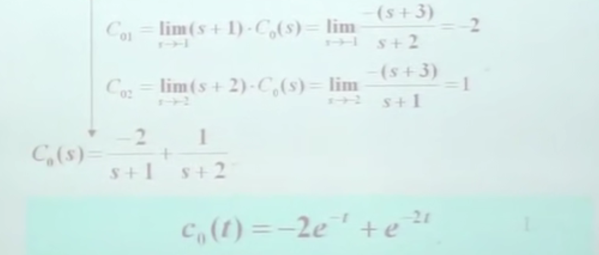

（**计算由初始条件引起的自由响应：已知传递函数，需将其转换为微分方程，同时写出齐次微分方程（零输入响应）。进行拉氏变换，并将初始条件代入，得到由初始条件引起的传递函数。再进行拉氏反变换。**）传递函数，本身计算的是输入为冲激信号的零状态响应，现在要求零输入响应，需要通过求解其次微分方程，同时带入初始条件。

REMAIN

零输入响应：方程为齐次方程，仅有齐次解，特解为0

零状态响应：齐次解+特解

（利用**叠加原理**，将总的输出计算出来）

（也可以在复数域，将系统所有输出相加，再一起进行拉氏反变换）

（偷鸡，由于本例较为简单，不适用于所有情况）

## 03 线性系统的时域分析与校正

### 概述

三个指标
1. 稳（**基本要求**）：稳定性分析。系统受到扰动后能回到原来的平衡位置。
2. 准（**稳态要求**）：稳态误差（稳态精度）稳态输出与理想输出之间的误差要小。
3. 快（**动态要求**）：时间响应&动态性能（跟踪阶跃信号的过渡过程指标）。阶跃响应的过渡过程要平稳迅速。

时域法
1. 可以提供系统时间响应的全部信息
2. 直接在时间域中对系统进行分析校正，直观，准确
3. 基于求解系统输出的解析解，十分繁琐

典型输入信号
1. 单位脉冲
2. 单位阶跃
3. 单位斜坡
4. 单位加速度

超调量：反映平稳性（在峰值时间取得）

**注意：超调量对应的就是单位阶跃响应曲线。二阶系统的闭环传递函数决定了单位阶跃响应最终的形态**。计算系统传递函数的时候不要将阶跃信号算入，只要求$\frac{Y(s)}{R(s)}$即可。

调节时间：反映迅速程度

### 一阶系统的时间响应及动态性能

*卢京潮 p15*

阶跃响应

调节时间是时间常数三倍（对于一阶系统，将分母化为尾一标准型（不用管分子），s前面的系数就是调节时间）

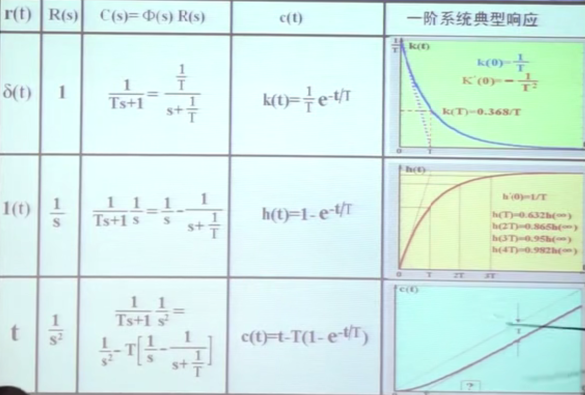

**系统对信号响应的微分=系统对信号的微分的响应**，**系统对信号响应的积分=系统对信号的积分的响应**（对任意有限阶的线性定常系统都成立）

原先做法是先对单位阶跃响应和单位阶跃信号进行Laplace变换再相除，得到系统闭环传递函数。对闭环传递函数进行Laplace反变换得到k(t)（单位冲激响应）。最后通过开环传递函数和闭环传递函数的关系求解G(s)。

现在可以直接对单位阶跃信号进行求导，得到单位冲激响应。再进行拉氏变换得到闭环传递函数，最后利用开闭环传递函数的关系求解。

### 二阶系统的时间响应及动态性能

*卢京潮 p16*

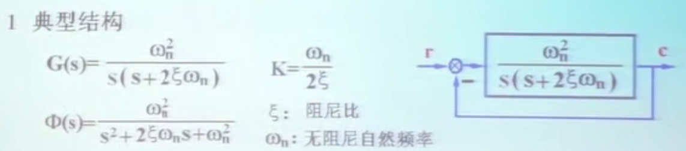

对于二阶系统的传递函数习惯使用**首一标准型**

**$\xi$阻尼比**

**$\omega_n$无阻尼自然频率**

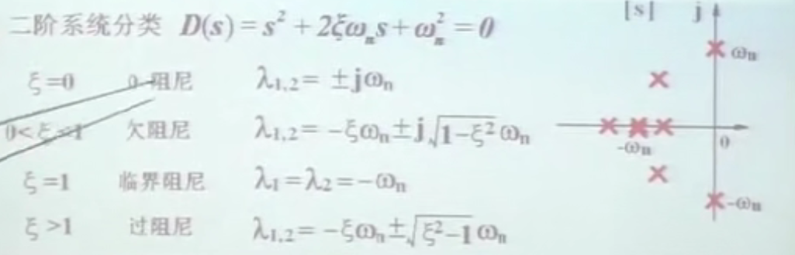

1. 零阻尼：两个纯虚根
2. 欠阻尼：两个共轭复根
3. 临界阻尼：一个重实根
4. 过阻尼：两个实根

#### 临界阻尼&过阻尼情况

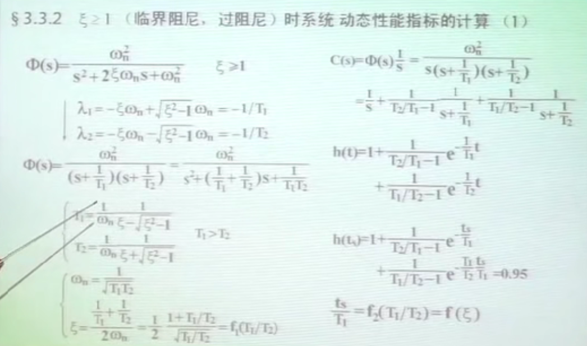

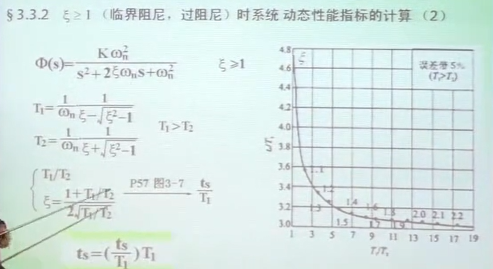

将二阶系统拆分为两个惯性环节的级联。可以看到，靠近虚轴较近的极点对于系统动态性能影响较大，距离虚轴远的极点影响较小。（距离虚轴远，与阶跃响应的拉氏变换$\frac{1}{s}$相乘后，进行拉氏反变换，得到的响应$1-e^{-at}$的指数幂是更大的负数，代表更接近阶跃函数本身，所以对系统影响不大。）下图中黑线为实际二阶系统的响应曲线，蓝线为主导极点的阶跃响应。

**闭环主导极点**，距离虚轴越近，影响越大

#### 欠阻尼情况

*卢京潮 p17、p18、p19*

极角：从实轴负半轴，顺时针转到共轭复根

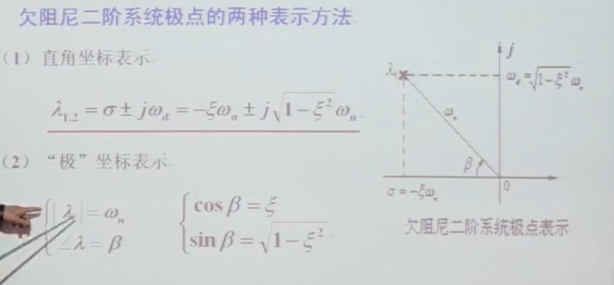

计算输出的时候将单位阶跃$\frac{1}{s}$于系统传递函数相乘，得到输出的拉氏变换。再进行拉氏逆变换，得到阶跃响应（振荡波形）。**计算动态性能指标的参数只需要从系统传递函数求得，而不是从阶跃响应获得。**当通过微分方程列写传递函数的时候，也不需要要将实际输入进行拉氏变换再带入，使用R(s)表示即可。

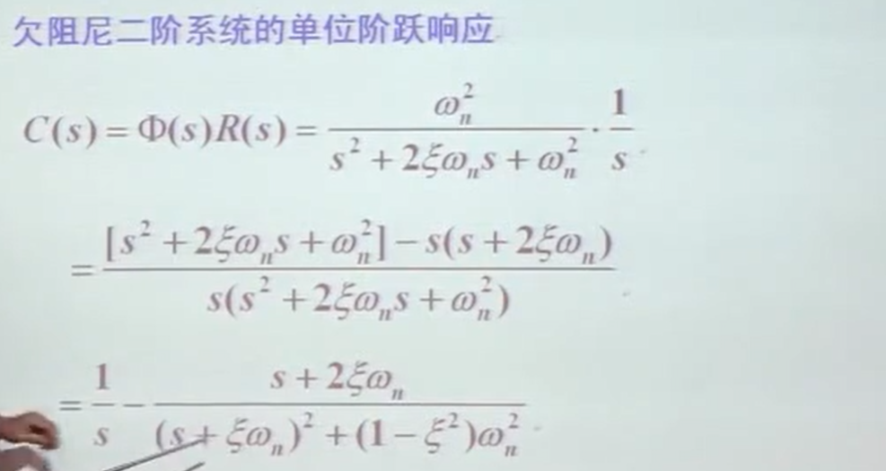

凑项

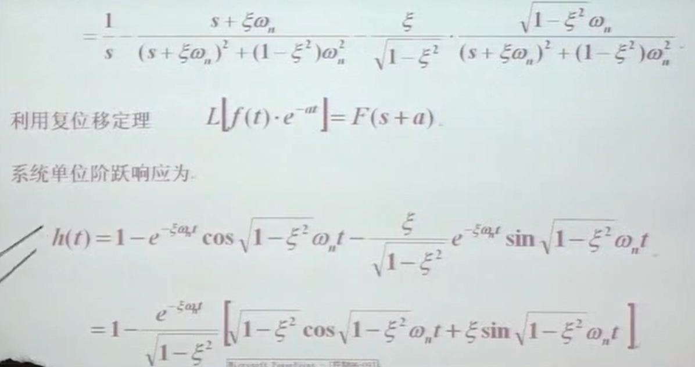

零阻尼二阶系统，超调量为100%，调节时间为∞。

欠阻尼二阶系统，两个包络线

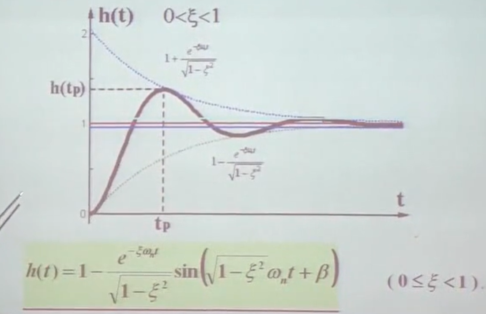

将单位阶跃响应对t求导，得到单位冲激响应。

令单位冲激响应等于0，求出极值点。只有正弦函数部分有可能等于零。

阻尼比越小，振荡越快，超调量越大。

**峰值时间**

**超调量**

超调量只与阻尼比有关，与无阻尼自然震荡频率无关。只要$\beta$值相同（极点在同一射线上），系统的超调量就确定了。

**阻尼比越大，超调量越小。（$\beta$角越大，超调量越大）**

**上升时间**

比峰值时间小（少转一个$\beta$角）

$\frac{\pi-\beta}{\sqrt{1-\xi} \omega_n}$

**调节时间**

以包络线进入5%误差带的时间为基准（得到的结果偏大，更加保守）。使用包络线是为了让调节时间可以连续变化。

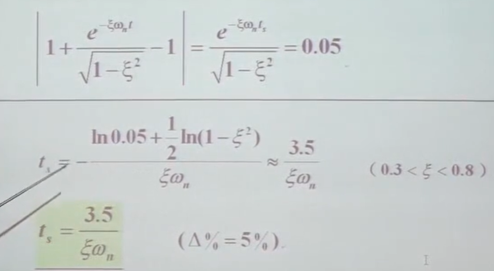

（注意这里也不一定是3.5。有别的版本，对于2%误差带是4，对于5%误差带是3）

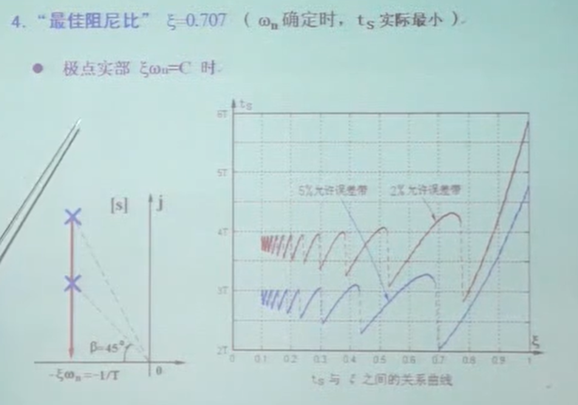

理论上阻尼比等于0.707最好（精确定义的时候）

利用拉氏变换的终值定理，计算最终的稳定值。

**峰值时间由闭环极点的虚部决定，超调量由极点的实部和虚部之比决定，调节时间由闭环极点的实部决定（实部决定包络线的收敛速度）**

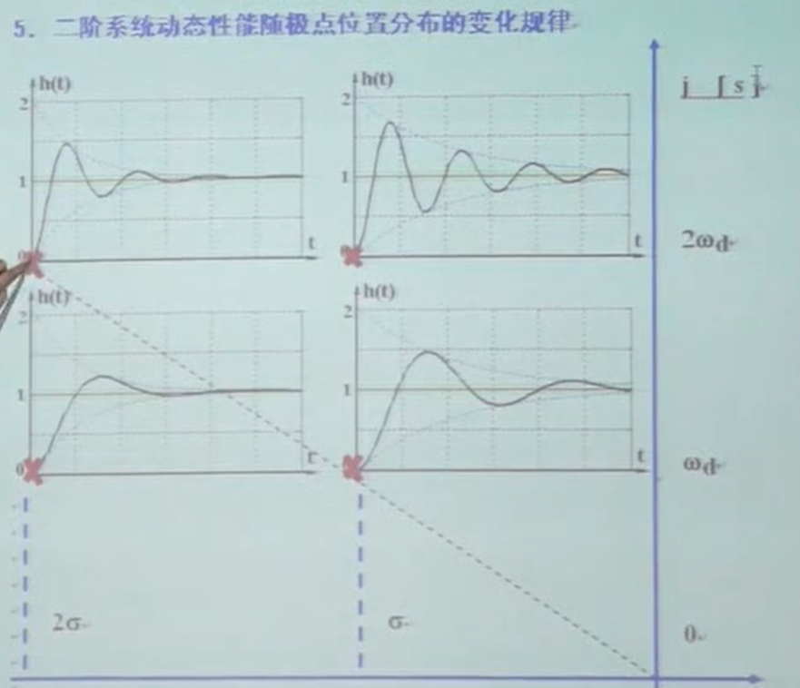

#### 二阶系统性能改善

改善二阶系统动态性能措施：
1. **测速反馈——增加阻尼**，对输出求导，再引回误差信号处（输出减输入）。
2. **比例+微分——提前控制**，原来的进入系统的只有误差信号本身，现在再加上误差的导数（PD控制）。误差会有滞后性，控制不及时。而比例微分做到了提前控制。

从闭环传递函数可以看出，测速反馈做的就是增大阻尼比，降低超调量（如果原先的阻尼比已经够大，就不要使用该方法）。

另外比例微分和测速反馈的闭环特征方程相同，所以闭环极点相同，推出**阻尼比和无阻尼自然震荡频率相同**。

但是，比例微分增加了闭环零点，结果相比测速反馈：**超调量增加，峰值时间减小**。

使用**零点极点法**，计算别的

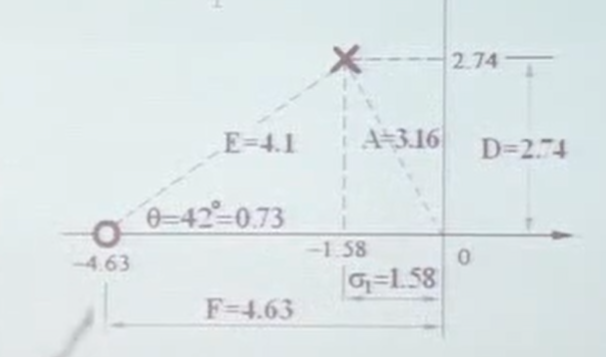

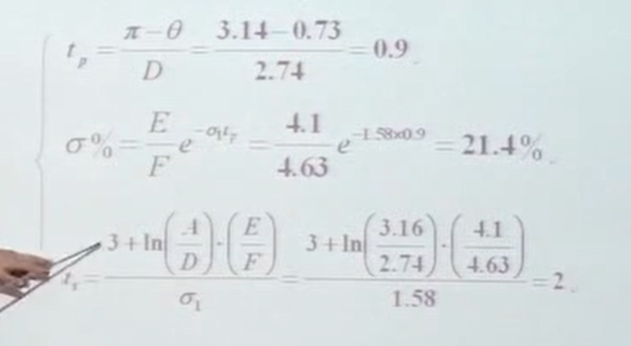

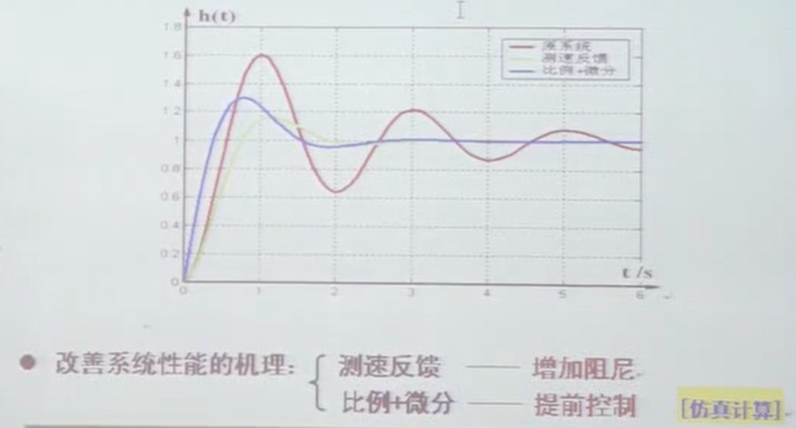

### 高阶系统的阶跃响应及动态性能

*卢京潮 p20*

**KEY:主导闭环极点**：距离虚轴较近，且不存在闭环零极点对消的闭环极点（远的零极点舍弃（距离>=5倍））。

偶极子：零极点对消。

上图是一个七阶系统（只画了上半平面，小心共轭复根），现在利用二阶系统估算动态性能指标。

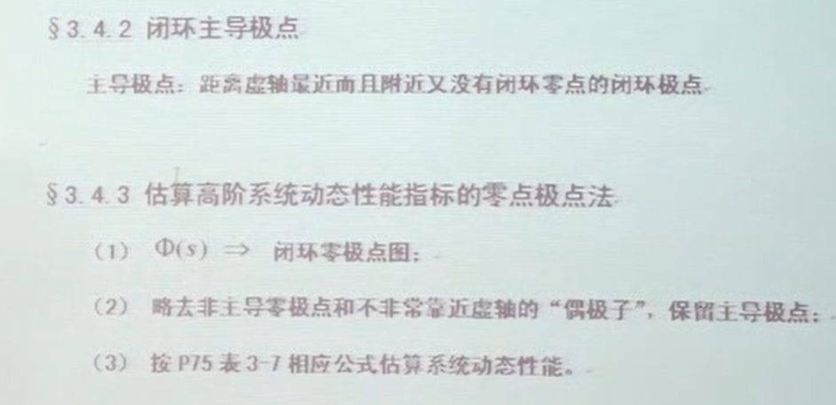

### 线性系统的稳定性分析

*卢京潮 p20*

**系统正常工作的首要条件**：受到干扰，偏离平衡位置。干扰消失，回到原来的位置。

**对于线性定常系统，通过判断单位冲激响应是否回零**，如果不回零一定不稳定，如果**回零一定稳定**。

**稳定的充要条件**：所有的闭环极点必须具有负实部，也不能在虚轴上。

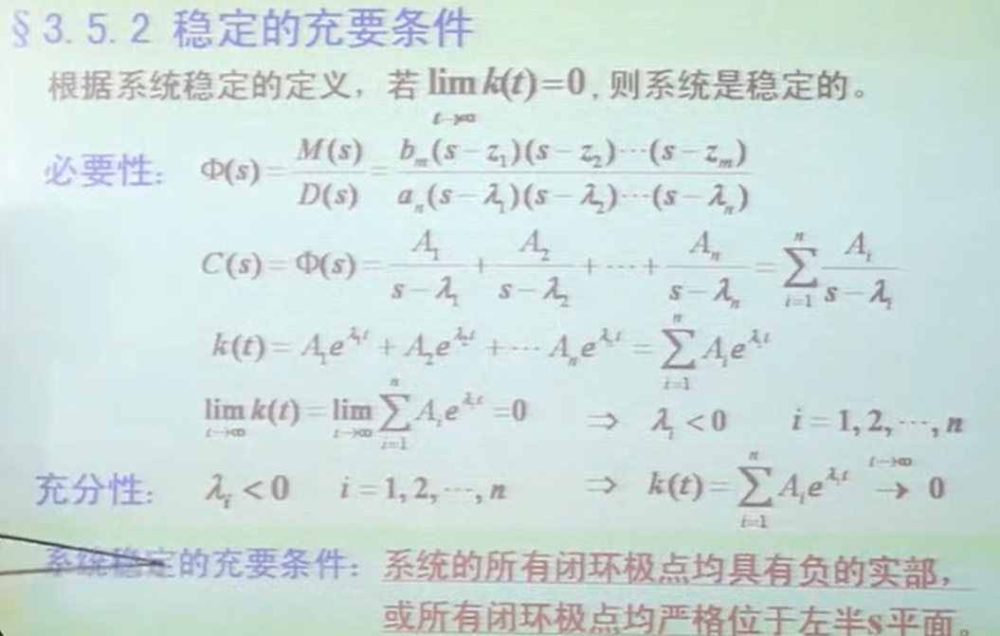

对于高阶系统，解出所有根是否困难。希望有一种可以不求解特征方程的根就能判断系统稳定性。

#### 劳斯判据

劳斯判据根据给定参数判断系统是否稳定，有几个不稳定的极点。参数不给定可以求解使得系统稳定的参数范围。

**闭环特征方程**

**只用考虑闭环极点，零点不考虑**。

**如果缺项也是不稳定，全负可能稳定**

首先要满足必要条件。（否则一定不稳定）

不仅可以判断稳定性，还能求出不稳定的点的个数

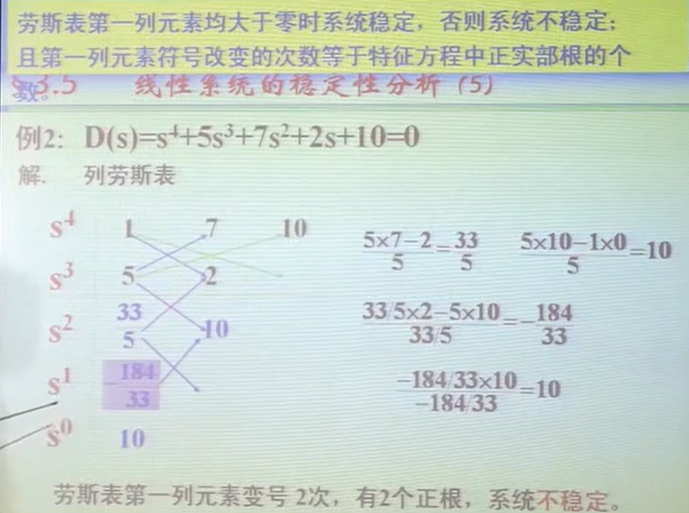

变号的次数就是右半平面的极点数。**（正变负、负变正都算）**

一般劳斯表的最后一行$s^0$的数就是特征方程的最后的常数项。

**特殊情况处理**

①如果劳斯表第一列有0，但不全为零（如果这一行只有第一列有数也不行），用$\varepsilon$（一个很小的正数）代替，继续算。

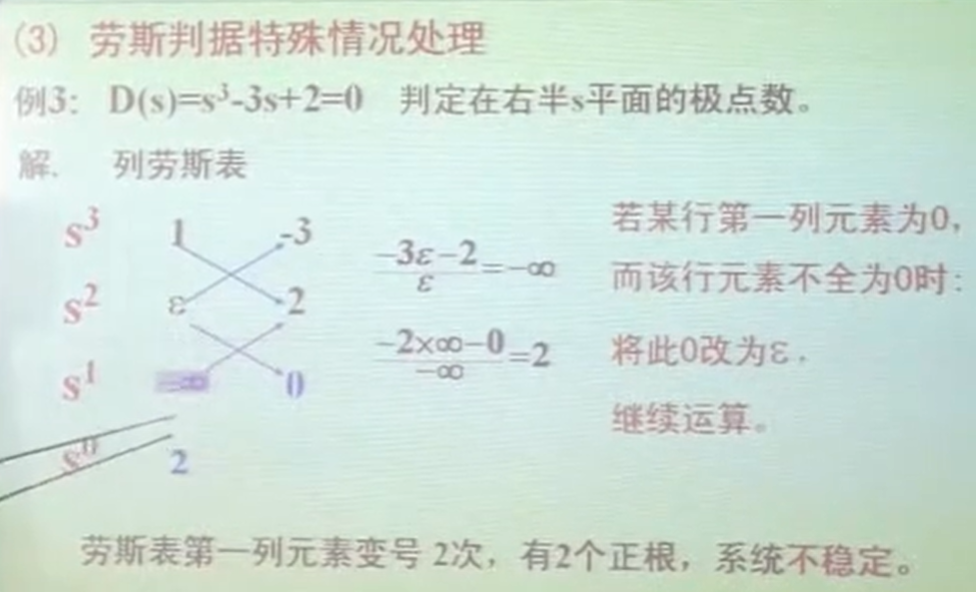

②遇到全零行，虽然可以继续算，但已经不稳定

**辅助方程的解是原特征方程解的子集。**（更新后的如果没变号，一定是在虚轴上的一对纯虚根，不稳定。变号可能是一对符号相反的实根，或者两对实部符号相反、虚部相同的共轭复根）。

对辅助方程求导。


**对于二阶系统，系数全部大于零，系统稳定。**

**对于三阶系统，系数全部大于零，中间两个系数的乘积大于外边两个系数的乘积，则稳定**

系统的开环稳定和闭环稳定不能相互保证。

K是开环增益不同于$K_a$。

两种思路（**基本原则，方程本身不能变**）
1. 将原特征方程中拆解出(s+1)
2. 将s=x-1带入，只要x都在虚轴左边，就能保证s比-1小

**系统的稳定性是自身的属性，与输入类型和形式无关**

**系统的稳定与否，只取决于闭环极点，与闭环零点无关**，闭环零点实惠影响系统的动态性能，但不会影响稳定性。


### 线性系统的稳态误差

*卢京潮 p21、p22*

**准，稳态误差是系统稳态性能指标，对系统控制精度的度量**

**只有与稳定系统才有研究稳态误差的意义**，一定要**先判稳**。

原理性误差（不考虑由于系统非线性因素引起的误差）

无差系统不是在任何情况都无差，只是在阶跃输入作用下。

按输出端定义的误差（强行写成单位负反馈形式）。按输入端定义的计算时较为方便。

由输入和干扰共同作用。一般说稳定误差就是静态误差（如果系统不稳定，只能得到动态误差）。

**利用拉普拉斯变换的终值定理**

#### 静态误差


**输入的闭环传递函数和干扰的闭环传递函数分母相同**

计算动态性能指标时，同一加单位阶跃信号。计算稳态误差时，没有这种规定，输入信号也可以是斜坡、加速度信号等等。

当输入提高“档次”后，无差系统就不一定无差了。

**静态误差系数法**

开环传递函数中由v个纯积分环节。纯积分环节的个数称为型别（类型）。

**型别是对闭环系统而言的，但是计算时是将主反馈打断，求出开环传递函数，看有几个纯积分环节**

**开环传递函数有几个积分环节，闭环系统就称为几型的**

显然，稳态误差与输入有关，也和系统的结构参数有关（最关键的是开环增益和型别）。


静态位置、速度、加速度误差系数是针对输入信号的（分别对应阶跃、斜坡、加速度信号）


**结论：**
1. **型别确定后，稳态误差随输入档次的增加而增加**
2. **输入档次确定后，稳态误差随型别的增加而降低**
3. **当型别和输入档次对等的时候，稳态误差是一个非零的常值**
4. **型别高、输入档次低，稳态误差为0**
5. **型别低、输入档次高，稳态误差为∞**


对于上图系统，输入最终一定等于输出。否则，假设达到稳态并且输出不等于输入，误差经过一个积分环节，再经过一个比例微分环节，再经过一个积分环节将会得到一个二次向上升的信号。与假设不符合。

**系统的型别对于减小稳态误差有很关键的因素，但是也不是越多越好。型别越高系统越难稳定（特征多项式越容易缺项，不稳定）。**

下题只能使用定义法求解。


前馈环节不影响系统的稳定性，不影响系统的传递函数。（写开环传递函数的时候不管前馈通道。（本题不用？REMAIN））写特征方程也不管前馈通道，因为只和回路有关，前馈构不成回路（用梅森公式考虑）。（本体其实也不需要写开环传递函数）

可以看出**按前馈补偿的符合控制方案可以有效提高系统的稳态精度**

最后稳态误差的式子中剩余什么说明什么起作用。本例对于输入信号产生的稳态误差，$s_1、s_2$都起作用才能和之前的$s^2$约去。对于干扰产生的稳态误差，只有$s_1$起了作用


一定要判稳

#### 动态误差

REMAIN 

### 线性系统的时域校正

瞬态响应

相对稳定性

## 04 根轨迹法

用于解决系统的分析和校正，根轨迹法也称作复域法

**一定是闭环特征根的轨迹**

**开环传递函数，写为首一标准型，系数$K^*$称为根轨迹增益**，根轨迹增益仅对开环传递函数而言。

### 根轨迹法的基本概念

*卢京潮 p25*

对于系统的调节时间，靠近虚轴的点的影响更大。向左移动，调节时间变短（由之前的系统性能指标可得，实部大渐近线衰减快）。**靠近虚轴的点是主导极点**


$K^*$越大，稳态误差越小。


闭环零点不会随开环增益改变，但是包括前向通道的开环零点和反馈通道的开环极点。

同时满足模条件和相角条件说明在根轨迹上。（$K^*$是0到∞变化的，所以模条件总是可以满足的，但是相角条件并不一定满足）


相角条件是充要条件，模值条件用于确定根轨迹增益

### 绘制根轨迹的基本法则

*卢京潮 p26（后半段）、p27、p28*


**法则1-4**

共轭开环零极点对于实轴上的根轨迹相角条件贡献为0（每组都是$2\pi$），实轴上的每一个开环零极点对于根轨迹的贡献为$\pi$。

当开环传递函数给定，a的值也就随之确定，开环极点的和等于$-a_{n-1}$（将分母$GH(s)$展开即得）也确定了。对于闭环特征方程，如果$n-m\geqslant2$，则不会影响到$-a_{n-1}$，所以**闭环极点之和就等于开环极点之和，是一个常数**。


用$\sigma、\omega$列写方程（以$K^*$为中间变量），如果可以表达成圆方程的形式就证明轨迹是圆弧。

相切时，超调量最大。


**法则5-8**


从根轨迹上的无穷远点s看，所有零极点都在“质心”上，这样相角条件很容易得出，n-m个角度的和要等于$(2k+1)\pi$。最终对任意整数k，不同的相角只有n-m个。

对于幅值条件，相当于s到质心距离的n-m次方，进行展开。同时，利用长除法，得到相对应位置的系数，得证。


由根之和可知，在本题中，-1和0的分离点应该在-0.5和-1之间（-4和-2的根在向右走），同时也不能超过渐近线。

分离点至少是一个二重根。


对于算出的根轨迹，需要进行检验，以保证正确性，不符合的要舍去。


根轨迹与虚轴交点有两种求法
1. 利用劳斯表全零行，求出根轨迹增益$K^*$（**这个根轨迹增益就是使得系统临界稳定的根轨迹增益**，还要经过换算得到开环增益$K$）。全零行上一行构成辅助方程，求解该方程即可。（如果要继续写完劳斯表，将辅助方程求导，得到对应系数继续列写）
2. 将$s=j\omega$带入特征方程进行求解，将结果进行检验。


在要求的极点附近取一点（挨得很近，开环零点极点到这个点的向量近似等于到所求点的向量）。通过相角条件列写方程，$\Theta_1$就是所要求的出射角。


上图可以稳定但是稳定的不多（右边的曲线向左穿过虚轴的时候是稳定的）。但系统的动态特性不好，$\beta$角较大，阻尼比小，超调量大。另外极点实部较小，调节时间较长。


### 广义根轨迹

*卢京潮 p29、p30*

REMAIN

### 利用根轨迹分析系统性能

*卢京潮 p31、p32*

REMAIN

**闭环特征根**在s平面的位置影响**相对稳定性**和**瞬态性能**。

**闭环传递函数**

$T(s)=\frac{Y(s)}{R(s)}=\frac{p(s)}{q(s)}$

特征方程$q(s)$，决定了系统响应模式

## 05 线性系统的频域分析与校正

任意给出一个模型，都可以推出其他的模型。

### 频率特性的基本概念

*卢京潮 p33*


前面部分是一个随时间衰减的分量（瞬态分量），稳态分量是一个同频率的正弦信号（幅值相角变了且都是$\omega$的函数）。

**频率响应：信息系统稳态正弦响应的幅值、相角随输入频率变化的规律性。**


幅频：稳态正弦响应和输入信号的**幅值比**随频率变化规律

相频：稳态输出的相角与输入信号的**相角差**随频率变化规律

1. 定义1：物理意义
2. 定义2：如何写频率特性
3. 定义3：傅里叶变换（$传递函数的傅里叶变换=\frac{输出傅里叶变换}{输入傅里叶变换}$）


其实就是将$s=j\omega$带入，求出频率特性

**幅相特性**：nyquist 将相频和幅频曲线结合 每一个点代表一个$G(j\omega)$ 要从原点连一条线段 “连衣裙”

**对数频率特性**：bode 对数刻度 “工作服”

**对数幅相特性**：nichols 直角坐标（将bode两个图融合） 每一点对应不同的频率

**四件衣服**

### 幅相频率特性 Nyquist

*卢京潮 p34、p35、p36*


**绘制时注意正负号**


惯性环节的Nyquist图就是**半圆**。证明如下：


对于振荡环节，先确定$\omega_n$和$\xi$的值，再让$\omega$进行变化。阻尼比越大，画的圈越大。

谐振频率$\omega_r$和谐振峰值$M_r$（**共振的概念**） （谐振：resonance）

将谐振频率带入频率特性表达式即得谐振峰值。

**谐振频率和谐振峰值的计算公式**

要达到-90°，arctan()里面的内容要无穷大，只能分母是0。由此得出$\omega_n$


**开环幅相特性曲线的绘制**

看作典型环节的乘积


对于Ⅰ、Ⅱ、Ⅲ型系统，用$G(j0_+)$代替$G(j0)。否则不好判断。

### 对数频率特性 Bode

*卢京潮 p37、p38、p39、p40*

绘制时化为尾一标准型：方便看出开环增益、转折频率

Bode图坐标纸性质


微分环节和积分环节在$\omega=1$的时候过$0dB$线

在转折频率的位置正好差根号2倍，$-3dB=20lg\sqrt{2}$

如果阻尼比等0
1. 幅频：在谐振频率处达到无穷大（峰）
2. 相频：一开始保持0°，在截止频率处突变为-180°。

需要考虑超调量


注意虽然是线性关系，但是坐标轴是非线性的，所以相角衰减是曲线形式。

**截止频率：开环对数幅频特性曲线和横轴交点对应的频率**


注意20分贝对应的是十倍频

两个频率相差的分贝数是$xdB/dec\times lg(\frac{\omega_2}{\omega_1})$


注意只有8分贝的超调是由振荡环节引起的。其他的是比例环节引起的。


绘制Bode图的时候先将开环传递函数化为尾一标准型。


积分和微分，不算在转折点数中。


**看系统是几型的可以通过看Bode图第一个转折频率之前有几个积分环节（几个-20dB/dec）**

为了计算方便，可以在设未知系统的传递函数的时候就设成**尾一形式**，不要忘记设开环增益

先求开环增益（**最简单的方法，将微分或积分环节延长，交横轴于$\omega_0$**，对于积分或者微分环节而言其他环节线不考虑，带入$G'(s)$（只有积分或者微分和比例环节）在$\omega_0$处应该为1），对应下图解法Ⅲ。


点A在幅相图中是相切点，B是幅值为1的点

**一定要注意，计算K时要计算$\omega$时不要直接进行相减，要用乘除**

#### 非最小相角系统情况

REMAIN

### 频域稳定判据

*卢京潮 p41、p42、p43（前半部分）*

#### 奈奎斯特稳定判据（Z=P-2N）
1. Z：**闭环特征根**在**s右半平面**的个数（Z=0则系统稳定，Z!=0系统不稳定）
2. P：**开环极点**在**s右半平面**的个数（由系统的开环传递函数即可得知）
3. N：**开环幅相曲线**穿越**负1之左实轴的次数**（有正负之分，逆时针是正穿越，顺时针是负穿越），起始或终止在-1之左实轴算半次

对奈奎斯特稳定性判据的说明：

**辅助函数F(s)的零点就是闭环系统的极点，辅助函数F(s)的极点就是开环系统的极点**。**辅助函数将开环和闭环的零极点连接起来**，一般情况两者阶数相同。

如果要画辅助函数的频率特性，也只需要将开环传递函数的频率特性向右搬移一个单位（实部+1）

s走过一个奈奎斯特路径，将辅助函数在s平面右侧的零极点包入。被包入的零极点对$F(j\omega)$绕过[F]平面原点的角度贡献都是$-2\pi$。而$F(j\omega)$（不能直接画，因为不知道闭环极点具体是什么，但是）可以由开环频率特性向右搬移一个单位得到。$F(j\omega)$包围0点相当于$GH(j\omega)$包围(-1,0)点。红圈包围-1阶零点的次数是其上半部分包围次数的两倍。

对于蓝圈说明如下，s沿着奈奎斯特路径从0+到+j∞对应蓝圈上半部分，从-j∞到0-对应蓝圈的下半部分，从+j∞到-j∞对蓝圈相当于一直在(+1,0)点原地打转。（其实是先分析红圈在平移得到蓝圈）

频率特性其实就是在s平面选取一个s值，让所有的零极点指向它，得到幅频和相频的关系。


**另外可以通过根轨迹进行辅助验证**


**如果传递函数在原点处由零极点，则使用一个小圆绕过去。（0到0+，0+到+无穷）对于处于原点的极点，由于奈奎斯特路径进行绕路，相当于将它算作左半平面的极点（虚轴上的极点都不算）。**如果没有极点等于零就不用补虚线。在计算圈数的时候需要将大圆弧的包围也算上。

#### 奈奎斯特对数稳定判据

在将奈奎斯特稳定判据运用到Bode图的时候要特别注意：由于半对数坐标系的特性，不能表示趋于0的$\omega$，也就是从0到0+等一些位置。**所以在Bode图的相频特性曲线上要增加一条虚线从0°连到相频曲线开始的位置。**（一定要小心，很容易漏）

为了查看幅相曲线有没有包住(-1,j0)点，需要在Bode图的幅频特性中找到幅频特性大于1（在0分贝线以上的位置），同时查看在该区间内，相频特性有没有穿越-180°。（**对于对数相频曲线，从上往下穿是负穿越，从下往上穿是正穿越**）（**前提一定是幅频大于0分贝**）。

对于增大K相当于将幅频特性向上搬移。

另外还要小心相频特性实际开始的位置（可能隐藏-180°）（如下图所示）


**零阻尼振荡环节，幅值和相角都有突变**


对于(-1,j0)点的相角可以是$(2k+1)\pi$

### 稳定裕度

*卢京潮 p43、p44*


稳定程度
1. 过于稳定不好，响应太慢，进不了5%误差带
2. 稳定程度不好也不行，超调量太大

对于最小相角系统（所有开环零极点都在右边），P=0，只看包不包围(-1,j0)

找相角裕度，就是找截止频率处的相角，距离-180°的裕量。

找幅值裕度，就是找相角等于-180°的地方，幅值小于一小了多少。

角度越大向后延迟的越多（越靠近0角度越大）。


计算稳定裕度

①在幅相曲线中计算


求$\omega_g$将频率响应分解为实部和虚部的形式

②在对数频率曲线中计算（不完全精准）

### 利用开环频率特性分析系统性能

*卢京潮 p45、p46*

**三频段理论**

低频段和稳态精度息息相关，开环增益和系统型别确定

高频段如果足够小，可以抑制高频噪声。而且在次情况下开环频率特性可以反映闭环频率特性。


**在谁的势力范围，相角归宿就看谁的幅相曲线的斜率**，**势力范围越宽越靠近自己的归宿**，斜率反映了（分子分母到目前频率的s阶数之差（对环节进行近似））

注意：相频曲线应该从0°开始画。（可能会产生先负半次穿越，之后再正半次穿越）


对于二阶系统的分析


对于二阶系统，使用频域法求动态性能指标不具有优势


### 闭环频率特性曲线的绘制

*卢京潮 p33、p34*

### 利用闭环频率特性分析系统的性能

*卢京潮 p33、p34*

### 频率法串联校正

*卢京潮 p33、p34*

## 06 线性离散系统的分析与校正

### 离散系统

*卢京潮 p57*

离散系统由两种
1. 采样系统 --- 时间离散，数值连续
2. 数字系统 --- 时间离散，数值量化（会有量化误差）

计算机控制系统优点：
1. 控制由程序实现，便于修改，可以实现复制控制律
2. 抗干扰性强
3. 一机多用，利用率高
4. 便于联网，实现生产过程的自动化和管理

计算机控制系统缺点：
1. 采样点间信息丢失，和连续系统相比，性能有所下降
2. 需要附加模数转换、数模转换


A/D过程：
1. 采样：时间上离散 --- 理想采样过程（采样瞬间完成，没有量化误差）
2. 量化：数值上离散
3. 编码：

数字计算机
1. 离散输入、离散输出

D/A过程：
1. 零阶保持器（ZOH --- zero order holder）
2. 将离散的信号变为阶梯信号

### 信号采样与保持

*卢京潮 p57、p58*

**理想采样序列及其拉氏变换**


两种表达方式
1. 离散信号与连续信号在采样点的关系
2. 离散系统像函数和连续系统像函数的关系（联系**香农采样定理**）


**采样定理（Shannon）**

信号完全复现的**必要条件**（没有理想滤波器，使用的是零阶保持器），规定了离散系统采样周期的设计

频谱和频率特性
1. 频谱对信号
2. 频率特性对系统（输出信号的傅里叶变换和输入信号的傅里叶变换的比）

周期信号，频谱离散；非周期信号，频谱密度连续

**零阶保持器对系统的影响**


（将$s=j\omega$带入第二个式子，取出一半（凑欧拉公式），使用欧拉公式）

抽样频率$\omega_s=\frac{1}{T}$，由香农采样定理，希望得到的理想滤波器是从$0\rightarrow\frac{\omega_s}{2}$的矩形框，如下图蓝线所示


零阶保持器近似看作**相角延迟环节**

导致了**相角裕度损失、系统稳定程度降低、动态性能指标变差**（数字系统性能变差的原因）

### Z变换

*卢京潮 p59、p60*


**将抽样信号的Laplace变换中的$e^{sT}$用$z$代换**（一般取$T=1$），即得到Z变换。

注意**不是**将$e^{-sT}$用$z$代换，**没有负号**

$z^{-1}$表示一拍延迟

**z变换只能对应离散信号，不能对应连续信号（不知道是有哪个连续信号抽样得来的）。**连续信号如果采样结果相同，则z变换也相同。

**连续信号先将t替换为nT**

**Z变换方法**
1. 级数求和法（定义法）
2. 查表法（部分分式展开法）
3. 留数法（反演积分法）

对表的说明：连续信号经过采样得到的离散信号再进行z变换（t=nT）


（**计算乘以$\frac{z}{z-e^{-Ts}}$的留数**）

**Z变换基本性质**


用一拍超前信号减去原信号（利用超前定理）

超前、滞后定理例题


假设蓝点为原信号，例8表示将信号延时一拍得到黑点，例9表示将超前两拍得到红点（又由于单边z变换指研究t大于0，所以要将前面两个红点减去）

复位移定理例题

初值定理例题

终值定理例题

**Z变换的局限性**
1. 只反映采样点信息（不对应连续函数）
2. 一定条件下，输出的连续信号在采样点处会有跳变

上图展示了Z变换的局限性，如果没有零阶保持器（将数字信号转为模拟信号），将会产生锯齿，和预期信号不符。

### Z反变换

*卢京潮 p60*


**长除法(可能写不出通项、只能写成有限项)**


**查表法（先除个z再进行展开，方便展开成熟悉的形式）**

**留数法（注意多重根）**

（**计算乘以$z^{n-1}$的留数**）


Z变换和Z反变换的留数法不同


### 离散系统的数学模型

*卢京潮 p61、p62*

**线性常系数差分方程及其解法**


**前向差分：未来到现在**

**后向差分：现在到过去**

**线性**：两端都是输入变量或者输出变量的采样值。**不出现交叉乘积项，不出现高次乘方项。**

**定常**：系数为常数


**脉冲传递函数**

在输出的地方虚设采样开关，使得可以用离散系统的分析方法进行分析（**舍得，退一步是为了进两步——卢京潮**）

G(z):单位脉冲响应序列的Z变换


环节之间有采样开关的时候，需要分别计算再相乘

环节之间无采样开关的时候，需要整体计算


有ZOH时，可以将ZOH进行拆分（中间可以添加一个采样开关，不影响系统整体结构，而且可以分开计算在相乘），信号经过采样开关，再经过$\frac{1}{s}$积分环节后，变为阶梯信号

通过和之前的结果进行比较，可以发现，**加ZOH环节并不改变系统阶数，也不改变开环极点，只改变开环零点**。

**对于离散系统，梅森增益公式不可用**（有采样开关）

对误差信号e的采样开关可以等效为再输入信号和反馈信号处添加采样开关。

上图使用梅森增益公式没错


上图使用梅森增益公式没错

