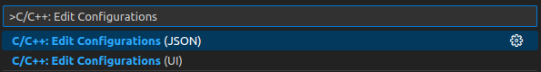
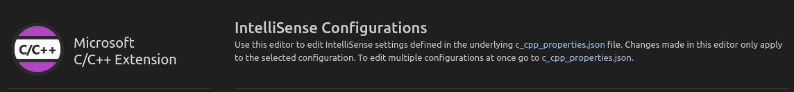
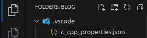
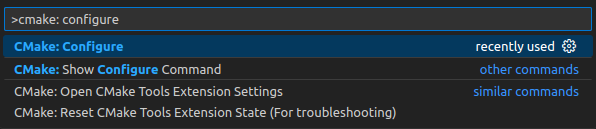
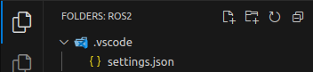

# VSCode 技巧

## Table of Contents

- [VSCode 技巧](#vscode-技巧)
  - [Table of Contents](#table-of-contents)
- [CPP](#cpp)
  - [C/C++ 插件](#cc-插件)
  - [CMake Tools](#cmake-tools)

---

# CPP

## C/C++ 插件

配置 `c_cpp_properties.json`

进入配置方式 - `Ctrl`+`Shift`+`P`，并输入 `C/C++: Edit Configurations`
1. UI
   
2. JSON
   1. 位置 - 项目顶层文件夹 中的 `.vscode` 文件夹
      

配置
1. Compiler path
2. Compiler arguments
3. IntelliSense mode
4. **Include path**
5. C/C++ standard

## CMake Tools

进入配置方式 - `Ctrl`+`Shift`+`P`，输入 `cmake: configure`，并选择一个 `CMakeLists.txt` 文件

会在 项目顶层文件夹 中的 `.vscode` 文件夹中 生成 `settings.json`，并且出现 CMakeTools 图标

  

