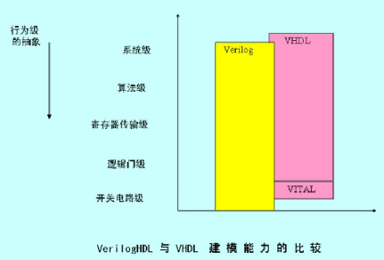
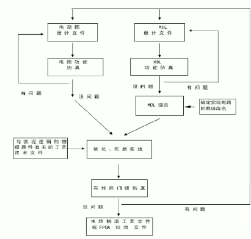

# Verilog HDL基础

 

## Part 1
HDL&emsp;:&emsp;**Hardware Description Language**（硬件描述语言）

&emsp;&emsp;是硬件设计人员和电子设计自动化（EDA）工具之间的接口，其主要目的是用来编写设计文件，建立电子系统**行为级的仿真模型**。利用计算机对HDL建模的赋值实在逻辑进行仿真。

 

具有特殊结构可以实现以下**功能**：

1. 描述电路的连接
2. 描述电路的功能
3. 在不同抽象级上描述电路
4. 描述电路的时序
5. 表达具有并行性

 

HDL主要有两种：**Verilog**和**VHDL**，Verilog多用于IC , VHDL用于FPGA。语法Verilog较为简单，有较多第三方工具支持，仿真工具多。

Verilog主要应用在**寄存器传输级**。

 

HDL的**优点**：
1. 电路逻辑功能容易理解
2. 便于计算机进行逻辑分析
3. 逻辑设计一电路实现分开
4. 逻辑设计资源可重复利用
5. 多人共同设计

 

历史：略

 

软核：功能实现，没有对应具体工艺。

硬核：版图已经完成，只需进行版图的合并。

固核：

 
 
 

## Part 2

自顶向下（Top-Down）设计理念：

&emsp;&emsp;从系统级开始，划分为若干单元，再将每个单元划分为下一层次的基本单元，直至可以直接使用EDA元件库的基本原件来实现为止。

具体模块的时间编译和仿真的过程:
1. 设计开发
2. 设计验证

*&emsp;&emsp;如下图所示：*

&emsp;&emsp;上图中，门级仿真会考虑延迟。

 

&emsp;&emsp;Verilog既是一种行为描述的语言，也是一种结构描述语言。

RTL级（Register Transfer Level）：描述数据再寄存器之间的流动和如何处理、控制这些流动的模型。与逻辑电路有明确的对应关系。

 

Task：不可综合

Function：可综合

原语（primitive）：可以描述开关级（switch-level）和门级（gate-level）

 
 
 

## Part 3

 
 
 

## Part 4

 
 
 

## Part 5

 
 
 

## Part 6

 
 
 

## Part 7

 
 
 

## Part 8

