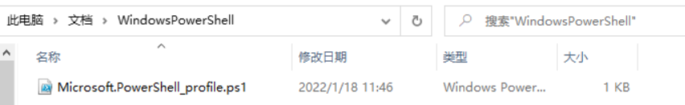
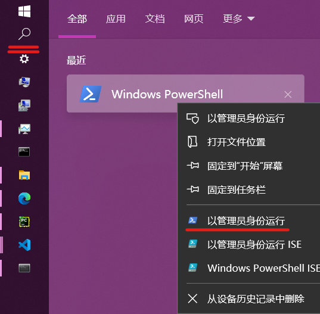

# 将powershell的编码默认改为UTF-8

[将powershell的编码默认改为UTF-8](https://blog.csdn.net/qq_39494169/article/details/122561317)

之前因为VScode默认的编码格式是UTF-8，但是终端powershell是GBK编码，所以打印出来的中文是乱码。在网上看过很多教程，什么修改注册表，或者在VScode中修改setting.json，试了一些都没用。

目前可以在终端输入chcp 65001,这个方法是有效的，但是只是在当前终端修改过来了，新任务运行的新终端还是GBK，只是暂时性的方法。还有在系统设置中改为UTF-8（杀敌100，自损10000），不建议使用这个方法。


修改方法：
1、以管理员身份打开powershell，运行下面代码

```New-Item $PROFILE  -ItemType File -Force```

2、 打开C盘，找到我的文档中的WindowsPowerShell文件夹



没有的话自己创建一个也行

3、编辑这个ps1文件（默认是空的），加上以下代码

```$OutputEncoding = [console]::InputEncoding = [console]::OutputEncoding = New-Object System.Text.UTF8Encoding```

4、以管理员身份打开powershell，运行下面代码



```Set-ExecutionPolicy Unrestricted```

按Y确认即可

5、打开powershell，输入chcp，查看代码活动页是否是65001 
