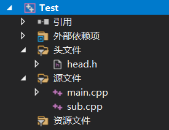

# 指针在头文件中的注意事项

## 一个简单案例

有一个项目由如下文件组成：



头文件：head.h
```cpp
#pragma once
#include <iostream>

const char p0[3] = "p0";
const char* p1 = "p1";
const char* const p2 = "p2";
char* const p3 = (char*)"p3";
const char p4[2][3] = {"p4","p4"};
char p5[2][3] = {"p5", "p5"};
```

主源文件：main.cpp
```cpp
#include <iostream>
#include "head.h"

using namespace std;

int main()
{

	return 0;
}
```

次源文件：sub.cpp
```cpp
#include <iostream>
#include "head.h"

using namespace std;
```

在这短短几行代码中，就有一处错误，也是我在做shenjian老师大作业的时候遇到的。

照理来说，常变量可以放在头文件中定义，但是哪里有错误呢？

错误如下：


可以看出，头文件中的
```cpp
const char* p1 = "p1";
char p5[2][3] = {"p5", "p5"};
```
是导致出错的关键

## 原因分析


