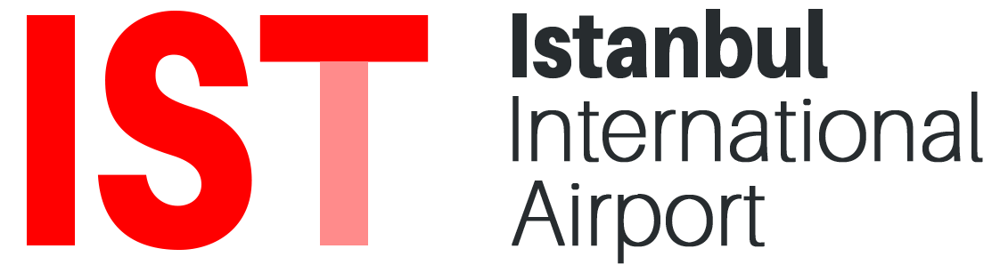
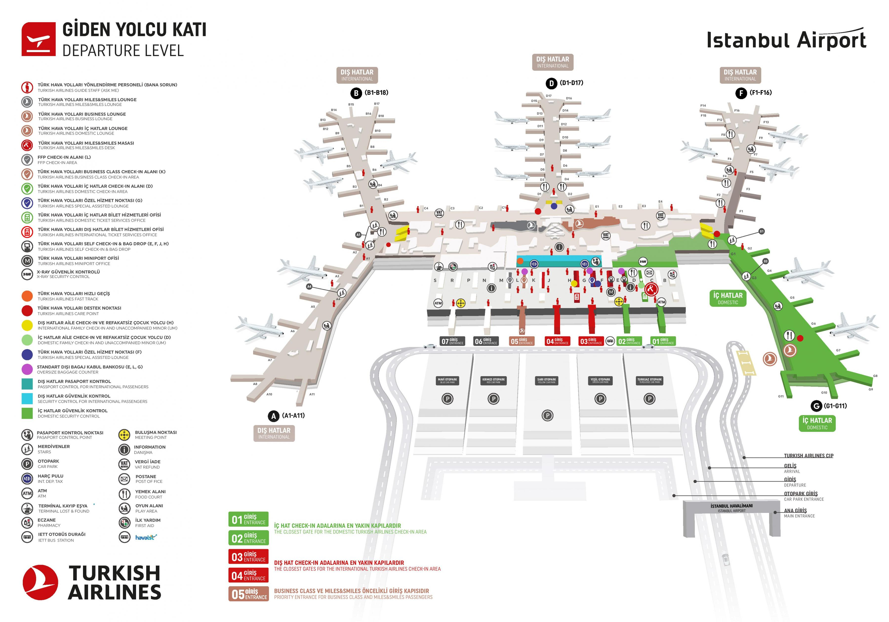

## Istanbul International Airport (IST)

[Istanbul International Airport (IST)](https://istanbul-international-airport.com/)

[Google Map - Istanbul International Airport](https://www.google.com/maps/place/Istanbul+Airport/@41.2646678,28.7192065,13.33z/data=!4m12!1m6!3m5!1s0x409ffff60abc95a9:0x380ce02cc824e506!2sIstanbul+Airport!8m2!3d41.259899!4d28.7427334!3m4!1s0x409ffff60abc95a9:0x380ce02cc824e506!8m2!3d41.259899!4d28.7427334)

[Turkish Airlines - 中转/过境乘客](https://www.turkishairlines.com/zh-int/any-questions/transfer-transit-passengers)

[乘坐飞机可能用到或可能在机场标志上见到的短句](https://zh.speaklanguages.com/%E8%8B%B1%E8%AF%AD/%E6%97%A5%E5%B8%B8%E7%94%A8%E8%AF%AD/%E4%B9%98%E9%A3%9E%E6%9C%BA)

check in 值机/托运
excess baggage charge 行李超重费
window/aisle seat 窗边/走道 位置
trolley 手推车
metallic object 金属制品
gate number xx xx号登机口
boarding card 登机牌
overhead locker 行李架
food and refreshment

