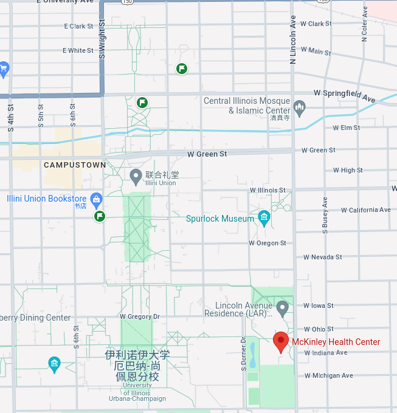

# McKinley Health Center

[McKinley Health Center - 主页](https://mckinley.illinois.edu/)
1. Position - `1109 South Lincoln Ave, Urbana, IL 61801`
2. Email - wellness@illinois.edu
3. Telephone - 217-333-2700

[McKinley Health Center - 表格&信息 提交页](https://illinois.medicatconnect.com/home.aspx)

[☆ Immunization Information - UIUC McKinley 官网整体说明+文件下载](https://mckinley.illinois.edu/immunization-information)

流程
1. check in with mobile devices
2. bring university I-Card

补打疫苗 - Immunization Form
1. MMR: Two vaccines are required after your 1st birthday and only one was on the form(s) submitted
2. Tetanus/Diphtheria/Pertussis: Three doses are required. One must be Tdap and one must be within 10 years of your enrollment date. Your most recent vaccine was over 10 years prior to enrollment and no Tdap vaccine dates were listed on submitted forms
3. include your University ID # (UIN) and your date of birth on each record

obtain a Q-Gold TB Blood test
1. Obtain your University I-Card
2. come to McKinley Health Center, Monday – Thursday 8:30-5:00 and Friday 8:30-3:00. Report to the Laboratory in the basement for your Q-Gold TB Blood Test
3. At the time of the lab draw, a $30 charge for the TB Blood Test will be applied to your student account

contact McKinley’s Immunization and Travel Clinic at 217-333-2702, Monday through Friday 8am to 4:30pm regarding your vaccinations

# Health Insurance

[Student Health Insurance - 主页](https://si.illinois.edu)
1. Email - insure@illinois.edu
2. Telephone - 217-300-9000

[Graduate - Medical Fees](https://si.illinois.edu/fees/medical-graduate-fees)

[Student Health Insurance Presentation Transcript](https://uofi.app.box.com/s/or8p1jkdcc7fzyk9kmmrhz3h91pp1fcs/file/1550871544675)

Health insurance is a requirement for all enrolled students

All students are automatically enrolled into the university plan and charged the student health insurance fee

The student health insurance fee will be placed on your student account the moment that the term starts

The university plan provides several benefits including competitive premiums(保费), low deductibles(免赔额), prescription drug coverage, mental health services, 24/7 tele-health services, and a nationwide provider network

For international students who plan to arrive to campus early, you will have the option to purchase up to 30 days of pre-arrival insurance coverage before the start of the semester

[Pre-Arrival Coverage - Student Health Insurance](https://si.illinois.edu/forms/pre-arrival-coverage)

UnitedHealthcare Student Resources (UHCSR) will NOT automatically send you an insurance ID Card
1. [UHCSR ID Cards 说明](https://si.illinois.edu/forms/id-cards)
2. [student health insurance plan page](https://www.uhcsr.com/school-page)
3. [Dental Plan](https://www.uhcsr.com/uhcsrbrochures/Public/BenefitSummaryFlyers/2024-1351-2%20Dental%20Benefit%20Summary.pdf)

