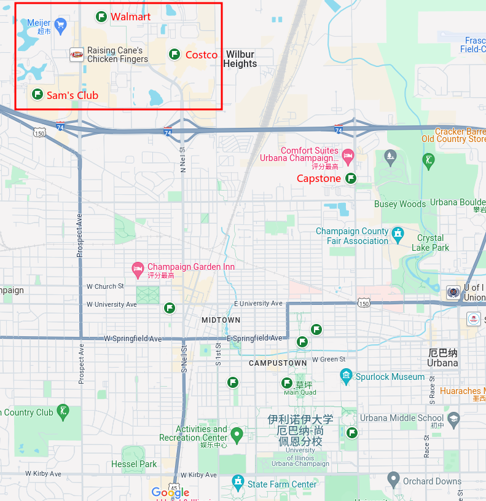

# Life

## Table of Contents

- [Life](#life)
  - [Table of Contents](#table-of-contents)
- [Travel](#travel)
- [Car](#car)
- [Phone \& SIM Card](#phone--sim-card)
- [Shopping](#shopping)
- [Electricity](#electricity)

---

# Travel

**Flight & Airline**
1. [星空联盟](https://flights.staralliance.com/zh/) 
   1. [土耳其航空](https://www.turkishairlines.com/) 
2. 廉价航空
   1. [美国边疆航空](https://www.flyfrontier.com/) 
   2. [美国精神航空](https://www.spirit.com/) 

**Train**

---

# Car

---

# Phone & SIM Card

[Mint Mobile](https://www.mintmobile.com/checkout/order-received/6480430/?key=wc_order_ex2j7LVYpeE9j&wc_nd=1) 

---

# Shopping

[Amazon](https://www.amazon.com/) 

[Walmart](https://www.walmart.com/)  `2610 N Prospect Ave, Champaign, IL 61822`

[Costco](https://www.costco.com/)  `2002 N Neil St, Champaign, IL 61820`

[Sam's Club](https://www.samsclub.com/)  `915 W Marketview Dr, Champaign, IL 61822`

---

# Electricity

美国使用的电压为 110V，而中国大陆使用的电压为 220V

手机和笔记本电脑 - 大部分手机和笔记本电脑都具备双电压功能，可以在美国正常使用

吹风机和电熨斗、电饭煲和电水壶 - 通常需要使用变压器进行适配，否则可能无法正常工作

