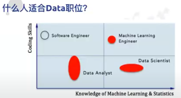
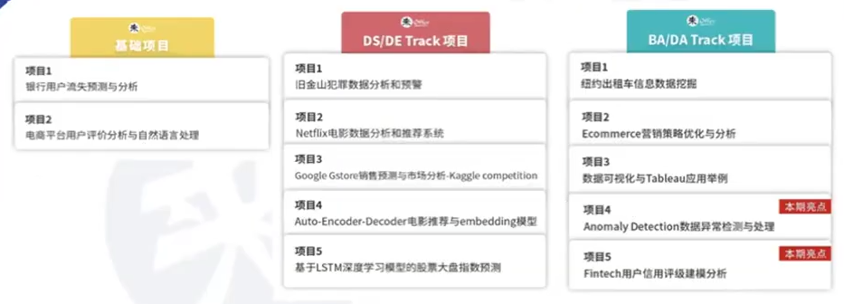
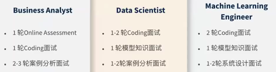

# 润 run

## Table of Contents

- [润 run](#润-run)
  - [Table of Contents](#table-of-contents)
- [OPT / CPT / H1B](#opt--cpt--h1b)
- [来 Offer](#来-offer)
  - [20240701 Yosef老师讲座 - Data 秋招技术面通关秘籍](#20240701-yosef老师讲座---data-秋招技术面通关秘籍)
  - [20240628 Zoil老师讲座 - DA/DS简历](#20240628-zoil老师讲座---dads简历)
  - [20240624 Logan老师讲座 - 数据分析(DA/DS/MLE)职业方向](#20240624-logan老师讲座---数据分析dadsmle职业方向)
- [美国联系人](#美国联系人)

---

# OPT / CPT / H1B

[详细CPT/OPT签证解读-如何合法在美国实习 - B站](https://www.bilibili.com/video/BV1T34y1y7WM/)

[OPT申请指南——线上申请全过程图文剖析 - 一亩三分地经验贴](https://www.1point3acres.com/bbs/thread-972695-1-1.html)

[移民局官网 SEVP Portal](https://sevp.ice.gov/opt/#/login)

VISA - 护照签证页(入境给海关) - 可以多次往返 - 过期影响入境

CPT - **Curricular Practical Training** - 国际学生毕业前在美国境内合法实习用的签证
1. 给 F1 更新(Page2 最上方一栏)，无需去移民局递交
2. 前提 有实习 Offer
3. 校内科研/实习/助教 无需申请 CPT，需要申请 SSN(Social Security Number)，对面试有帮助
4. 条件
   1. 美 本、研、博
   2. Offer 和 专业 有相关性(专业在工作中可以得到应用)
5. 办理
   1. 前往 国际学生办公室 递交材料，并填写 申请表
   2. I-20, I-94, 护照页, 雇主OfferLetter(公司抬头纸，上司，工作内容)
6. 提前找实习，再申请 CPT，通常需要注册一门与你的实习直接相关的课程
7. 要求连续 2个 学期在读
8. 学校有最终审批权

OPT - **Optional Practical Training** - 过渡签证(过渡到H1B)
1. OPT 申请时间 - 毕业前90天 ~ 毕业后60天
2. 毕业时间 - I-20 上的截止，**美国移民局**记录
3. OPT 结束时间 - STEM 最多 3年(找到工作能够工作的时长)，不能和本科的累加
4. OPT 开始时间 - 毕业后60天之内(grace period 缓冲期)任意一天，可以比入职时间早一些
5. OPT 一年结束后需要 OPT Extension，和申请 OPT 流程一样
6. 申请 OPT 成功标识是 拿到 EAD卡(Employment Authorization Document)(三四月审批慢)，拿到卡后才能公司入职
7. 保持身份有效性
   1. 需要去 移民局官网 SEVP Portal 做信息更新
   2. 工作 和 专业 需要有直接关联
   3. 每周工作时间 21小时+
   4. 学校 国际学生办公室 系统更新
8. 鼓励线上申请 OPT
9. OPT 期间，拿到 EAD 后，回国前最好走完入职流程
10. 根据 Offer 情况填写
11. 没有 Offer，90天 内离境
12. 先去国际学生办公室拿新的 I-20(OPT Recommendation Letter)，拿到新的OPT 30天 内去移民局递交资料
13. 地址最好填国际学生办公室，防止 EAD 卡送错
14. 递交资料
    1. 照片
    2. I-20
    3. [I-94](https://i94.cbp.dhs.gov/I94/#/home)
    4. [I-765](https://www.uscis.gov/i-765)，文件在 **Form Details**
    5. [G-1145](https://www.uscis.gov/g-1145) - [G-1145 Explain](https://www.boundless.com/immigration-resources/form-g-1145-explained/)
15. 办理流程
    1. 参加 学校的 Info Session
    2. Info Session 的 确认邮件
    3. 约 国际学生办公室，更新 I-20
    4. 线上 填 I-765 & G-1145
    5. 缴费 410 美金
    6. 缴费后 **USCIS**(U.S. Citizenship and Immigration Services) 会发送信息，可能需要补交资料或被驳回，需要等到确认邮件，等 EAD卡(60 ~ 120天)，检查核对信息
    7. 拿到 EAD卡 14天内 根据 移民局邮件链接 填写状态(工作、专业匹配度)
    8. 前往国际学生办公室进行信息更新
    9. 拿到 OfferLetter 就可以去 SSN Office 办理 SSN(半个月 ~ 一个半月)
16. OPT Extension
    1. 第一年结束前三个月，去 USCIS 官网更新 I-765
    2. 需要 雇主填写表格，
    3. 除第一年外，需要 公司是 [E-Verify](https://www.e-verify.gov/)，不能是 volunteer

H1B -
1. 工作签证，需要抽签。研究生抽签几率比本科生高，但是可以申请的岗位少
2. 有 H1B 就不需要 OPT
3. 如果没有抽中 H1B，则要离开美国
4. H1B抽中后，企业叫 5000 美金

Designated school officials 学校指定负责人
1. 所有经SEVP认证的学校都 至少会有一名DSO
2. 是国际学生、学校和美国政府之间的桥梁
3. 负责签发留学生必备的移民表格与文件
4. 在学生留美期间提供帮助
5. 同时也有权利维持以及变更学生的SEVIS记录

---

# 来 Offer

## 20240701 Yosef老师讲座 - Data 秋招技术面通关秘籍

[20240701 Yosef老师讲座 - Data 秋招技术面通关秘籍](https://drive.google.com/file/d/1PHfEGeqGFYliwUCWiLUwzgTqk2s7GJhz)

Coding Interview
1. SQL (Data Analyst, Business Analyst, Analytical Data Scientist, etc.)
   1. Given a couple tables, write SQL queries to solve problems
2. Python algorithm coding (Data Scientist, Applied Scientist, Machine Learning Eng, etc.)
   1. Computer science data structure & algorithms
3. Python data manipulation coding (Data Scientist, Data Analyst, etc.)
   1. How to leverage existing packages to manipulate data (e.g. pandas, numpy, sklearn, pytorch, matplotlib, etc.)

面试时
1. 不要着急开始写，先确认信息，corner case(数据量、空值)，well-defined
2. 可以列举多个解法，并沟通
3. coding时，可以语言沟通，解释步骤
4. 记得进行测试、验证

准备面试
1. How do I prepare for a coding interview?Be solid about the fundamental knowledge
   1. SQL syntaxes, Python data structure & algorithm, Python common packages
2. Plenty of coding practice
   1. Don't recite the answers. Must understand the mechanism
   2. Recite the answers for 3000+ problems < Get to the bottom of 300 problemsO
3. Practice toward the interview (mock interview)
   1. Act like you were in an interview and record the entire process
   2. Review the process to see whether you are able to understand if you were the interviewer and identify areas for improvement.

## 20240628 Zoil老师讲座 - DA/DS简历

[20240628 Zoil老师讲座 - DA/DS简历](https://drive.google.com/file/d/1pfNzhQh4wnYmgDIfeMi9FOJMgg9SnbUi)

resume content fit the job you apply for 根据 工作要求 customize 简历
1. BA
   1. Experience to resolve business problem, no matter it's big or small
   2. Ability to dig business insight from data
2. DA
   1. Ability to deal with complex dataset
   2. Ability to present the data and insight in a clear way
3. DS
   1. Modeling building skills
   2. Modeling application and impact to the business

common mistakes
1. Buried in the timeline
2. Not enough project details for HR/interviewer to understand
3. No business/real/potential impact (**numbers**)
4. Undervalued internship/project experience
5. Too much learning but less practice

重要信息 - highlight

经验 可以往 目标工作 方向靠

## 20240624 Logan老师讲座 - 数据分析(DA/DS/MLE)职业方向

[20240624 Logan老师讲座 - 数据分析(DA/DS/MLE)职业方向](https://drive.google.com/file/d/1ajEcqBE4DhGw9dYyw1c0NAOvW_XmYuta)

相关岗位
1. business analyst - 了解业务线
2. data analyst
3. data engineer - infrastructure, pipeline, data base, big data
4. data scientist - statistics, ML
5. machine learning engineer - 需要上 production

交叉学科
1. cs
2. math & statistics
3. business/domain

不用回避转专业

招聘趋势
1. 项目经验 - 热点项目/公司相关/描述细节
2. 算法编程 - 针对性
3. 案例分析 - 场景/系统设计

面试知识准备
1. BA/DA
   1. Domain Business Sense
   2. Data Visualization - Familiar with Tableau
   3. Business Case Studies - Search Engine Marketing / Bike Sharing Platform
   4. Communication Skills
   5. Data Manipulation in Python
   6. A/B Testing
   7. SQL/Excel
2. DS/DE
   1. Python Programming
   2. Machine Learning Model
   3. Data Pipeline Workflow
   4. Statistics Essentials
      1. Hypothesis Testing
      2. A/B Testing
      3. Conditional Probability & Bayes Rules
3. MLE
   1. Apache Spark
      1. ML Library
      2. Distributed System Design
      3. Data Pipeline with Spark
      4. Recommendation System (Collaborative Filtering & Model-based Approaches)
      5. Recommendation System (Spark ML implementation)
   2. Deep Learning
      1. Practical Application with Pytorch
      2. CNN and Image Classification Project
      3. RNN and Sentiment Analysis Project

spotify
google
microsoft
visa
amazon
lyft

engineering blog

---

# 美国联系人

1. 魏天一
2. 裘渝琛
3. 袁天赟
4. 康郦昂
5. 乐筱霖
6. 何昊阳
7. 李诚彦

