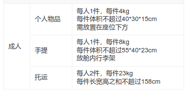

# 留学物品

## 行李要求

1. 个人物品
   1. 每人 1 件，每件 4kg
   2. 每件体积不超过 40*30*15cm
   3. 需放置在座位下方
2. 手提
   1. 每人 1 件，每件 8kg
   2. 每件体积不超过 55*40*23cm
   3. 放舱内行李架
3. 托运
   1. 每人 2 件，每件 23kg
   2. 每件长宽高之和不超过 158cm

## 携带

1. 文件和证件
   1. 护照 * 2
   2. 签证
   3. I-20 原件 & 复印件
   4. SEVIS收据
   5. 录取通知书
   6. 体检 & 疫苗 证书 （小红本、小黄本）
   7. 大学成绩单 （中英文）+ 学历 & 学位
   8. 英语考试成绩单
   9. 信用卡
   10. 财务证明
   11. 保险文件（旅行保险 & 健康保险）
   12. 驾照
   13. 零钱（<$5000）
2. 生活用品
   1. 背包
   2. 旅行箱
   3. 眼镜 * 2
   4. 水杯
   5. 毛巾
   6. 牙膏、牙刷
   7. 沐浴露、洗发液
   8. 纸巾 & 湿巾
   9. 剃须刀 & 充电器
   10. 衣服
   11. 鞋子
      1. 篮球鞋
      2. 跑步鞋
      3. 休闲鞋
      4. 拖鞋
   12. 袜子 * 12+
   13. 床上用品
      1. 枕头
      2. 被子
      3. 床单
   14. 转换插头、变压器、拖线板
   15. 螺丝工具盒
   16. 牙签 & 牙线 & 指甲刀 & 挖耳勺
   17. 锁
   18. 墨镜
   19. 耳塞
   20. 眼罩
   21. 手柄
   22. 雨伞
   23. 颈枕
   24. 水果刀
   25. 手提包
3. 学习用品
   1. 手机 & 充电器 & 支架
   2. 笔记本电脑 & 充电器 & 支架
   3. 鼠标
   4. 副屏 & 线
   5. 充电宝
   6. U盘 & 硬盘
   7. Casio 计算器
   8. 耳机 & 充电器
      1. 有线耳机
      2. Sony豆
   9. 平板 & 充电器
   10. 转换器 & 拖线板
   11. 笔 & 修正带
   12. 笔记本

## 过去购买

生活用品
1. 锅、铲
2. 碗、筷
3. 洗衣液、洗衣粉、消毒液
4. 盆
5. 刀

禁止携带
    新鲜、脱水或罐装的肉类、肉制品
    植物种子、蔬菜、水果及土壤
    中草药，止咳糖浆
    昆虫及其它对植物有害的虫类
    非罐装或腌制鱼类及鱼籽
    野生动物及标本
    毒品及危险药品
    盗印（无版权）书籍及录音、录像带
    受美国制裁的特定国家产品
    军火弹药