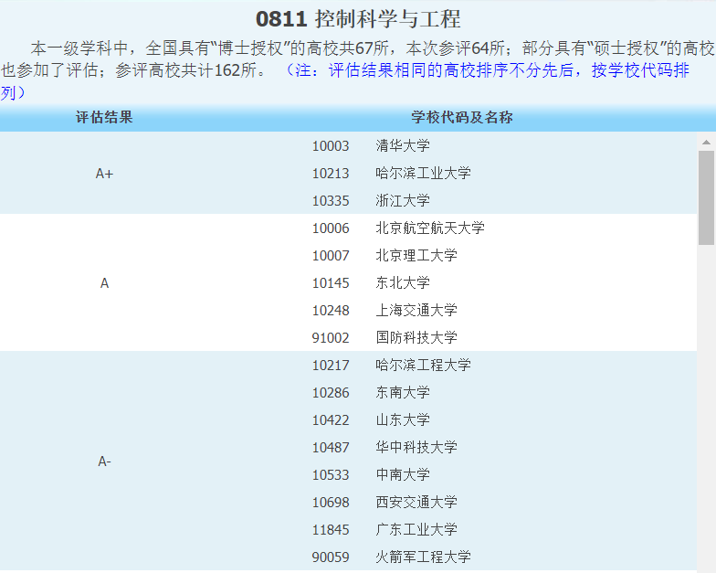
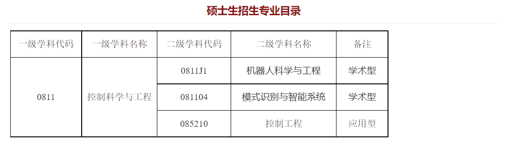

# 考研学校选择

[toc]

# 第四轮学科评估

[第四轮学科评估---控制科学与工程](https://www.cdgdc.edu.cn/webrms/wwwroot/zgxwyyjsjyxxw/xwyyjsjyxx/xkpgjg/)

# 浙江大学

[浙江大学 --- 控制科学与工程学院](http://www.cse.zju.edu.cn/)

# 北京航空航天大学

[北京航空航天大学 --- 自动化科学与电气工程学院](http://dept3.buaa.edu.cn/)

# 北京理工大学

# 东北大学

[东北大学 --- 机器人科学与工程学院](http://www.rse.neu.edu.cn/)

[东北大学 --- 人工智能与机器人实验室](http://www.newneu.cn/)

机器人科学与工程专业历年招生情况:

2017年：招生33人，复试分数线：总分356，政治外语45，业务课75;
2018年：招生33人，复试分数线：总分300，政治外语45，业务课70。

# 上海交通大学

# 东南大学

